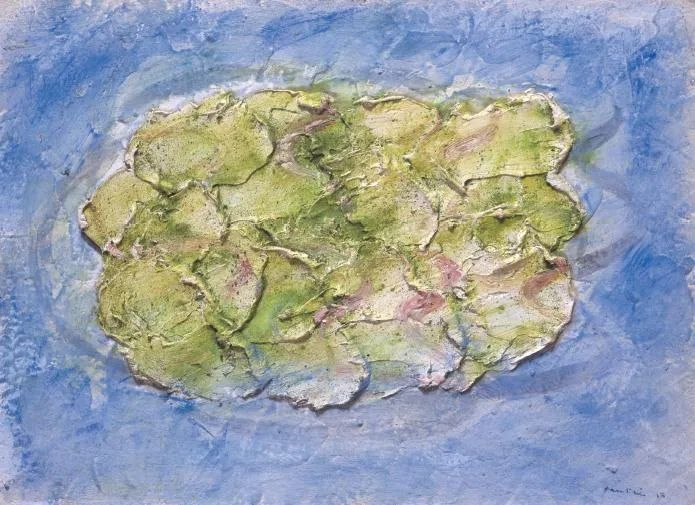

  

Piero Manzoni，Frog Pond

  

连叔：  

  

您好！希望您和连太最近一切都好。

  

第一次提问，不清楚提问的规则，若有不妥之处万分抱歉，望您见谅。

  

我是一名已留学一年的海外学生，目前在澳大利亚读计算机硕士，本科编程基础无。出国第一学期的基础课成绩尚可，第二学期因此放松了自己，加上课程难度增加，学校因为疫情改成网课＋在线考试等原因，期末成绩极差，几门课不及格，按学校的学分制，这些课程要再交学费上第二遍。

  

家里条件一般，供我出国几乎花光了积蓄，现在因为自己犯错多出近十万额外花费，心里特别自责。加上自我感觉基础实在薄弱，没信心能从这个专业顺利毕业，算了一下继续读下去就算一切顺利也要再花近六十万，因此在考虑及时止损，退学回国。

  

这个决定有一定风险，一方面回去已经不算应届生，加上疫情影响难以找到工作，另一方面现在也很难买到回国机票（票代机票将近十万十分昂贵）。父母建议我先休学半年留在国外自学巩固一下基础，然后试着继续读完，但也说了决定必须我自己做，会尊重我一切选择。我自己现在非常迷茫，不知如何选，休学担心自己再多浪费半年，最后还是无法毕业；退学又担心回国找不到工作，会懊悔放弃了现在的读书机会。而且也有些分不清现在的想回国究竟是真的虑及家里情况还是仅仅是受了打击想逃避面对继续读书的困难。

  

希望能得到您指点迷津，万分感谢！

  

感谢您花时间阅读，再次祝愿您和家人一切顺利。

  

一个迷惘的年轻人

  

* * *

  

一个迷惘的年轻人：

  

现在看来，你去澳大利亚读硕士的决定错了，你的专业与自律，极大可能不足以保证你完成学业。将来这个结果出现，你和你的父母，是承受不起的，耗尽家庭财力，除了浪费几年时间，一无所获，这是经济与心理的双重打击。

  

即使完成学业，拿到硕士文凭，洋文凭在国内逐年贬值的情况下，它完全无法保证你得到一个好工作，甚至未必能得到工作。即使得到工作，薪资也未必能增加。更特殊的是，由于近来澳大利亚愚蠢的激进反华政策，会导致它的一切产品在中国不受欢迎，包括文凭这种教育产品。

  

上面这些不利因素，你自己意识到了。否则，你就不会有退学的想法。

  

障碍人修正错误的，有两大因素：

  

一是面子。大多数人好面子，这关过不了。我希望你最后能过面子关，但一下无法彻底过，也没有关系，疫情与中澳关系是很好的借口，让你中止学业回国显得非常可以理解。当然，希望你几年以后能够参透，人品与实力才能真正支撑面子，只追求外在的装饰，那就会满足于廉价而客套的夸奖，让潮流与他人轻易地控制自己的人生，里子与面子都会失去。

  

二是损失厌恶。人在坏股票里越套越牢，在坏婚姻里越陷越深，明知是错，却不愿意止损，这就是损失厌恶在起作用。只要我不止损，损失就没有确认，事情就可能变好，最后弥补我的损失。而结局总是自己的资源耗尽，将小损失拖延成大损失。事情做错了，止损是真本事，迅速将自己的时间、能力与金钱转投对的事，而对的事，增长是无限的。人在知识上的局限性决定了每个人一生会做很多错事，没有学会止损，总会有一件错事吞噬我们的人生。

  

所以，你现在买张机票回国，从金钱到时间，都是损失最小的理性选择。回国了，就赶紧去找工作，如果你是国内好大学的本科文凭，那在雇主这里，行情是看涨的，现在大家知道，在中国激烈的高考竞争中胜出的孩子，值得高看一眼。如果大学一般，那就把自己的期望值放低，我和一些高中生去竞争工作机会，那光彩夺目。世上永远都有充足的工作机会，只是惰性与虚荣让我们只看见少数好工作。

  

因为自己浪费了父母的一大笔钱，你内心一定会有愧疚感，而且长时间内难以消失。但是这也是成长的养料，它帮助你建立“受托人责任感”。李录认为，“受托人责任感”是一部分人才有的好品质，客户委托他的的每一分钱，他都把它看成是自己父母辛勤劳动、勤俭节省、积攒了一辈子、交给他打理的钱。你损失过父母的钱，感受过痛苦，你因此知道，钱很难得到，但太容易失去。若因此知道责任心、意志力与判断力的重要，不停加强，以后对得起自己的，别人的每一分钱，那今天的痛苦，何尝不是塞翁失马呢？

  

祝开心。

  

连岳

  

推荐：[道理虽好，孩子必须过他们的一生](http://mp.weixin.qq.com/s?__biz=MjM5NDU0Mjk2MQ==&mid=2651637134&idx=1&sn=cd4edab7c20a41963fb5c0b826f163df&chksm=bd7e41908a09c8865a83a211307257674c70a7d8f36974bafc7bb076582ce1821e64395fedcb&scene=21#wechat_redirect)  

上文：[掌握“资源有限”思维法，痛苦少掉大半](http://mp.weixin.qq.com/s?__biz=MjM5NDU0Mjk2MQ==&mid=2651644034&idx=1&sn=dfa4be050f301b0471effbb8f5e98c76&chksm=bd7e649c8a09ed8a8a3ffb7d4c6ed753bcdde47f7c895ade6444cb987ec56ffc3bbe52cba92c&scene=21#wechat_redirect)
