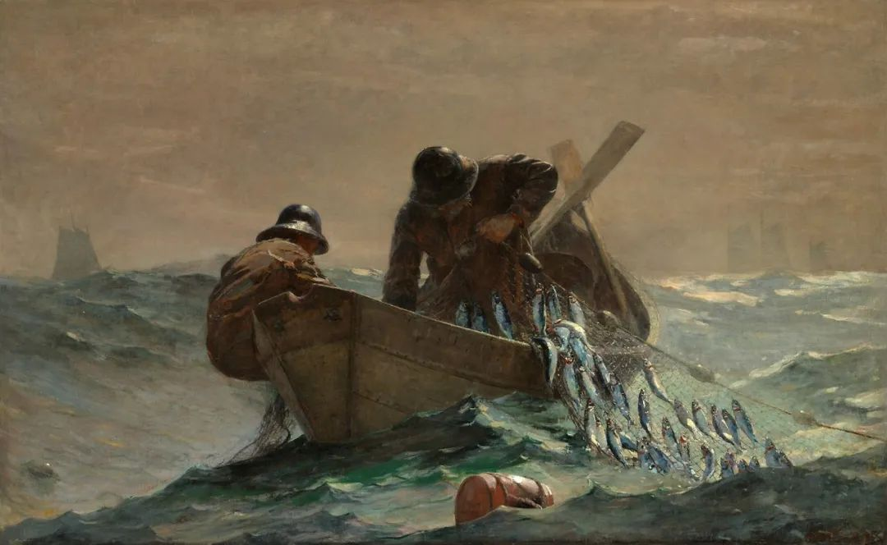

  

Winslow Homer，The Herring Net 

  

人生苦的时候居多。这点释迦牟尼总结得对。

  

这苦不能单纯理解为死亡、疾病、饥寒与悲伤。人类自近几百年来，工业革命加上市场经济，已经消除了很多苦，寿命大幅增长，饥寒基本消失。人生之苦，应该理解为精神之苦，肉体的满足，无法消除精神之苦。

  

可能肉体满足之后，精神之苦更甚。比如我们现在餐餐可以饕餮，但是食欲满足之后却伴随着懊悔与疾病，依旧苦。此时，唯一的办法就是控制自己的食欲，不摄入太多，这种克制，也苦。只不过，它是更好一点的苦，苦之后有甜，有控制自己的美妙感觉。

  

人生往往是在两种苦之中选一个，你是要坏的苦，还是要好的苦？

  

看过黑塞的杰作《悉达多》的人，一定对这情节印象深刻：悉达多认为自己的本事无非是斋戒、等候与思考。没饭吃的时候，不着急，这多出来的时间，想想问题，下一顿饭出现时再吃吧。

  

曾有位公务员朋友向我感叹收入比较刚性，省钱不容易。我说，我有办法让你每天增收几十元。哦，你不要担心，是合法的。是这样的，你的午餐，单位有补贴，花一点点钱就能吃饱吃好，你晚餐就别吃了，像悉达多一样，这样就省下了餐费。即使这样机械地模仿悉达多的硬扛，也能解决一点点问题。

  

仅仅机械理解当然浪费了智慧。硬扛除了用来忍饥挨饿，它还适用于人生的一切领域，当好的苦出现时，主动硬扛，等美妙的结果。否则，就只能滑入坏的苦。

  

我们在做任何一件事时，都应知道，不可能有完美的开始，也不可能有完美的过程与结束，总有局限，总有意外，你就是做足了一切准备，不尽人意的事情也会发生，到时只能硬扛。

  

我曾非常有限的指导过几个好朋友买股票，就是直接下指令，某个公司好，买入一直拿着，有闲钱了，股票分红了，就继续买，其余的，就是好好工作，不要盯行情，十年后的回报必然可观。当然，这些人我观察过，他们就是所谓的天生投资者，意志坚定，账面出现亏损能够硬扛——甚至不存在硬的问题，根本就无所谓，知道结局好，过程完全忽略。他们后来都发了财，我当然不是说我指导得好，而是说，这种好生活是他们应得的。

  

没有这种硬扛的能力，患得患失，任何投资，带来的都只有痛苦，即使是正确的投资，他也无法享受。有点波动，他就睡不着，而波动是市场的必然，于是他就经常睡不着，账面出现亏损，那更是天塌了。有趣的是，甚至账面盈利，带给他的也是痛苦，因为他害怕盈利失去，总在想如何才能卖在最高点。这就是多数人精神力量的写照，没有硬扛的能力，时时需要满足，一点都不能饿。这种人即使是你的好朋友，也不能给任何投资建议，不然会毁了你的安宁。

  

若不训练自己，脱离这种精神软弱，给我们好机会，好生活，也会把它变得无法忍受，所以，你别无选择，一定得有硬扛的能力。

  

推荐：[道理虽好，孩子必须过他们的一生](http://mp.weixin.qq.com/s?__biz=MjM5NDU0Mjk2MQ==&mid=2651637134&idx=1&sn=cd4edab7c20a41963fb5c0b826f163df&chksm=bd7e41908a09c8865a83a211307257674c70a7d8f36974bafc7bb076582ce1821e64395fedcb&scene=21#wechat_redirect)  

上文：[抓住“一即是多”的几件事，得到高效率的人生](http://mp.weixin.qq.com/s?__biz=MjM5NDU0Mjk2MQ==&mid=2651643298&idx=1&sn=b2cb328a642afd25917bdeff603f6b48&chksm=bd7e59bc8a09d0aa9e166dcfff951b781540f1605b63c9a7ef75c3de3b6c5bd89c52ed693b72&scene=21#wechat_redirect)
