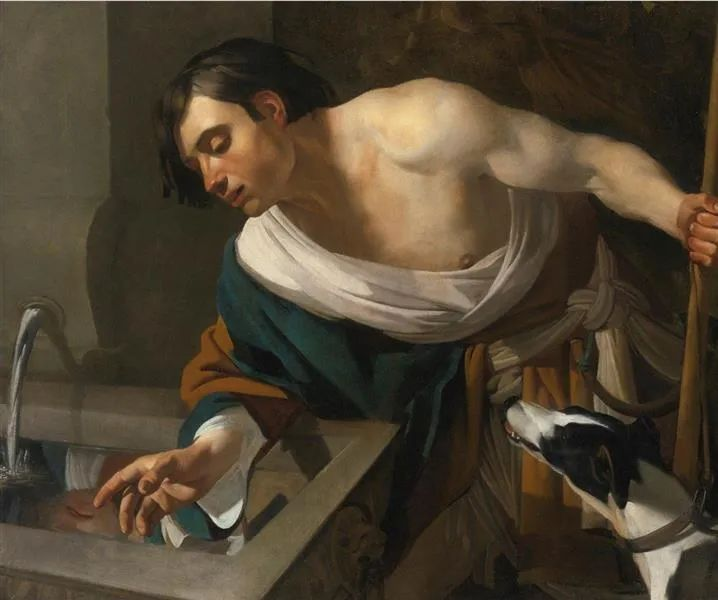

  

Dirck van Baburen，Narcissus Gazing

  

吉林省公安厅党委副书记、常务副厅长贺电所著的《平安经》，引发极大关注。这是一本人人看得出毫无价值的怪书，全书以“XXX平安”句型造句，从地名、企业名到人体器官名。书不便宜，299元一本。

  

大多数书是没有价值的，副厅长当然也有权利写这样的书。如果他愿意，还可以继续按这种句式写《幸福经》《快乐经》，写百部千部经。但人们的关注点是，《平安经》却得到了官媒、官微的报道与推荐，还组织了朗诵与研讨，这就是赤裸裸的拍马屁。这书若是一个普通警察写的，绝没有这个待遇。

  

更尴尬的是，《平安经》显示由两大出版社联袂出版，其中之一的人民出版社，发表声明否认出版过该书。在出版著作之前，作者与出版社要签订合同，贺电副厅长可能签了个假合同，上当受骗了。

  

这事件对体制的权威与形象，当然是损害。人们会想，一个副厅长，智商这么低，而那些吹捧他的人，节操这么差，他们混在一起，能做些什么好事？人都有名利心，官员不当得利，是腐败，法律有刚性标准，但只是这种拍马屁，抬轿子，满足自己的虚荣心，法律是没什么办法的，不能因为有人奉承我而惩罚我吧，了不起批评一下。

  

客观来说，在体制内官至副厅级，过五关斩六将，智商与情商，都不会低。本来不至于闹这种低级笑话，只能说，权力大了，说任何一句话都有人奉承，时间一长，把平台的价值误认为自己的价值，把权力的威力当成自己的威力，智商与情商就变低了。人性中的弱点就会放大，最后闹出低级笑话。

  

贺电副厅长炒作新书的做法，其实是文艺圈一向的陋习。圈子里，只要一人出了书，他可以光明正大地要求圈子内的人推荐与吹捧，至于你有没有看过这本书，并不重要。今天你吹捧我，明天我吹捧你。今年我们一起捧红你的孩子，明天就轮到我家的孩子。在前互联网时代，发表与出版资源牢牢掌握在文艺圈内时，不这么做，就难有出头之日。互联网给了人人发表作品的机会，大家接受市场的苛刻批评。写得好，凭自己实力赢得读者，写得不好，怎么吹捧也得露馅。这种陋习的危害才逐渐消失。

  

现在当然还有很多文艺圈人士这么玩，但除了给人酸臭、无能的感觉之外，没什么别的害处，人们都懒得嘲笑了。人们嘲笑贺电副厅长这么玩，主要因为他是重要岗位的副厅长，竟然沦落得如此蠢萌，人们觉得不太平安。

  

推荐：[你太快了！](http://mp.weixin.qq.com/s?__biz=MjM5NDU0Mjk2MQ==&mid=2651638717&idx=1&sn=d8768ef95153c504ad94bfb268b84ee3&chksm=bd7e4fa38a09c6b5d22876141236ae3f363437cd35b41cdfd9dadc2ff6a1d1da00ade9dc0100&scene=21#wechat_redirect)  

上文：[对世界，对婚姻，那些没必要的恐惧](http://mp.weixin.qq.com/s?__biz=MjM5NDU0Mjk2MQ==&mid=2651645091&idx=1&sn=f698ef340e947f76d32fc5bb37af9fdb&chksm=bd7e60bd8a09e9ab74568eaf1f2b1f85250b269d44b28d24f8f3033b0bffebeb792bad7f07e3&scene=21#wechat_redirect)
