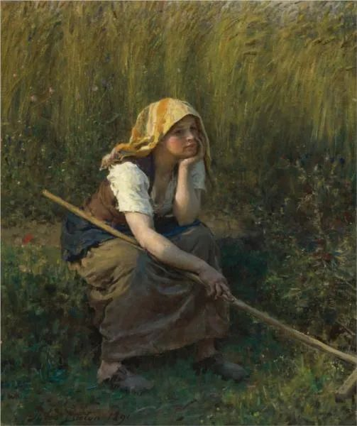

  

Jules Breton，Summer

  

7月2日，深圳市教育局宣布取消期末考试：

  

“一、除高考、中考、学业水平考试（初、高中）外，全市各级各类学校不组织期末考试。

  

二、已经开展期末考试的学校，不得公布考试成绩，不得进行排名。”

  

理由是：“2019-2020学年第二学期因受疫情影响，返校复学时间较晚，各校课程进度受到不同程度影响。”

  

这理由不成立。因为学业受疫情影响，考试成绩可能不好，所以我们就不考了，考了也不告诉你。作为学生，不要考试，肯定是喜欢的，取消学校，小朋友更开心。但从教育规律来说，这并不是好做法，考试的目的，就是知道一个学生的真实水平，他还有多少知识没理解，他与同学比较，处于什么位置，这是分数与排名的作用，就像开车时的导航一样，取消导航，只会更难到达目的地，甚至可能找不到目的地。

  

大家都知道今年的学业受疫情影响，对绝大多数学生来说，是坏的影响。但有多坏？没人具体知道。这次期末考试，本来可以知道，成绩可能令人沮丧，原来90分的，现在考了60分，原来排名靠前的，现在可能下滑了。根据新的情况，老师，学生与家长，可以制定新的教学计划。我相信一定有少数学生，在疫情期间，特别自律，家长特别负责，这次期末考试本来可以大放异彩，可惜这荣耀被剥夺了，他的学习方法也无法第一时间被发现，被借鉴。

  

取消考试，这样大家就不必为学习焦虑。这相当于疫情时不公布感染人数，大家就以为疫情不存在。掩耳盗铃罢了。这次期末不考，问题积压到下学期，考试结果就更震撼，那时怎么办？就算可以一直取消，中考高考也取消不了，总要面对分数与排名，考不好的痛苦总要承受的。就算荒唐地取消了中考高考，社会的毒打不是永远在吗？你的品德与才能总要被人打分与排名的。

  

学习是反人性的，其中的迷惑、反复、压力与痛苦，本身就是学习的一部分，成绩再好的孩子，也得体验这些。某种程度上说，学会与这些情绪共生，觉察到它们传递的真正信号，就是进步。当现有的知识让我们迷惑，回答不了新问题时，就意味着新知识要产生了。如果把这些所谓的“负面”情绪妖魔化，以为孩子沾一点就会奔溃与受伤，那真正的教育就无法进行。真正的教育，总是有批评，有对品格与学业不足的指出与纠正。

  

如果大家都是100分，怎么样都开心，老师不敢、不能、不愿批评学生，师生一起混日子，那就变成假教育了。有一点压力就取消期末考试，这就有滑向假教育的风险。

  

总有极个别人无法适应教育，也会有不负责任的家长想甩锅学校，但这也是正常的教育体系应该承受的压力，得有定力按正常的教学节奏走，一味迁就，那对大多数学生及其负责任的家长来说，就不太公平了。

  

但愿这学期取消期末考试的地方不要多起来。

  

推荐：[太快的进步不是进步](http://mp.weixin.qq.com/s?__biz=MjM5NDU0Mjk2MQ==&mid=2651633984&idx=1&sn=c5b0815e43e884ec7c26a93e283e4b8e&chksm=bd7e3d5e8a09b44838d5a4334a2987491a95f61fbe8f229636c1eaf01e8d28c9a63d3e5e8e0f&scene=21#wechat_redirect)  

上文：[一条高考应急建议](http://mp.weixin.qq.com/s?__biz=MjM5NDU0Mjk2MQ==&mid=2651643487&idx=1&sn=d99a176c8a11eca83af6b6519b4f91c2&chksm=bd7e5a418a09d357b0fef022bbd6b808ff66c7f227583a6e7fd555bf845bd6acda893adcb5a4&scene=21#wechat_redirect)
