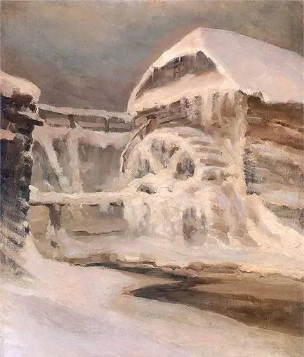

  

Ferdynand Ruszczyc，Młyn zimą  

  

7月15日，深圳市住建局发出通知，收紧当地房产市场，主要内容包括：落户满3年且连续缴纳36个月个税或社保才能购买商品住房。个人住房转让增值税征免年限由2年调整为5年。二套房首付比例至少提至70%。夫妻离异购房亦受相应限制（部分堵死了假离婚购房之路）。

  

这打乱了一些人在深圳购房的计划。有读者刚卖了临深房产，正看深圳的房子；有读者正准备从广州迁深圳。都不得不停止。每一个限制政策出台时，都有一些人处于这种不利境地。这时候不要赌气，如果你仍然愿意在深圳发展，那就根据新政策，等候自己获得购房资格。

  

深圳这次调控，再次印证这个猜想：房产市场，只能成为受限极严的有限市场，政府日子再难过，也不会放开房产市场了，在热点区域，每人买房资格有限。所以其他城市的房产若像深圳一样热起来，应该也会出相应的调控政策。而不必调控的城市，房产又基本没有投资价值，一般人买一两套也就算了。

  

政府本身是地产的最大受益者，调控减少其自身利益。那只能理解为，经过权衡，政府认为有必要部分放弃这块利益。反正有限的市场，一人只能买一两套，也足够大。

  

我觉得，有几个原因：

  

一是香港地产模式被否定。香港全民炒楼，举世闻名，几大地产商赚得盆满钵满，但最后显示他们钱再多，格局也小，缺乏道德感召力，有话语权，却因自己私利，把城市的发展越带越窄。政府显然不愿意北上深广之类的发达城市步此后尘，任正非，曹德旺，马云，马化腾，成为企业家代表，更服众，更可依赖。挥金如土，教子无方的地产商，起不了引领大众的作用。

  

二是避免贫富差距刺激与撕裂社会。世上从来苦人多，生产力不发达时，饥寒交迫的绝对苦人多。生产力发达了，统计学决定相对苦人多，平均线以下的人，总是多数。我一年挣10万，温饱无忧，可你一年挣500万，锦衣玉食，这差距与对比就让我痛苦。尤其是知道有些人不过只是在好城市不停买房，就能迅速积攒财富，更是不服气。都是国民，手心手背都是肉，政策自然要照顾人多的那一方。

  

聪明人，也不是不让你买房，买一两套得了，挣的钱也不少。其余心思，去做做别的事，成为一个非地产商实业家，像任正非那样，钱再多，也不会引起仇恨。这种类型的贫富差距，可接受度高，对社会更有利。

  

随着中国的城市化进程，几代人之内，居住在发达城市的人口，可能多占多数。从长远来看，都可通过购买的住房分享发展红利。当然，有些人几代人都看空，死都不愿意买房子，那政府估计也没办法帮他。

  

你在深圳这样的发达城市，资格够了，就上车，没什么可犹豫的。一犹豫，说不定资格就没了。买完就努力工作，好好享受生活。房子只能长期锁定，无法频繁交易，对心态脆弱，容易受影响的人来说，也有好处，避免你天天盯着价格波动，大喜大悲，像个疯子。

  

推荐：[自由是权利，自由更是财富](http://mp.weixin.qq.com/s?__biz=MjM5NDU0Mjk2MQ==&mid=2651638759&idx=2&sn=a99512bbfe2e2b2c774733447b783231&chksm=bd7e4ff98a09c6ef800baecc789610e65d5d839baebe52da7e92e74eb2859ea73403ee471bbf&scene=21#wechat_redirect)

上文：[我大学毕业，你让我当骑手？](http://mp.weixin.qq.com/s?__biz=MjM5NDU0Mjk2MQ==&mid=2651644142&idx=1&sn=0925336f9819edc0398a238e9a5395ff&chksm=bd7e64f08a09ede6327490365a3b262fe02ba94be35dc446cc1bdcd734de2c961a14ece86717&scene=21#wechat_redirect)
