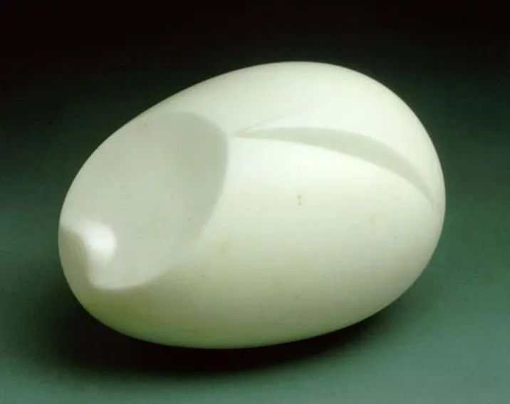

  

Constantin Brancusi，The Newborn  

  

《纽约时报》援引知情人士的话称，特朗普政府正在考虑全面禁止中共党员及其家人前往美国。这是昨天最震撼的消息。

  

如果这个真的变成现实，中国9000多万党员及其家人，数以亿计，不能前往美国。中国再施加对等的反制。新冷战就实实在在降临了。大家日子都会难过一些，中国难过，美国也不好过。如果只有对方日子难过，自己更好过，那新冷战早就开始了。

  

冷战不是热战，打一仗让对方投降。双方都是核武器大国，谁也赢不了谁，热战不可能是选项。冷战拼的就是意志力、信念和生产力，谁熬不下去谁输。其实中国也只有一个选择，非得熬下去，因为美国的漫天要价你接受不了：你的科技不能比我先进，出现了华为这种企业就得自废武功，世世代代安心当老二。最后你还得改变体制，不像我美国，选个疯疯癫癫的总统，疫情大蔓延，你的体制就不对。

  

没得选，我觉得也不错，置之死地而后生，大家没有选择烦恼，只能团结在一起。不然局势不明的时候，美国开始搞华为，还有一堆中国人骂华为，其中不仅有脑子不清楚的文科教授与作家，一些科技人士，理科评论家们，也在冷嘲热讽。后者更失态，毕竟你们有专业在。现在美国说明白了，就是不能让中国关键技术领先，我想，原来糊涂的人现在也不会糊涂了。

  

世界原来是分工合作的整体，我有些东西不会做，你有些东西做不好，这是市场的常态，什么事都自己做，那是人类的贫穷时代。美国政客反市场，意识形态挂帅，硬生生扯断市场的分工，中国确实有些东西得自己做了，比如芯片。

  

我不认为中国做不好，这不是单纯的信念问题，信念要有，有真实力量支持更好，李录在2019年，有个深刻的观察，他认为中国即将享受巨大的工程师红利，2018年，中国毕业了750万大学生，其中STEM（科学、技术、工程与数学）硬核专业有470万人，几乎是美国的10倍。再过几年，中国受过大学教育的人口接近2亿，接近全美的工作人口。认定这样的国家做不好芯片，才是奇怪的。如果中国注定技术要落后，就不可能有华为这样的公司。出现华为，也是中国工程师时代到来的证明。

  

世界一分为二，市场变小了，但中国14亿人口，仍是大市场，按照市场规律办事，能够产生出足够细致的分工，维持住创新与财富。再说了，美国有盟友，中国也有。中国对盟友，还是遵守自己的传统美德，以和为贵。美国人对盟友，不开心就给一棒子，我不用华为技术，也不许你用。长久来看，谁的朋友多，谁的市场大，还难说呢。

  

当然，全面禁止中共党员及其家人前往美国，极可能就是特朗普的选举噱头，没什么疯话假话他说不出来，他可能当不了下一任总统，当上了，说不定就换个嘴脸。不过，经过华为事件，疫情事件，在这魔幻的2020年，绝大多数中国人应该明白了，美国政客，不管是共和党，还是民主党，骨子里，都是觉得自己高中国一等，中国只有一家华为，他们不会服气，只有到了中国再富裕10倍，再发达10倍，他们才会承认现实，世界才会再次统一。能见证这个过程，不管这过程多么难，还是挺有意思的。

  

推荐：[解决投资中国的最本质问题](http://mp.weixin.qq.com/s?__biz=MjM5NDU0Mjk2MQ==&mid=2651643667&idx=1&sn=5f38a255b168c7d0c433f1a52a898a6a&chksm=bd7e5b0d8a09d21ba539ccb7444aaf2b21f6b9745428c12b7920144b7a845e578bfe2d2097ec&scene=21#wechat_redirect)  

上文：[说说深圳房产新政，不要和政策赌气](http://mp.weixin.qq.com/s?__biz=MjM5NDU0Mjk2MQ==&mid=2651644223&idx=1&sn=f5a60350bccb20cae759ddcb4a8810c4&chksm=bd7e65218a09ec37976467d547db7adb638179f605352297259fed972ddd7d40064669a990a5&scene=21#wechat_redirect)
