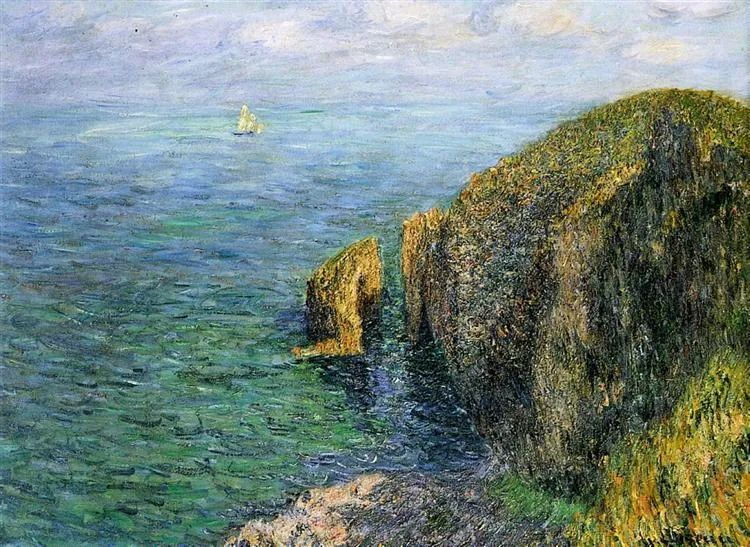

  

Gustave Loiseau，La Banche

  

中美关系真是一个震撼接着一个震撼，“特朗普政府正在考虑全面禁止中共党员及其家人前往美国”的传言还没停歇，“美方要求中方关闭驻休斯顿总领馆“已在昨天真实发生。  

  

防疫、经济，一团糟，种族矛盾又在撕裂，美国大选前几个月，特朗普只有意识形态一张牌可打了。按他出尔反尔，短线炒作的思维，什么事都做得出来。他以为要求中方关闭驻休斯顿总领馆，是左右逢源的好事。试对了，支持率上升，那就层层加码，把连任捞到手，到时再调整。试错了，也没有成本，反正都要输，恶心一下拜登，让他收拾烂摊子。一个人为了权力，连自己国民生死都无所谓，要求他公正对待中国，不是天方夜谭吗？

  

去猜特朗普的底线，已经毫无意义，他的底线就是没有底线。我们自己的生活，有底线思维就是了，如果中美真脱钩，自己也要活得好。两国关系也像谈恋爱一样，美国就是要分手，你也只能分。其实也没什么可怕的，美国死10多万人了，上至总统，下至平民，连戴口罩的简单科学问题都还搞不清楚，他们都不怕，中国人有什么可怕的？

  

生于忧患，有点危机感也好。做为普通人，身体健康，工作负责，现金流不出问题，小日子一定不输美国普通人。作为国家，国家领导人21日在企业家座谈会上的讲话，我觉得讲得很好，很有企业家精神。大的层面，维护产权、法治，改革开放不止步。小的层面，具体到指示继续减税降费、减租降息。在这场全球危机中，中国更加拥抱科学与市场，美国却反科学反市场，中国的选择，显然才是正确的。做为中国人，应该更踏实。

  

疫情是人类社会的常态，五年十年来一次，都不奇怪，美国这种做法，再厚的家底，也折腾不了几次。只是，中国总会被当成转移焦点的目标，实际问题解决不了，就打意识形态牌。今年的剧本，以后还会重演。其实今年的事情，在历史上也不陌生，有些人为了自己的一点名利，什么假话都说得出来，把汪精卫都衬托得高大了。

  

现在是特殊的战争时期，打到什么程度，决定权在美国。中国人怎么可能支持美国政客造谣抹黑中国？尤其是在中国当官的、发财的、成名的、吃体制饭的、生活幸福的，得了国家发展的好处，更是得共担风险。这也是企业家精神，美国的钢铁大王卡内基，认为自己死前有义务把财富回馈给社会。他给发家地匹兹堡捐赠图书馆时，受到当地官员的刁难，一时无法进行，理顺以后，他一点不生气，反而把捐赠额提高了4倍，无他，他认为必须回馈自己的发家地。

  

美国之所以强大，靠的是无数这样的企业家与企业家精神。中国走向强大，靠的也是这样的企业家与企业家精神，而每一个人，都是企业家。

  

推荐：[说说“特朗普政府正在考虑全面禁止中共党员及其家人前往美国”](http://mp.weixin.qq.com/s?__biz=MjM5NDU0Mjk2MQ==&mid=2651644295&idx=1&sn=78308fa6dc5f0b76a4a7dbe58ea4d057&chksm=bd7e65998a09ec8f722ed3bddfedb167db002d0c1ed417595605c1be6cf121b0e57a7a96cad0&scene=21#wechat_redirect)  

上文：[孩子“不成器”怎么办](http://mp.weixin.qq.com/s?__biz=MjM5NDU0Mjk2MQ==&mid=2651644652&idx=1&sn=68e5ec1d6f68b46a52395f75745155bf&chksm=bd7e66f28a09efe46035c93c88ada923d3a4dfa34cc555f23e6294b7d6cac6688e72231753ab&scene=21#wechat_redirect)
