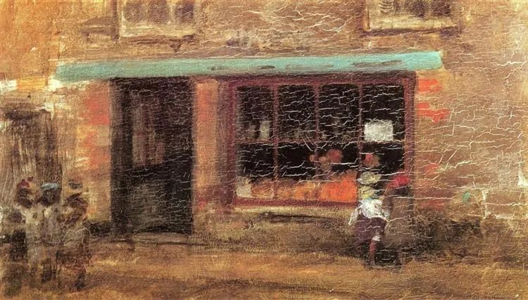

  

James McNeill Whistler， The Sweet Shop

  

涨了几天，希望谈股市的人越来越多。

  

首先，视野放大一点，看看我们一生面临的财务挑战，这样才能更好地理解股市。

  

人的寿命越来越长，普遍活过100岁的时代到了，不尽早规划与准备，人可能会后悔活那么长时间。

  

越老越不能缺钱，医疗与养老的花费逐渐加大，靠无法战胜通货膨胀的退休金，支撑不了这个支出。

  

孩子能资助？这确实是中国人的传统美德。但是想想看，你90岁时，孩子也60来岁了，他也变成老人，将面临自己的养老问题，他若能力一般，对你的资助将极有限，甚至还得让你资助。靠孙辈？他养两代老人？够呛。

  

没有钱，只能一直降低生活质量，甚至放弃，晚景凄凉。人生若是这样收尾，真是太遗憾。但如果没有规划好自己的财务，极可能只有这样的晚年。

  

按照现有的退休年龄，工作时间30年左右，在这段时间，除了完成常规的人生任务，照顾老人，抚育孩子，还得准备自己下半生的财务安全。可以说，一点时间都不能浪费，一点大错都不能犯。否则的话，大学毕业，高不成低不就，闲逛几年；工作迟迟进不了状态，蹉跎几年；转眼中年了，手里什么也没有，一急就想来快钱，被各类创业、投资、理财，甚至高利贷忽悠，几年又得白忙。

  

然后股市涨起来了，你豪情万丈，觉得自己的命运就是股神，不仅辞职炒股，更要把房子（如果有的话）卖了当本金。几个月后，或几年后，亏个精光。余生只能嘴硬、敏感、好面子，常常批判体制。

  

不要过这样的生活。你要有自己的财务安全。

  

财务安全依靠的最重要品质是自知之明。我只是大多数普通人中的一员，只能靠踏实工作、少犯错误、不停积累；我不可能是股神，去炒股，只能像大多数人一样，赔钱出场。

  

对待股市，工薪阶层别碰。本金少，就那么几万十几万，涨两倍也赚不了多少。其实，也没这样的机会，真买中能涨两倍的股票，一般人也拿不住，涨一点就兴奋地兑现了，然后买入一支亏损股股票。而亏了，痛入心脾，怀疑人生。干嘛这样折腾自己？

  

这不是说富裕阶层炒股必赢，他们也多数要输，只是输得起而已。输掉500万，还有1000万，生活无忧。

  

不自以为是，在这个市场经济的和平时代，一般人的财务安全，容易做到。  

  

第一步，无论你在什么地方，有套自己的房子。有房子住，其他生活成本并不高，尽量把身体照顾好，有一点退休金，孩子适当资助一点，维持基本体面，不难。  

  

更进一步，如果你还有另一套房子收租、保值（经济发达城市的房子才能做到这点），那么，你的下半生就比较放松。租金可以跟上通货膨胀，你的收入一直在增长。在极需用大钱的关键时刻，房子能够变现救命。  

  

只要你不浪费时间与金钱，这个任务不难完成。  

  

多数人是要在股市输钱的，记住这点。你是不是多数人呢？如果你看完这篇文章，写留言问：我该买哪只股票？你就是。如果你看完这篇文章，要给我推荐一只股票，你更是。如果你看完仍然坚信自己是股神，准备借钱炒股，卖房炒股，那你必然是输家。

  

忘了股市吧，把今天的工作做好，把以后每一天的工作都做好。  

  

推荐：[解决投资中国的最本质问题](http://mp.weixin.qq.com/s?__biz=MjM5NDU0Mjk2MQ==&mid=2651643667&idx=1&sn=5f38a255b168c7d0c433f1a52a898a6a&chksm=bd7e5b0d8a09d21ba539ccb7444aaf2b21f6b9745428c12b7920144b7a845e578bfe2d2097ec&scene=21#wechat_redirect)  

上文：[顾家的人一般不会坏](http://mp.weixin.qq.com/s?__biz=MjM5NDU0Mjk2MQ==&mid=2651643715&idx=1&sn=984db72885ca159f35a45dfb60609b3d&chksm=bd7e5b5d8a09d24bb9c42892e63e07ebfeaf107d6eaf15f924d24537fa286dfa4d0050bbcaf5&scene=21#wechat_redirect)
