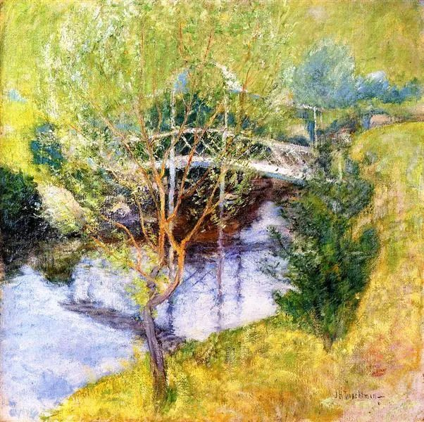
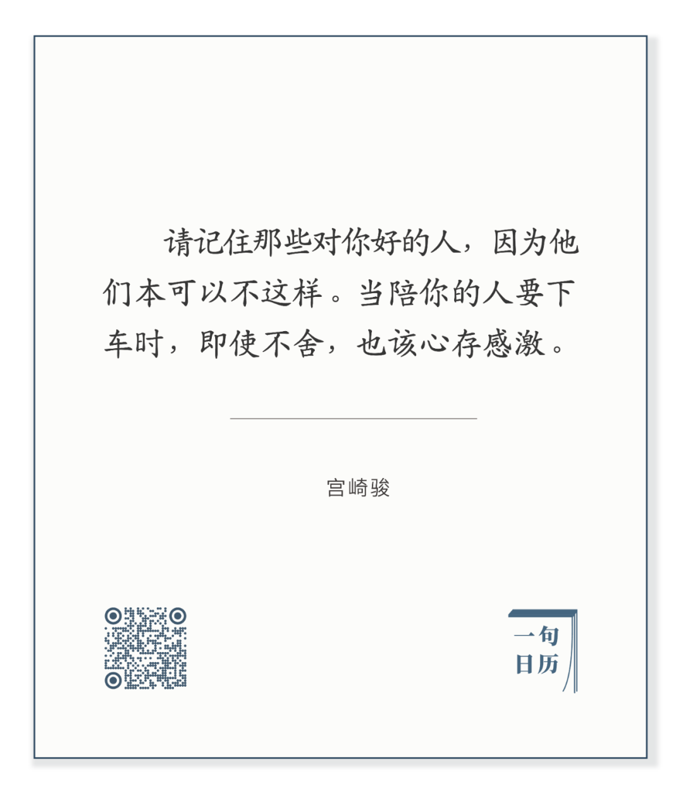

  

 John Henry Twachtman，The White Bridge

  

长按二维码可关注  

  

对他人，我们本不应该要求太多。  

  

要求太多，要么就苛刻，要么就谄媚。  

  

谄媚他富他贵，以换取他的恩宠与施舍，他平常心待你，你都觉得他不够慷慨，由失落而不满，由不满而怨恨。  

  

而真正慷慨的人，则很快习惯他的付出。那些爱我的人。那些照顾我衣食的人。那些在乎我成长的人。他是那个在千万人中，能看出我不同的人。其实我与这千万人并无区别，并没有更富，也没有更贵，不过河滩上一粒鹅卵石，森林里的一棵树，沙海里的一粒沙，狼群里的一只狼。只是他爱我，能够看出我与他者的区别，我自己都不知道的区别。

  

可一旦习惯，一旦理所当然，被爱的人反而变得苛刻，要得更多，更好。人生的种种没实现，不得意，全转变对身边人的挑剔与不耐烦，陪我再久，给我再多，最后因为一言不合我意，一餐不对我口味，生出怨恨。在那个时候，就是忘了，这个人，原本可以不对我这么好。

  

知道他们原来可以不对我这么好，你则可以接受那些冷漠与平淡，他们有自己要爱的人，一个人的能量是有限的。  

  

知道他原本可以不对我这么好，你则一直记得那些温暖与爱意，也会回报温暖与爱意。

  

今天是第135期“下周很重要”，写下你将要做的好。

  

推荐：[生命是什么？](http://mp.weixin.qq.com/s?__biz=MjM5NDU0Mjk2MQ==&mid=2651644822&idx=2&sn=c2977ea27c13e5c8343f322dbe959e1b&chksm=bd7e67888a09ee9e635549b42cfca4f850ae19eedac021c7ac5f1e7c809401742c70812c05e9&scene=21#wechat_redirect)  

上文：[不忠诚，基因要不要背锅？](http://mp.weixin.qq.com/s?__biz=MjM5NDU0Mjk2MQ==&mid=2651644822&idx=1&sn=4c10064890ca501c42f47d65482c4aac&chksm=bd7e67888a09ee9e2518896906afa4185217840ba50b818db3b17c968f725fdb13f1980659bb&scene=21#wechat_redirect)
