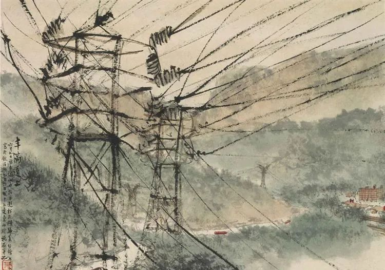

傅抱石，电  

  

连叔！

  

我是一名刚高考完的山东学生，早上对完答案感觉还行，接下来的一周开始学车，学做饭，学电脑（当然也包括开始学着玩游戏啦~）

  

本人大学专业比较倾向与和人打交道的，心理学，公共管理，经济学一类的。但是父母比较担心就业问题，毕竟自己成绩也就够个985中下游的学校，有些小争执，望连叔能够给予点拨！

  

清寐

  

* * *

  

清寐：

  

你的问题有普遍性，我们展开说一下。

  

高中毕业，有少数孩子，对某个学科，有强烈的兴趣，他们应该顺从这个热情，填报相关志愿。兴趣是最好的老师，有助于他们一门深入，成为相关领域的专家。当然，也存在真正读了，兴趣消失的情况，那也没关系，把课程学好就是了。没兴趣的事，该做好，也把它做好，这也是应该学的本事。这本事在人生中用得最多。

  

更多孩子只想着结束“地狱”般的高考，没想过大学要读什么，也没什么特殊的兴趣。让他们选专业，要么是一时冲动，要么凭借媒体与议论中的热点，要么纯粹是对某个学科的误解（以为很好玩）。此时，反而要听听父母长辈的意见，他们被生活毒打过，考虑问题，至少比较接地气，想得多的是以后好不好找工作。

  

大多数人不走纯学术这条路，大学毕业后就会去找工作。所以，站在雇主的角度，想想他需要什么人，这样原则就容易确立。

  

一、 少选别人可以依靠天赋秒杀你的专业。比如很多人选中文专业，就犯了这个错。中文当然不仅仅是写文章，可中文毕业不会写文章，也说不过去。你在985学中文，文章可能写不过一个有天赋的初中毕业生。但同样是文科专业，你法律系毕业，没受过专业训练的人，就赢不了你。

  

二、 选只能在大学学到的专业。比如你想学与人打交道，就不符合这个标准，大学老师，无论哪个专业的，可能最难教会你的，就是如何与人打交道。不带偏见地说，大学老师在这一块比较弱，这要在工作中学。相反，比如STEM，科学、技术、工程与数学，这种硬专业，只能依靠大学里系统的、严格的训练，才能建立基础。所以，有两个专业摆在你面前，选更难的那一个。

  

三、 工作极可能与大学的专业无关。这不是说学习可以随便混混，反正以后要改行。反而要学好，改行，学习新知识，这需要你有学习能力支撑。学好一个专业，无论你喜不喜欢，以后用不用得上，你得到最硬核的本领就是学习能力，它可以平移至学习任何一门新知识。大学除了把自己的专业学好，利用大学的便利，尽量多学一点其他知识，建立多学科思维。

  

四、 专业只是术，德才是道。上了大学，尤其是985级别的大学，术已经赢过大多数中国人，换言之，无论你读什么专业，都有让人高看一眼的资格，在就业市场有了先手。但术一定要有德的支撑。德是什么？一言蔽之，对得起信任的能力。人在职场的进阶，都伴随着权力的增加，你管的人、事、钱增加，这需要人的诚信、自律与主动，才能用好权力。获得信任很难，维持信任更难，一次谎言，一次甩锅，一次奸诈，就会失去信任。没有德，才并没有用，有别人也不敢用。。有没有德，短时间看不出来，长期必然知道，有德之人，一定脱颖而出，获得尊重与安全，无德之人，一定装不久，风险随之增加。德也需要训练，最后内化成自己的品质，这样才有长期主义的眼光，既能规划好人生，也不会因为对手暂时耍滑头领先而焦虑。

  

祝开心。

  

连岳

  

推荐：[赤子孤独了，会创造一个世界](http://mp.weixin.qq.com/s?__biz=MjM5NDU0Mjk2MQ==&mid=2651636790&idx=2&sn=b4e0dd4904e3480acbdbf97726bdeb2e&chksm=bd7e40288a09c93e2636c0f32d1ebc2151be676385c783801d5e20fa6f42195e549734dd5a84&scene=21#wechat_redirect)  

上文：[不可不知的能力圈概念](http://mp.weixin.qq.com/s?__biz=MjM5NDU0Mjk2MQ==&mid=2651643836&idx=1&sn=e14d5cb20f821f80394681c93e020443&chksm=bd7e5ba28a09d2b43edf24ad9b4341f75916b83f6b9047a2b4e2896eb237a7b03d454c628efd&scene=21#wechat_redirect)
