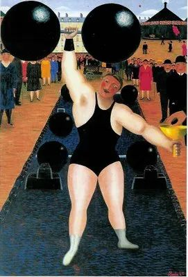

  

Camille Bombois，The Athlete

  

中国在很长时间里，一直是靠教育立国的。  

  

这往前可以推到秦国，秦在诸侯国中，本来并不是最强。依靠商鞅变法，人才的晋升由血统变为功绩，人人都有机会，社会动员能力强，最后一统天下。这种选贤与能的方法，慢慢演变为科举制度，把书读好，就有机会，朝为田舍郎，暮登天子堂。中国的统治者不停在换，而科举制度很稳定，这让中国在漫长的农业文明时代一直处于领先。

  

科举制度肯定有它残酷的一面，我们学过的《范进中举》，就看到科举把读书人搞得疯疯癫癫，虽是小说，也可参考。但是换个角度理解，一旦中举，社会地位瞬间提升为上等人，这么关键的选拔制度，竞争肯定激烈，残酷是必然的。有几个疯疯癫癫的失败者，不奇怪，没有，才奇怪。

  

现代社会，选拔贤能，也离不开层层的考试选拔，考试的内容与时俱进，不再是千年不变的经书，但其残酷性是不变的，对这点，从家长到学校，我觉得，要有清醒的认知，也得做出选择。你要么选轻轻松松毫无压力地学习，要么选接受竞争承受压力的升级之路。非此即彼，不可能无压力不辛苦地升级。

  

选了其中任何一条路，就接受其后果。选择轻松快乐混完义务教育，脱盲任务勉强可以完成，更多技能应该就没了，能力差，意志弱，地位低，一生也就按着哪里压力小去哪里混的方式走，实在混不下去，就靠亲友救济与社会福利。

  

我们知道，很多国家的公立义务教育，已经选择了这条路，孩子不会受到批评，没有作业、考试与成绩的压力。孩子、家长与老师，个个开心，花纳税人的钱编一个天大的谎言。不愿意选择这条路的家长，只好花钱送孩子上私立学校，接受严格的教育与残酷的竞争，准备将来当精英，掌管社会。

  

某种程度上说，轻松快乐的公立教育，变成一个哄骗下等阶层的精神鸦片，你们永远在里面混着吧。越没见识的人越容易上当，子子孙孙无穷尽也，阶层上升只能靠意外了。

  

中国的公立教育，还不至于此，各个城市的中小学名校，基本还是以公立教育为主。我们见过许多父母无见识，无文化的孩子，只要在学校按着老师的指导，认真完成学业，又有好胜心，最后成为社会精英。如果公立教育白左化，追求轻松快乐，这些孩子的机会可能就没了。

  

公立教育，一定有白左化的压力，因为总有一定比例的家长与舆论，要求学校与老师承担无限责任，要求他们像神一样无所不能，家长的失职，不可抗力的意外，都可对学校与老师追责。扛不住这压力，就只好白左化，不求有功，但求无过，不做任何可能有风险的事，教育变成向最玻璃心的人看齐，安乐死了。这种情况真发生了，对精英阶层的影响不大，他们有见识，有智力与金钱资源，可以让孩子接受真正的教育。对普通大众来说，则不是好消息。一个国家，失去教育这张王牌，选拔人才的机制变得更为低效，阶层的鸿沟加大，国力也会变弱。  

  

推荐：[在大学，那些应该做的事](http://mp.weixin.qq.com/s?__biz=MjM5NDU0Mjk2MQ==&mid=2651628977&idx=1&sn=29fbf0d749aa58d5e8d962856a59ced6&chksm=bd7e21af8a09a8b904e4dd097cf742c44dd9ab9e92f9905e945899bf55b0aa3972ed897d123f&scene=21#wechat_redirect)

上文：[说说深圳取消期末考试](http://mp.weixin.qq.com/s?__biz=MjM5NDU0Mjk2MQ==&mid=2651643541&idx=1&sn=6ccaa9fd01f0621919de7aa05ef88f3d&chksm=bd7e5a8b8a09d39dd956ee72fd6550ba9ca7df8886bb406fa38359c4ec0c8d49d0572f17fc21&scene=21#wechat_redirect)
