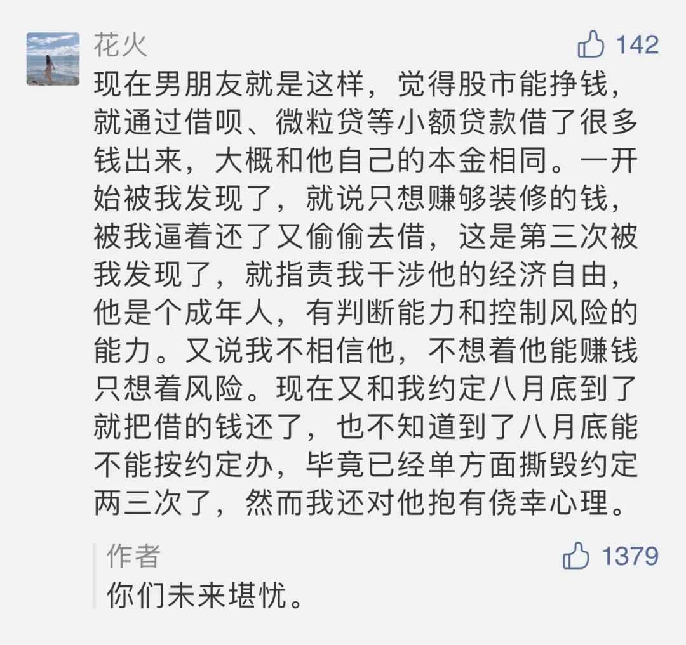

  

Edwin Henry Landseer，Shoeing

  

人生大概到了45岁，才到了比较舒服的阶段。如果多走一点弯路，多付出一点成本，就迟几年。

  

这样算一算，从你大学毕业开始，有20多年的时间，是比较辛苦的。这可以说人生的必然。即使富贵人家的孩子，也得吃这苦，他们物质上的压力小，可能不必为钱与房子发愁，但要展示自己的能力，建立自己的事业，得到别人的尊重，也有漫长的过程。甚至有非赢不可的压力，不然，别人就会说“不过只是会花父母的钱而已”，颇为轻视。

  

在这段时间，最不能犯的错误，就是图快，想走捷径。就像下面这位男朋友：

  

  

这样用网贷炒股是必输的。最好的结局就是开始借一点小钱输掉，输到痛，懂得怕，以后踏实过日子。如果不改，人生就没戏了。

  

年轻时，存几万块钱，很难。工资还比较低，消费欲望又强。在金融如此发达的当下，借几万钱却很容易，把它花掉，亏掉，半天一天的事。人生分岔出好坏，往往就在开始这一点小钱。亏欠一次，半年一年才能填坑。想到这加大的难度，有人就会失去耐心，又多借一点钱翻本，坑越挖越深，赌性越来越大，信誉越来越差，再三再四后，人生再无翻本的可能，还连累一家老小。

  

年轻时，唯一应该欠的钱，就是房贷。它其实相当于强制储蓄，逼迫年轻人养成量入为出，认真工作的好习惯。一套房子供完，品格与财技，都得到提升。人生的风险就变小了。

  

谈恋爱，某种程度上说，是接受对方缺点的过程，因为优点自然可爱。一个可爱的人总是附带一些缺点。你得判断出这些缺点是否致命。贪婪，是比花心不负责任更致命的，后者，过不下去离婚，还有点财产分。贪婪，想走捷径，分开也分一身债务。  

  

一夜暴富的诱惑很多，年轻时，总以为写一篇文章就天下闻名，搏一把“投资”就财务自由，其实没有这种事，有的只是一夜破产。好东西定价都很贵，想要？至少花20年时间慢慢努力。越早知道这点，接受这点，你的人生反而又快又稳。  

  

推荐：[有些天生的弱点必须补强，尤其是涉及财富](http://mp.weixin.qq.com/s?__biz=MjM5NDU0Mjk2MQ==&mid=2651643154&idx=1&sn=f0803a81e6047d3d118b53ada90b8b63&chksm=bd7e590c8a09d01aff8ad07196e9b962cac44b8f82d56dd5b7d1a31ec199decdb9f6c3d19dc7&scene=21#wechat_redirect)  

上文：[家庭责任感，是一个人最好的标志](http://mp.weixin.qq.com/s?__biz=MjM5NDU0Mjk2MQ==&mid=2651645581&idx=1&sn=00f74cf2dcbca044a7e3d805c7b8dc44&chksm=bd7e62938a09eb8599a127f026a552d475c8f7c9d1b8d439e3957ff3c6c630319e0960a884d3&scene=21#wechat_redirect)
