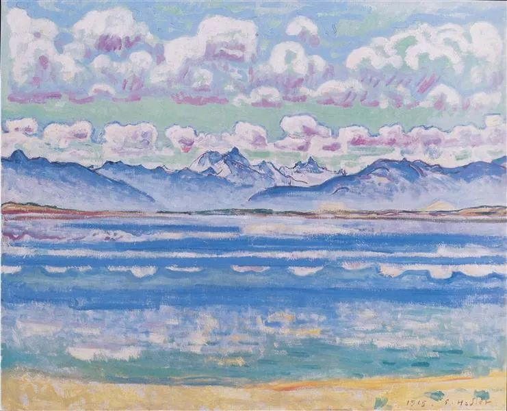
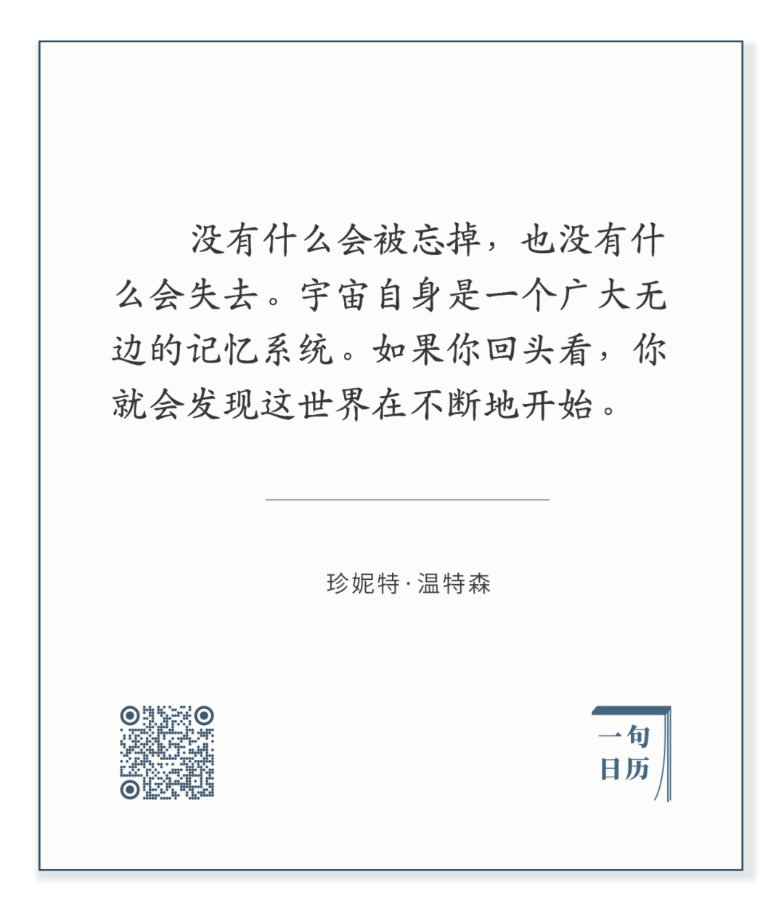

  

Ferdinand Hodler，Weisshorn of Montana

  

时间某种程度上是主观的，正如下面这句话所说：

长按二维码可关注  

  

人总在惋惜失去的岁月，以为人生的时间越来越少，再也没有机会。最后彻底进入老年心态，自我放弃。这种老年心态，有人在二三十岁就出现。有人一生没有。它是心理状态。  

  

正如我们不会认为昨天挣的钱不属于我们，我们昨天的一切经历也属于我们。钱还会消耗，我们的经历却永存，而且随着新事实、新观点与新方法的出现，过去与现在又再次组合，产生更多的可能。所以，我们的时间不只是“逝者如斯夫”的片断，它是一条河流，过去不断涌现为现在，不尽长江滚滚来。只要你不熄灭现在，过去就没有失去。  

  

物理学家戴维·多伊奇（David Deutsch）曾在[《真实世界的脉络：平行宇宙及其寓意》](http://mp.weixin.qq.com/s?__biz=MjM5NDU0Mjk2MQ==&mid=2651645255&idx=1&sn=b174aaad482b07e636ac08e4a7bd00ec&chksm=bd7e61598a09e84ff9e66017e910a0a43364140643de5a5c9407a0467fe97b2d0f076c181e33&scene=21#wechat_redirect)中描述人类在宇宙最后一秒时的状态。按现在的时间观，那当然是什么也不做，什么也做不了，连悲伤的时间都不够。可那时的人类（当然形态完全不同）却在作智慧的登顶工作，他们掌握了宇宙的所有信息，将计算速度无限加快，时间也就无限延长，意味着最后一秒永远用不完。壮观吧？物理学家谈学术，科幻作家的想象力赶不上。

  

时间还有的是（当然，也不知道自己现在是否生存在被超级智能调慢的最后一秒中），每一个今天整合过去的机会。人生难免有悲伤、失意、痛苦、甚至绝望，就像我们有影子，只要不停止在这些情绪，它们就是你的资源，在今天，或在将来的某一天，它将转变成快乐、得意、幸福与希望，就像影子的实体。

  

不停即可，是人生最好的方法论。  

  

今天是第139期“下周很重要”，不停地制订你不停的计划吧。

  

推荐：[活着多好呀](http://mp.weixin.qq.com/s?__biz=MjM5NDU0Mjk2MQ==&mid=2651646425&idx=1&sn=7b3631cdca24fb51d08884da4ee8ca03&chksm=bd7e6dc78a09e4d16c11941d3c3e2ea8d766320667be8b4fc5cc80a23635b9007a56a09f27e7&scene=21#wechat_redirect)  

上文：[爱重复](http://mp.weixin.qq.com/s?__biz=MjM5NDU0Mjk2MQ==&mid=2651646876&idx=1&sn=6017ba39c5ab6e0dd9f9d29b6ea922f6&chksm=bd7e6f828a09e6943df07f3ab2394c1d189b57d0d3d48b709310aafd7d84813a34ed32e43001&scene=21#wechat_redirect)
