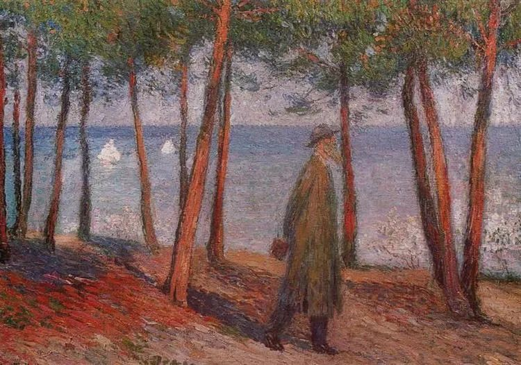

  

Henri Martin，Philosopher

  

连叔：

  

展信佳。            

  

此刻我正在医院的病房，这只是我一年中必来医院多次中的一次，稀松平常，只是我越来越难以逻辑自洽，于是想写下这封一直就想写的信给您，希望得到一些逻辑上的圆满。去年，在经历长达几年的病程，最后住院确诊得了一种终身免疫性炎症性肠病，学名“克罗恩”，从最初的无法接受，到平常心接纳，再到难以平复，再到无奈接纳。。。如此往复。此间往复以每到医院接受药物治疗为最甚，严重时就会影响到正常生活。妻子从最初的宽心安慰，到最后的词穷意竭，被我弄的身心倦怠，现在只能是随我，不再经常提及。我心里其实十分难受，根本不愿这样，只是苦心追问：为什么是我？为什么活下去的代价要这么大？此种疾病，治疗需要每隔两月左右去医院打点滴输入一种昂贵的生物制剂，然而这不是最难以接受的，最难以接受的是：此类药物总有一天会在你的身体里面失去药效，从而需要另外更加昂贵的药物代替，直到无药可用，直到医生和你说的：你迟早需要手术。。。直到生活质量极低的死去。。。而罹患此类疾病的基本都是年轻人，我三十岁都算是较大患者。。。。。。

  

很多人会问：是什么原因会得这种疾病呢？既然是肠病，肯定是你胡吃海喝的吧，你自己作的，能怪谁呢？我只能无奈一笑，听的太多已不再解释，要是胡吃海喝还好，我总有个怪罪的源头，我总有个改正的方向，而现在我只能怪罪于DNA，那个你无法改变的DNA，于是我写下了很悲观的文字：你的很多努力，在DNA面前一无是处。

  

妻子让我乐观一点，让我想想因为今年的疫情，多少人失去了生命，又有多少人比我更年轻的得上这种疾病，很多人不都是乐观的活着。而我总是不愿采用这种“比惨”的方式宽恕自己，我执拗的认为：这种“比惨”最终我得不到救赎，而别人比我更惨或者身残志坚似乎只是精神麻药，麻药失去药效最终还是要疼。

  

以前的我，本就是多愁善感之人，自此我更是难以完成自我的逻辑自洽：难道我活着，只是为了挣钱防止以后自己买不起药？而终有一天我也害怕自己觉得自己毫无价值。我害怕有一天我会一意孤行地决定留下我拼来的房子给妻子孩子，不再为自己活着折腾下去，离开这我热爱的无奈的世界。而爱情，亲情又怎么办？？？？？

  

盼您回复这个对于您恐怕都很难的问题（因为我看了很多您的文章，涉及此类话题的回复几乎没有，这或许不能算是一个情感问题了，而是一个哲学问题。），这不是激将，而是来自一个不合格的忠实粉丝的殷切盼望。

  

谢谢！祝您和连太安好！  

  

玻璃杯

  

* * *

  

玻璃杯：

  

我来尝试一下这个很难的问题。

  

人活着为了什么？这本质上还是一个情感问题。从哲学的角度看，人就是一堆原子，死了它们散掉，聚合成别的物体，如此而已。在物质上，人是不灭的，消失的，只是一个人的情感，我们爱的人成为离散的原子，再也无法回应我们，这让我们伤感。

  

某种程度上，人一生主要目的，其实是好情感的输出，让自己爱的人活得更好一些。一个人身上有多种爱，爱自己的配偶，持久而排他；爱自己的孩子，权重最大，但可以及于他人的孩子；爱一切值得爱的人，即使这爱像露水一样广泛而短暂，比如我们这次交流，毫无疑问，我们是相爱的，我迫切地渴望自己短短的文字能给你带去一点好心情。——能否做到，我不知道，但努力去做，是我的责任所在。

  

我们追求更多知识、更多财富、更多时间，就是为了更好地行使这个责任，不让爱自己的人失望，也更有能力解除所爱之人的困扰。不然，我们为什么要去获得呢？得到的一切，享用的时间极短，利也罢，名也罢，转眼成空，再大的人物，时间一长，就在记忆里消失。可我们要努力去获得这一切，因为这可以保护我们所爱的人。能力越大，我们给的爱就越多，甚至可以惠及全人类。所以，古圣先贤，不认识我们，但他们爱我们。发明新技术、新药的人，实际上也在爱我们。

  

爱之责任，具体到你身上，就是要有乐观的心态及强烈的求生欲；挣更多的钱购买好医疗；为自己争取更多时间，等候医疗技术随时可能的进步。因为这样的你可以让妻子不再“身心倦怠”，能给她力量。否则，她看着自己爱的人崩溃，一筹莫展，所受的打击不亚于你生病。

  

人生给每个人的任务不同，每个人表达爱的方式也不同。你艰巨一点，通过不被疾病击溃意志，我轻松一点，只是写写文章，但愿我们日复一日，总是能够尽责。  

  

祝开心。

  

连岳

  

推荐：[当你真爱一个人，生命的意义就会慢慢呈现](http://mp.weixin.qq.com/s?__biz=MjM5NDU0Mjk2MQ==&mid=2651642780&idx=2&sn=ea14ca3f8ceeb84add553bbbfa301f4f&chksm=bd7e5f828a09d694ff0864711df23cf5932657d8719badc60acfa179180dd5f2958f8f6db737&scene=21#wechat_redirect)  

上文：[不停即可](http://mp.weixin.qq.com/s?__biz=MjM5NDU0Mjk2MQ==&mid=2651646940&idx=1&sn=100b2729ca73b7a287736d1fbc3018a2&chksm=bd7e6fc28a09e6d4a9139c37ce2a6d976538b89ed9aacbf81068f7f23a8ebadeea71d6ed0617&scene=21#wechat_redirect)
