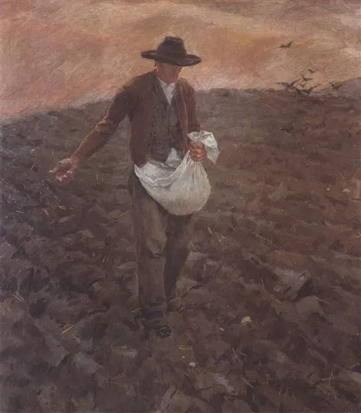

  

Albin Egger-Lienz，The sower

  

连叔，

  

上完班回到出租房，舍友都去上班了。今天工作第三天，这三天的工作强度工作压力都很大，说是实习生但是要我们承担的东西仍然很多，不到一个礼拜时间就要像正式员工一样对待，所以这几天都是高强度学习记忆。

  

从大半年疫情中居家日子一下子过渡到上班远离家人的生活也许还没适应过来吧。回到出租屋，拿起我的计划小本，准备好好利用下班后时间的时候，就终于憋不住了，一下子嚎啕大哭起来，哭了大概十几分钟心里舒缓了很多，也想不明白我的压力到底源自哪里，稍微平复了一下心情去拿了个快递回来洗澡的时候又再一次崩溃了。我是在后悔，我后悔有本科不读读了大专，我后悔没有把握最后一次机会，我后悔自己那时的年少无知，我后悔选了现在的工作如今却又没有放弃的勇气！这所有的所有都归因于对自己现在工作的不满意。以至于这篇文章也都是留着泪写完的。

  

我想转行，我希望通过学习许多技能来改变自己的生活，于是乎我每天都想把计划本排得慢慢的，把时间规划得充实好让自己没有愧疚感。可是到这一刻才发现，我所谓的那些计划好像也没有给自己带来写什么，还是每天重复着重复着那一份我不喜欢的工作，那一种我不想要的日子。我现在可以考虑去提升学历吗，比如说插本，或者考研。望连叔可以回复。

  

一个无助的毕业生

  

* * *

  

一个无助的毕业生：

  

先恭喜你，今年工作不好找，甚至实习的机会也难得。由此形成连锁反应，每年积压一些失业者，接下来几年就业形势都严峻，今年领先一步，就意味着可以领先几年。看来你当年选择专业还是有眼光的（或者运气不错），符合市场的需求，专科照样有工作，否则的话，博士也得发愁没工作。

  

实习期一般是雇主对新员工的考核期，时间很短，主要目的是测试员工能否达到基本要求，从德到才，全面考核一下。这注定了实习期并不轻松，必然按正式员工的标准要求你，不然怎么叫实用期呢？甚至要求还会高一些，测试出你的极限能力。60分就能录用，压一压，你跑出100分，对你就更有信心，你若撑死只能跑60分，常规状态下就不易合格。

  

所以，你现在承受的压力是正常的。你下班后，拿了快递，洗了澡，哭了两次，还写了这么长的留言，说明工作强度恰当。真是累到极点，倒头就睡了，没有这么丰富的业余生活。不是说你不能哭，可以，爱哭也有个好处，情绪不容易压抑，也是一个比较直观的判断标准，你哭得少了，不哭了，那证明你适应了新生活。

  

让你这次哭，并不是针对你是专科生，不过是人生进入新阶段的压力体现。你是本科生、研究生，也一样要哭，甚至哭得更厉害，学历高，相应的要求也高。只是，有些人的眼泪是无形的，他们未必哭出来，表面很淡定，内心承受的压力和你是一样的。这是每个人必经的人生阶段，就像青春痘，你再不喜欢，也得长几粒。

  

人确实要不停地学习，这不是想不想的问题，这是知识社会的硬性要求，不然要掉队。学习可以体现提升学历，你以后拿了本科、研究生文凭，但学习更多体现在工作中成长，今天有问题给压力，哭一会，明天解决问题，长一点知识。能在工作中成长，你学历低，一直是专科，重要性与收入也能不停提升。不能在工作中成长，就是博士，人生也得失败，哭到天荒地老。

  

你现在最重要的学习，就是接受工作的挑战，哭完继续去上班。记住，大家都要哭的，你先哭，就是领先。

  

祝开心。

  

连岳

  

推荐：[幸福而丰富的一生，就是六个字](http://mp.weixin.qq.com/s?__biz=MjM5NDU0Mjk2MQ==&mid=2651645764&idx=1&sn=a0de5f4558466e57d7bec4f5aa75a80b&chksm=bd7e635a8a09ea4c7b5a962ee4140ca0d978202d9276f859cfa5a9dffea8bb792d9f2e128cc3&scene=21#wechat_redirect)

上文：[活着多好呀](http://mp.weixin.qq.com/s?__biz=MjM5NDU0Mjk2MQ==&mid=2651646425&idx=1&sn=7b3631cdca24fb51d08884da4ee8ca03&chksm=bd7e6dc78a09e4d16c11941d3c3e2ea8d766320667be8b4fc5cc80a23635b9007a56a09f27e7&scene=21#wechat_redirect)
