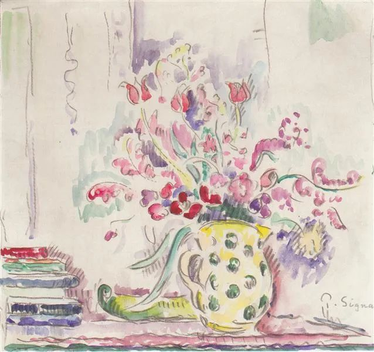

Paul Signac，Floral still life

  

有读者朋友感慨：优美的爱情都存在于古时候，现在少了。

  

同意这想法的人，可能并不少。

  

原来比现在好。这种厚古非今的思维模式，在人文领域一直很盛行。作家只要一死掉，政治家只要一退休，人们就开始说他们的好话，并不是突然发现了他们的价值，主要是为了用他们来否定现在。在科学技术领域，这种思维模式毫无立足之地。现在比过去发达，未来比现在发达，这是必然。科技思维没有怀旧，它热爱现在，更渴望未来。

  

人类科技时代开启后，便永远向前，退不回去。我们应该为生活在这种时代感到幸运。如果我们处在农业时代，进步不是必然，社会长期停滞，残酷的杀戮、饥荒，还会带来剧烈的倒退。短短四五十年前，很多中国人还吃不饱，穿不暖。知道一点这种历史，就不会掉入人文思维误区，总以为过去更美。

  

爱情，总被划归为人文范畴，所以比较容易被误导。但其实，爱情的底子，也是科技，是生产力。

  

爱情，就是彼此觉得你是世界上最适合我的，无法对第二个人有这感觉，一起创造的“两人史”越久，越无法分开。这目的当然高级且模糊。

  

两个成年男女的结合，有两个比较低的目的：

  

一、 动物性，DNA的复制命令，性成熟后的繁衍。

  

二、 经济性，男女分工合作，各擅所长，增加财产与生存概率。

  

在科技不发达，生产力低下时，男女结合主要为了这两个低目的，爱情并非必要。绝大多数人也无谈情说爱的资格，尤其是地位低下的女性，十多岁，青春期还没结束，就被许配给一个男子，婚后或会产生爱情，但更大可能是没有。你只能这么过一生，没有选择。男人当然选择多一点，极少数阔的，三妻四妾，还可以逛青楼，但这只是性行为多一些，爱情则未必增长，就像现在包小三嫖妓的男人，你不认为他更懂得爱。

  

有追求爱情的机会，一定是有了选择权。

  

现在男女都有选择，女性的选择权更是前所未有的多，所以，答案是，现在的爱情及优美爱情更多。

  

在自由选择的情况下，有人的婚姻不追求爱情，只满足动物性与经济性，这当然是其权利。事实上，这种婚姻的占比不低。

  

由于素质、能力或运气，并不是所有选择都正确，并不是每一个人都有爱情，存在许多不幸的婚姻。这是事实，这也证明爱情比较奢侈，你要足够强大，足够聪明，再加一点运气，才能得到。任务不容易，但选择权给了你，一切看你了。

  

推荐：[不忠诚，基因要不要背锅？](http://mp.weixin.qq.com/s?__biz=MjM5NDU0Mjk2MQ==&mid=2651644822&idx=1&sn=4c10064890ca501c42f47d65482c4aac&chksm=bd7e67888a09ee9e2518896906afa4185217840ba50b818db3b17c968f725fdb13f1980659bb&scene=21#wechat_redirect)  

上文：[相信爱情](http://mp.weixin.qq.com/s?__biz=MjM5NDU0Mjk2MQ==&mid=2651647115&idx=1&sn=ab9e2d8b27dc4976ff15f76dbd30ddcd&chksm=bd7e68958a09e18348c6aae89055110a71bbedd3e6bebe91b90822f2382aaa94b75f49704278&scene=21#wechat_redirect)
