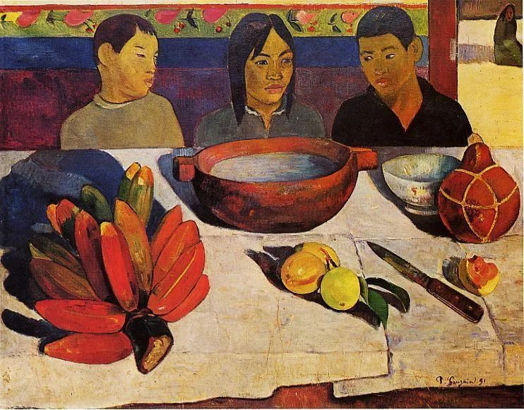
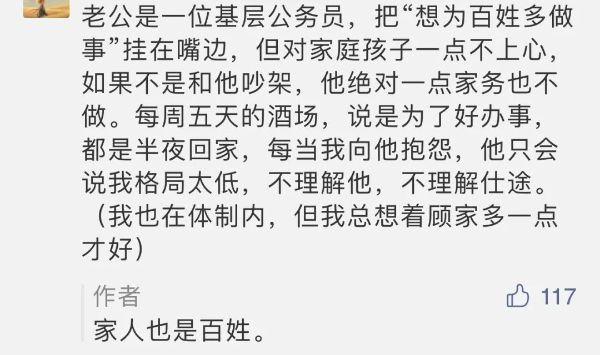

Paul Gauguin，The Meal

  

有人说，不喝酒，不应酬，就办不成事。持有这种观念的人，往往自我验证，最后身边都是爱喝之人，再也接触不到不喝酒，少应酬也办成事的人。这种人有点地位和权力，别人不喝，不往死里喝，他就觉得被冒犯，一些恶劣的酒桌风气也随之出现。

  

亲朋好友，同事之间，聚一聚，想喝酒的喝酒，爱喝的多喝，不能喝的，不想喝的，就不喝，随自己的意。这是非常健康的社交，也是人类社会的必须。人与人之间，尤其是相亲相爱的，没有这样的聚会，很难表达自己的感情。一个简单的标准，你最爱谁，你就和他吃过最多饭，喝过最多酒（如果双方都会喝）。

  

按我的观察，那些认为只有喝酒才能办事的，并不会有更大的成就，朴实无华的人，往往走得更远。我喝酒很挑剔人，只偶尔和朋友喝，这个世界也没有为难我，我照样活得好。无论做什么，人应该有这个朴素的信仰：我做成事，是因为我的品格与能力，并非因为我是酒鬼。丢掉这个信仰，只能证明一个人酒精成瘾，然后自我欺骗而已。天天喝大酒，把脑子和身体喝坏，能做成什么像样的事？  

  

就像下面这位先生一样：

  

  

问任何一个老百姓，都不会认可公务员喝酒是为人民服务。这条高尚的理由不成立，不必这样骗自己。  

  

一个人去当公务员，不能忘了初心。最真实的初心，就是因为其稳定，更能够陪伴家人。这和为人民服务并不冲突，认真上班，知道来办事的人民是自己的衣食父母，和颜悦色，我想，人民就很满意了。并不会额外要求你必须喝到半夜。这样的公务员，人民反而不满意，你一个月的工资，两次就喝完了，那些为你买单的人，不就指望你滥用权力回报吗？  

  

公务员对仕途有期待，人之常情。但也要知道概率，绝大多数公务员，到退休也是普通公务员。有官当，一生不过也就是科级处级。再大的官，那要运气中的运气，更是和喝酒没有关系。仕途之路，不如平常心，把事情做好，其他交给概率，反正已经得到一生平静陪伴家人的好处，应该知足。  

  

发了大财，当了大官，最后陪伴家人的自由都没有，夜夜在外陪人喝酒，这样的财，就是为别人而发，这样的官，不当又有什么可惜的。  

  

推荐：[只有唯美，才能致敬传统](http://mp.weixin.qq.com/s?__biz=MjM5NDU0Mjk2MQ==&mid=2651647315&idx=2&sn=7128be60119008fc0f46f57fd68c507f&chksm=bd7e694d8a09e05bd5e61c34e324c7b4fe89455d23413055803be99eb871c74b9d1fde4bea89&scene=21#wechat_redirect)  

上文：[说说那些去街道办的北大清华生](http://mp.weixin.qq.com/s?__biz=MjM5NDU0Mjk2MQ==&mid=2651647315&idx=1&sn=d1901f037cfb1e9a613681a65aab664e&chksm=bd7e694d8a09e05bea9da57b12c0a0247afda620919e74b570c2d9db169e2cf3c41149d101f5&scene=21#wechat_redirect)
