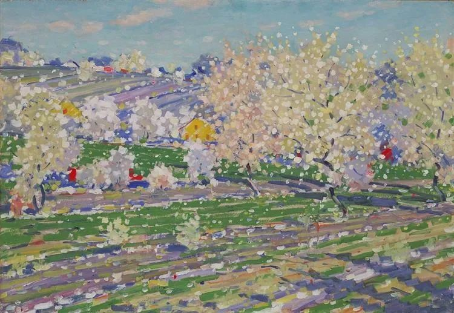

  

Vilhelms Purvitis，Ziedonis  

  

连叔您好：

  

我是一名初中生，网课期间因朋友推荐的文章关注了您，您正确的三观给我带来了很好的影响，我发现自己看事情更清楚了，对于一些事有属于自己的看法了（在此之前判断力一直比较弱），关于我自己生活道路上的问题我看清了一些，但最近在家庭的问题上，我又有了新的困惑。

  

我的母亲和父亲是农村人，母亲大专学历，现在与父亲一起在深圳打拼，但父亲的文化水平较低，上进心不强，早前有赌博的恶习，听母亲与父亲吵架时的描述他之前似乎还有过家暴行为（2次，我未出生时），几乎年年都有事情欺骗母亲（在外借新钱还旧钱，网络轻度赌博等），我印象最深刻的一次是父亲在百度借贷，那一次母亲情绪激动要和父亲离婚，甚至有轻生的言论（当然以前也不是没有），我参与调节并和父亲说母亲为什么生气和恳请他改变，最后他们还是和好了。其实母亲和父亲这样吵架次数真的不算少，每次都是因为父亲让母亲崩溃，我有时候甚至想劝母亲和父亲离婚（父亲从小参与我的教育少，我与母亲感情较深，母亲很多时候也是受父亲拖累才活得这么辛苦），但是母亲又说她和父亲都不是真吵，她离不开父亲，又说父亲其实人也不坏，后来也就继续生活了。父亲人也确实不坏，疫情期间对我的关心也渐渐提升了，最近也有在改。

  

接下来就是我的情况了，我现在是在深圳读书，非深户，在我的学校的重点班，成绩中上，保持在年级前五十；班级前十，母亲常说我很懂事，说我是她的安慰，我也很高兴能给她一点慰藉，但是我也会犯错，但母亲和父亲从来不打我，只是母亲会狠狠地骂，她对我的教育一向是很上心的，幼儿园时不管怎样都要把我带到深圳来，对我的教育也是一直陪伴着，从小学时就会和我讲道理，母亲在生活上宠我，立志要和我做朋友，我和母亲也很亲密。

母亲在学习上很严格，因为我没有时间观念，有一次去买赔同学的书耽搁了时间，作业还没有做完，她隔着电话手表在地铁上骂了我一路，我在地铁车厢里也哭了一路，期间一直捂着手表想要不吵到周围人，类似这样的还有很多，很多。

  

今年我总体学的挺好，相比上学期有进步，但是期末英语测试成绩并不理想，暑假期间，我放松了很多，母亲在准备考药师，最近她晚上做题时15道题只对了一个，她早上就很颓废，又开始觉得自己的人生太失败了，觉得不配做我的母亲，又感叹自己找了个这样的老公，觉得压力很大，又开始说对不起我，别人家都给孩子报各种补习班兴趣班，她却没那个能力（我们家的收入不算高），问我会不会怪她，我安慰了她，因为我从来没有那么觉得过，而她也尽她所能对我很好了。前阵子她在看一些女儿长大和母亲分开的文章，感慨说她以后也要优雅的退场，不能给我添麻烦，又问我以后会不会嫌弃她，抛弃她，我又好笑又有点生气，很坚决地说不会并且安慰了她，但她好像还是很伤感。她最近也陷入了伤感，和我交流时情绪也是时好时坏。

  

我后面详细问了母亲为什么觉得对不起我，她说是不能给我报补习班，要是报了补习班我或许会更好，我觉得是因为母亲不太满意我的成绩，加上最近比较焦虑才会这样。我想我现在应该先好好学习。其它的我就不知道该怎么办了。

  

我该怎么做？连叔，您可以给我个建议吗？谢谢您。

  

祝您和连太身体健康，平安喜乐。

  

橘子

  

* * *

  

橘子：

  

看得出来，你很想帮你的父母，尤其是你的母亲，你渴望得到办法，让她焦虑少一点，快乐多一点。

  

这种“想帮助某人（事）”的愿望，是一个人成长的最大动力。起点也是像你一样，从想帮助自己最爱的人开始，帮助的力量一步步外扩，最后一个能量大的人，可以帮助天下所有人，还能帮助那些还没有出生的人，就像释迦牟尼和孔夫子虽然死了，也还在帮助我们。

  

“想帮助”愿望，一定是从你发现问题开始。就像你清楚地知道母亲有时急躁、软弱，父亲总有些小毛病，他们也小矛盾不断，你自己也有松懈的时刻。发现问题，总是让人不太愉快，有些焦虑，因为许多问题没那么容易解决。

  

从现在开始，你要习惯这种状态，想着怎么解决问题，但要把焦虑去掉。多年以后，当你像我这么大时，其实你会喜欢问题，有问题挑战，就意味着有力量成长。你不会像那些无视问题的、逃避问题的人，无论大事小事，个人、家庭还是国家，一有问题，他们的反应就是：要死了，完蛋了，然后表演各种悲观沮丧，最后，他们变成最大的问题，害人害己。

  

你的反应将平静而坚定：问题总能解决的，不是现在，就是以后。

  

你现在遇到的家庭问题，你本能的反应是正确的解决办法，“我现在应该先好好学习”，因为，这是你能量增长的最好方式。让你疑惑的是，这似乎并没有马上解决问题，学习好一点，母亲还是焦虑，父亲还是有毛病，他们仍然会吵闹。那是你还不知道，这个问题本身就是需要长时间才能解决。

  

超越父母，安慰父母，这需要半生的“好好学习”才能完成，并非一朝一夕之功，你考上好高中，问题解决一点点，肉眼看不出；进入名大学，又解决一点点，进展似乎也不够快；你有了自己的事业，对自己人生负责，他们半信半疑。到最后，他们看到你有力量不害怕任何问题，还有足够的爱让他们依靠，他们终于放松了。

  

当然，他们不放松也没关系，那只是茶壶里的风波，见过了大江大海的你，不再认为那是问题。更了解人性的你，见过更多疾苦的你，也有更多慈悲，知道他们有能力天花板，可能一生突破不了，多抚慰，不苛求。

  

没错的，好好学习就是在解决问题，你是这样，我现在也是这样，遇见问题，第一反应就是好好学习，学习才能长能量，能量大了，问题就小了，没了。

  

祝开心。

  

连岳

  

推荐：[难，更难](http://mp.weixin.qq.com/s?__biz=MjM5NDU0Mjk2MQ==&mid=2651645255&idx=1&sn=b174aaad482b07e636ac08e4a7bd00ec&chksm=bd7e61598a09e84ff9e66017e910a0a43364140643de5a5c9407a0467fe97b2d0f076c181e33&scene=21#wechat_redirect)

上文：[说说“内循环”，或“美国围堵中国能成功吗？”](http://mp.weixin.qq.com/s?__biz=MjM5NDU0Mjk2MQ==&mid=2651646082&idx=1&sn=fb962dc7a396b3b8695e5544658480b9&chksm=bd7e6c9c8a09e58ac24184da9fb28565267a11ec449dfe87613ad3dc830750f6db041c1480dd&scene=21#wechat_redirect)
