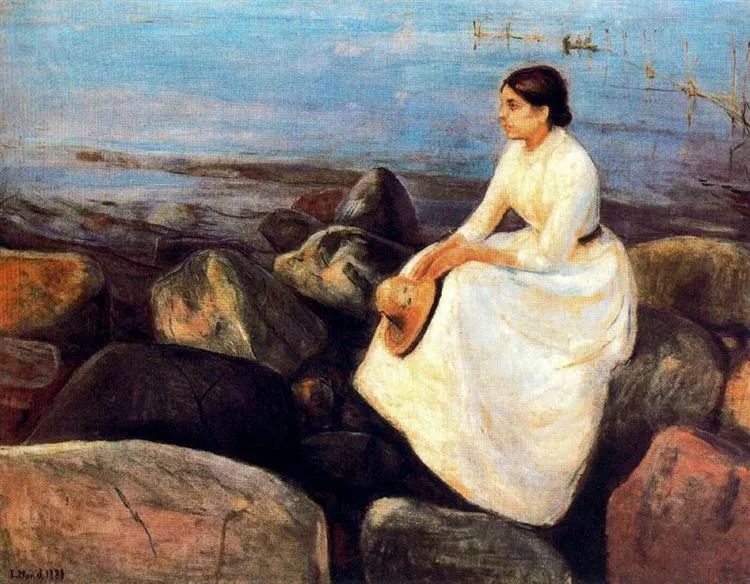

Edvard Munch，Summer Night 

  

连叔，  

  

你好！关注您很久了，经常看您给朋友们解惑，您的文章让我学到很多，真心感谢！最近我也有一个烦恼，恳求连叔指点迷津。       

我今年29岁，二线城市机关事业单位工作，长相中上，不是本地人，无房无车，父亲去世母亲改嫁，从小奶奶带大，还有一群爱我的叔叔伯伯姑姑。因为圈子小，只能靠相亲认识男生。去年接触过一个条件好的优秀的男生，在一起后相处挺愉快，偶尔因为对方不体贴拌拌嘴，但是没过多久一次小吵就分手了，我询问过原因，对方表示一是性格不合，二是他妈妈希望找家庭条件好点的（虽然在一起前对方家里就知道我的情况）。这段恋情两个多月，时间短，但是我非常受伤，这一年多我反思了自身的问题，也认识到婚恋市场的现实，认识到不在乎家庭条件的男生有多珍贵。

  

今年遇到一个男生，年龄和我一样大，辞职在家考公务员，我告诉他我的家庭情况，他说他家可以接受。他为人善良，家庭氛围好，爸爸妈妈共同分担家务，他也是一个愿意分担家务的人。我现在犹豫的，一是他的工作问题，迟迟没考上，也没有专业技能；二是他啰嗦爱说话，相处时我是觉得不舒服的甚至是不喜欢的。这种情况下我还能接受这个男生吗？我一方面想要安稳的家庭生活，另一方面我担心这两个原因导致婚姻不愉。

  

我知道婚姻要考虑的问题很多，我担心自己考虑的大都是现实因素，而弱化喜欢的重要性。我希望自己在步入婚姻前能解开纠结的问题，更加理性的对待婚姻。

  

迷路的小猫

  

* * *

  

迷路的小猫：

  

你能从分手中迅速走出来，去接触下一个候选对象，这是难得的优势。对婚姻有强烈的渴望，你就容易得到婚姻。

  

反之，“有没有婚姻无所谓”“随缘啦”之类被动消极的态度，让人更难得到婚姻。当然，极少数人有这个“消极”特权，那是他知道自己各方面因素无可挑剔，家世美，高富帅，自然有别人采取主动，他慢慢选择就是了。即使这 种婚恋“特权”人士，时间也是残忍的，挑个没完没了，挑到40岁，头发秃了，肚皮大了，“特权”照样被剥夺。

  

一个人在极年轻的时候，就想清楚他不需要婚姻，这是个例。绝大多数人，从基因本能到社会认同，他都需要婚姻，嘴上说不要，不过在骗自己，只是浪费自己的时间。把时间浪费完，就只能真不要了。

  

年轻人除了承认自己需要婚姻，还要克服一个更难的点：婚姻是现实的。你总得接受对方身上某些你不那么喜欢的因素。他善良稳重负责任，但就是不够帅，最后你能接受他的长相，而且能够抑制住自己婚后出轨更帅的人。听起来就很难吧？确实，婚姻就是难的，正如单身也是难的，人生也是难的，为了得到，任何一种生活方式，我们总得付出某种代价。

  

我们总认为，降低自己的某个婚姻标准，委屈了自己。这时候如果站在对方的立场想一想，委屈就没了。因为我自己也不尽人意，对方最后接受我，那一定也是降低了某个标准。恋爱的过程，其实就是展现自己实力与优势，让对方可以降低其他标准。我很能干，所以家境不重要。我很温柔，战胜了我的不够美。我赚大钱，你可忽略我不够帅。我是大名人，你就不嫌我年纪大。以后在婚姻生活中也是如此，不可能事事愉快，只是其中的愉快让人愿意接受不愉快。

  

这个原则，用在今天这个事例上，就容易选择了，如果确定这个男人是善良的、负责的，那么，他接受我的家境不够好，我也应该接受他话多一点和暂时没工作。

  

祝开心。

  

连岳

  

推荐：[我才25岁，要不要当后妈？](http://mp.weixin.qq.com/s?__biz=MjM5NDU0Mjk2MQ==&mid=2651644943&idx=1&sn=4176cb99b43d46cf04e4cf654717f727&chksm=bd7e60118a09e9079084a50a0377009d00b9fea2246252131a91fee155d2ef6245e1ea346023&scene=21#wechat_redirect)  

上文：[活着](http://mp.weixin.qq.com/s?__biz=MjM5NDU0Mjk2MQ==&mid=2651645384&idx=1&sn=63f7967b598b152a6524f522628bbe94&chksm=bd7e61d68a09e8c0ddd2fd5abe3440b5ea0a59de72d6278997d4ffaba0314dd2d53d9bbcdc9e&scene=21#wechat_redirect)
