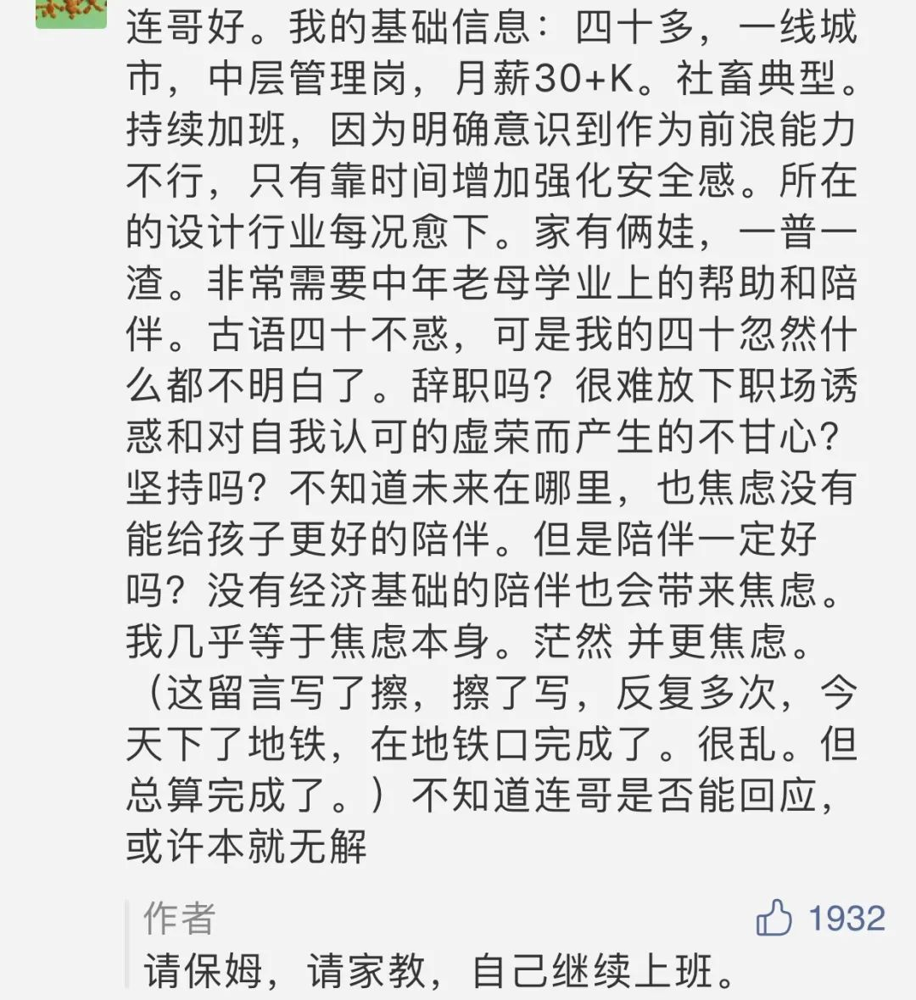

  

Albert Aublet，Reading on the Garden Path

  

是诱惑？是压力？还是陷阱？下面这个难题是许多女性必然遇到的：

  

  

有女士会问，如果我的工资收入刚好用来请家教和保姆，我不是白忙了吗？我不如全职家庭主妇。算起来是合理的，我不增加额外开支，又免除了“社畜”压力。

  

全职家庭主妇固然值得尊敬，我认为也应该视为职业，而且是特别难做好的职业。但有其独特的风险，没有任何一个职业是无风险的。一个女性逃离了“社畜”压力，“家畜”压力却随之加大。

  

合格的先生，如果自己太太是全职主妇，那对她要额外多一份尊重，多一份忍让。她在国家的统计表格中，是一个失业者。在多数人的观念里，先生才是挣钱养家的主力，“真辛苦”，同时往往忽视了太太的辛苦，她的价值总是被低估。如果先生也体现出这种观念与作派，给钱时带点居高临下的神情，杀伤力可真是大。归根结底，主妇的心理安全，就取决于先生的道德修养了，他万一不那么高尚，甚至变得猥琐，主妇不仅是心理不痛快，生计可能都成问题。

  

所以，即使自己所有的工资都转移支付给了保姆与家教，也是值得的。往大里说，这为国家增加了三份工作：你的、保姆的、家教的。不过，最主要的价值还是你没有中断职业生涯。

  

职业生涯中断几年，想恢复，很难。各种职业的知识都在积累，层级越高，越复杂，知识积累越快，中断几年，落伍了，机会也就没了。职业的知识积累，需要职场的真实环境，脱离压力，有的也是纸上谈兵。回想一下，我们每次柳暗花明之前，不都是山穷水尽？没有“社畜”的压力，我们身上虚的、假的，这些水分就挤不掉。压力是常态，也是生态，逃不了，也不要逃。

  

职业生涯总是由一个又一个瓶颈期组成，间或是非线性的提升。在瓶颈期，不忘初心，保持匠心，把手头的工作做好，熬下去，明天，或有质变，或有灵光一现的变异，而一中断，这些机会就全没了。

  

推荐：[你老婆犯的罪，就是嫁给你](http://mp.weixin.qq.com/s?__biz=MjM5NDU0Mjk2MQ==&mid=2651625568&idx=1&sn=a0dfaeccb0e2d93c346daaeee7cfb7fa&chksm=bd7e1c7e8a099568bc80d4c8e16304ae5bfbf03d7b9ffabe95c57810e9f057c559e6862e70ec&scene=21#wechat_redirect)

上文：[美人大忌](http://mp.weixin.qq.com/s?__biz=MjM5NDU0Mjk2MQ==&mid=2651646192&idx=1&sn=13e1d9b0efc919db7320be85a09fd93d&chksm=bd7e6cee8a09e5f88b5b327e7a5ea9398d3a18035b951b36f920ed41df36a1ea1d68c04f71d8&scene=21#wechat_redirect)
