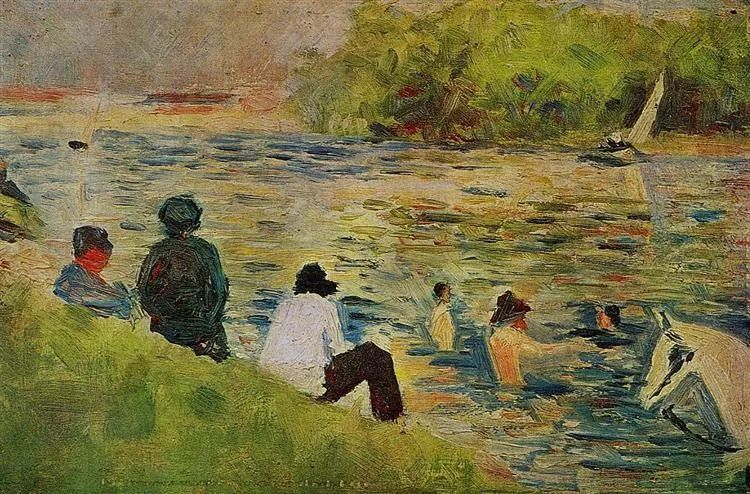

Georges Seurat，The Bank of the Seine

  

连叔您好，

  

关注您公众号挺长时间了，一直默默看您的文章，吸收您的正面思想。这两天我有一个小困扰，跟身边朋友倾诉了还是不痛快，所以想到了您，因为您总能给予我们开导与启发。就算无回复，我也想跟您倾诉一下。

  

我是90年的我老公89年的，都是从农村上大学出来在北京工作，全家人租住在这里。这些年靠我们的努力和省吃俭用（省吃俭用有点夸张不过差不多，不敢大手大脚），目前在天津和老家市里各有一套房，今年又有了二胎。公公婆婆生老大时就在这儿帮忙看孩子（公婆从老家来，无收入也基本无存款，公公还有病干不了什么）。

  

老公有一个妹妹，95年的，前年本科毕业来北京就一直跟我们住在一块。她在北京找了一个小财务的工作，每个月挣三千多块钱，竟然也一直干了下去。期间我鼓励她换工作或者提涨薪，但是不了了之。老公也着急他妹妹，觉得来北京也不奋斗，挣这么点钱看她也没啥想法，但是老公没有正面跟他妹沟通过，他们全家人性格都不爱沟通。我们都明白，她跟我们生活在一起，有吃有住的没啥压力，三千多块钱就足够她自己花了。没压力就没动力嘛。虽然她也想有所改变，但是很难迈出脚步的，尤其是性格温吞的人。      

  

老公妹妹这一住就是两年多，时间一久我有点儿不乐意，我们压力也挺大的，上有老下有小还有两个房贷和一大家子的开销，一大家子挤巴巴地住在一起。最主要的是，她应该自己闯闯了，锻炼锻炼独立自主的能力和与别人沟通接触的能力，每天除了上班就老是我们一家这几个人，她也没什么爱好没什么社交，这样下去不是办法。

  

前几天他妹妹打算辞职回老家市里，觉得在北京挣不到什么钱，想回去考个公务员或者事业单位（她在北京一直有看书看资料）。我们都支持她，如果能考上当然很好。然后，我的困扰就来了，因为她回去要住在我们市里的房里！这是我的婚房，从找房、看房、买房、办手续、装修、买家具家电、布置全是我和老公跑前跑后弄的，我公婆在村里她们也不懂，也没出钱。当时他妹妹还在念大学，也没出过一点钱一点力。这个房子我总共只住过两次，加起来还不到十天，平时就是给老公妹妹有事回市里或公婆偶尔回老家落脚住一住。现在她要回去发展了，就是长期住在里面了！我崭新的房子，我自己都没住几天呀。要是过渡住一住我没意见，但是这一住到啥时候都不知道。婆婆有次还说要在这个房子送她女儿出嫁不从村里，我其实是不愿意的，我的女儿我才让她从我房子出嫁呢！现在我在打这些字，想想就心里不平衡，我辛辛苦苦建造的家园，就要被别人占用了。最主要的是，又给她提供了温床，要什么时候才能自立自强！一辈子都要我们帮助她吗。自己不立起来，将来还要靠我们多少！

  

我心里不愿意，但是又不好拒绝，毕竟公婆帮我看孩子，我应该照顾她女儿似的，而且我老公也愿意让她妹妹去住，他比较护着他妹，他是个大好人吧，平时自己有点东西很愿意拿出来给全家人。我要是反对估计家里得闹矛盾了。我只能忍了吗？

  

我们从认识到结婚到买房、生娃，我没拿过他们家什么。这几年我和他一起努力，我想当一个好媳妇、好嫂子，尽量让家里和谐尽量照顾着大家，可是每次只要关乎于他家人的事就把我的意见和感受摆在次要，好多回了。心里真不痛快。

  

您说我该怎么办？我老公是不是就是凤凰男？

  

RB

  

* * *

  

RB：

  

你们夫妻走在正确的道路上，踏实节俭，积攒财富。我也可以看到你们光明的未来：最后在北京拥有房子，把两个孩子培养成像你们一样负责任，有韧性的人。这可能还只是你们人生成就的低点。雪球滚大到一定程度，突然的爆发，其高度是难以预估的。所以，一般孩子，要像你们一样，不怕白手起家，每一分钱都是自己挣的，是值得自豪的事，也能令自己增加力量感。

  

你小姑子让你不舒服，本质上并非她占了你们的便宜。看得出来，你是慷慨的，宽容的人，并没有多少人能够忍受她在自己家寄居几年。因为她并不自立，也无进取之心，这种本性的不同，令你气恼。按你的性格，在北京有落脚点和家人的支持，那一定会走得比别人更快更好。她非你同类。人性是这样的，对我景仰的、欣赏的人，可倾囊相助；对我鄙视的、厌恶的，拔一毛都痛苦。你现在就被这样的人性折磨。

  

确实，有些人若不是家人，多瞧一眼都不可能，但他偏偏就是家人，又非大奸大恶，不能一刀两断，必须相处一生，有两个原则可消除烦恼：

  

一是简单的术，两害相权取其轻。你小姑子住在你北京的家里和住在你老家的房里，后者的伤害小得多。老家的房子，你自己不住，也不出租，小姑子住，你没有经济损失。她不住房子也会旧，十多年后，也得重新装修。再说了，这也是还公婆替你们带孩子的人情，有这种轻松还的机会，何乐而不为？

  

二是复杂一点的道，强者有帮助他人的“义务”。这义务打了引号，法律上并没有强制，强者完全可以不帮助他人。但人强到一定程度，却会主动承担起这义务，在不影响自己小家的情况下，你愿意伸手拉人一把，主要是从自己的家人开始拉起。他们可能并非同类，是陌生人，你绝不会管，但他们运气好，有你这样的家人。所以，你得恭喜他们，同时庆幸自己不是被拉的。能力再大一些，你的帮助就会超出家庭的范畴。人生本来就有归还这个程序，人有一死，我们从这个世界得到的恩惠，财富也罢，智慧也罢，你得还给世界，这样才不会患得患失。得我们恩惠的人越多，说明我们所得也越多，这是乐失乐得。

  

祝开心。

  

连岳

  

推荐：[人为什么活着？](http://mp.weixin.qq.com/s?__biz=MjM5NDU0Mjk2MQ==&mid=2651647000&idx=1&sn=3182990cc7a25a07ab0257bdac36a01d&chksm=bd7e68068a09e1100f97fc68169fd49e29ca11e90e7265b05ee9475f1a620eed7f4aae07b0cb&scene=21#wechat_redirect)  

上文：[尽](http://mp.weixin.qq.com/s?__biz=MjM5NDU0Mjk2MQ==&mid=2651647437&idx=1&sn=853cd1788a0b7dd48c09a4d6646dc3d4&chksm=bd7e69d38a09e0c5dc3181bf7d349e237ddeffc19a486962fad2cd28f9eaafa97f2f20a5b2e3&scene=21#wechat_redirect)
