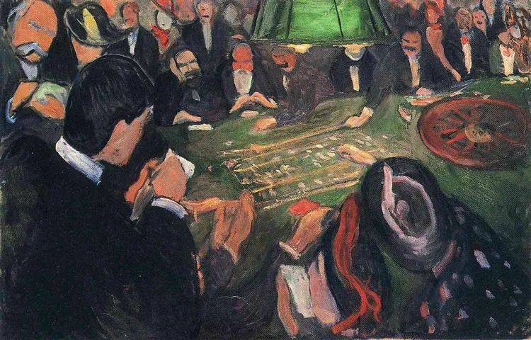
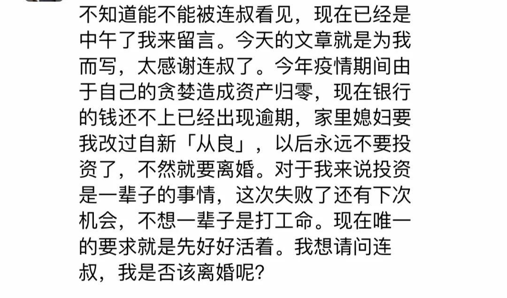

  

Edvard Munch，By the Roulette

  

上面这位投资者，我建议他离婚。为了他的家人好。

  

合格的投资者，犯的最大的错误，不过是买贵了。其实这并不是错误，投资中，买贵是经常发生的，但好资产本身的成长性，很快会弥补这些“损失”，时间一拉长，买入时多花的一点成本，完全无所谓的。所以，合格的投资者，资产不可能被清零。

  

投资，既是非常安全的，也是非常凶险的。

  

说它安全，那是因为中国是最佳投资地。疫情以来，尤其证明这点。在这里并不需要一个人特别聪明，按部就班即可，工作，积蓄，买入资产，几十年后，生活就可处于富足状态，即使人的寿命越来越长，退休后还有几十年，但因为有资产性收入，也无匮乏之忧。

  

说它凶险，因为资产不过一串数字，只要错一次，就可清零。这种清零型“投资者”，你岁数越大，会见得越多，因为他们的凄凉的晚景让你印象深刻。他们并非不聪明，也不是没有机会，甚至一度还得到很多，但只要输一次，再大的数字乘以0，都等于0。

  

清零型投资者的思维缺陷，就在于他们投资前，从来没有考虑过“万一最坏的情况发生怎么办？”他们的脑子里只有一片光明，不停地上涨和翻倍。这种思维力甚至弱于赌徒，赌徒都知道自己下的注极可能输掉。

  

最坏情况一定会发生。不是这次，就是下次。不在预料之中，就在预料之外。如果没有充足的准备，再正确的投资，都可能清零，只要超出你能力，用了承受不起的杠杆，事情一朝坏的方向发展，就成雪崩之势，你的一切都被剥夺。情况再坏，一两年就会过去，人人都知道冬天之后是春天，但在冬天清零的人，就永远停在冬天了。  

  

如何成为一个安全的投资者？那就是成为一个负责任的人。做任何一次重大投资前，问问自己，最坏的情况发生，家人的温饱、住房、教育与医疗，是否仍然可以得到保障？保障不了，那看起来再美的机会，都不是你能参与的。  

  

有人说，如果我考虑家人这些需求，我就没有多少资本了。这种事，你得换个角度想，你能力如此一般，都有人爱你，有人投胎到你家，你不是更应该感恩吗？怎么能用他们的幸福与安危去赌？  

  

家庭责任感，是一个人最好的标志，也是一个人最好的财富与运气来源。没有的人，就不要成家，成了家赶紧离。你赌对发达了，搞三搞四，抛妻弃子。你赌错破产（最后总会发生的），家人倒有受苦的份。

  

这种人，真是太让人瞧不起。不要成为这种人，也不要和这种人合作。

  

推荐：[卵巢彩票一代的成长模版](http://mp.weixin.qq.com/s?__biz=MjM5NDU0Mjk2MQ==&mid=2651644723&idx=2&sn=ab8b7c236b663f775a6d01a4e7041ca1&chksm=bd7e672d8a09ee3b233c0000efaa65d651c2a6be0e283dee46b527fc9cf5eeca341b1fd9305b&scene=21#wechat_redirect)  

上文：[这可能是让小三界无语的小三](http://mp.weixin.qq.com/s?__biz=MjM5NDU0Mjk2MQ==&mid=2651645501&idx=1&sn=43101bddfc18d185547848c7b813f9ad&chksm=bd7e62238a09eb356b804a26733c0b866744af441dbc19306aaa78b2ec6dcdb8a54b21c4094f&scene=21#wechat_redirect)
