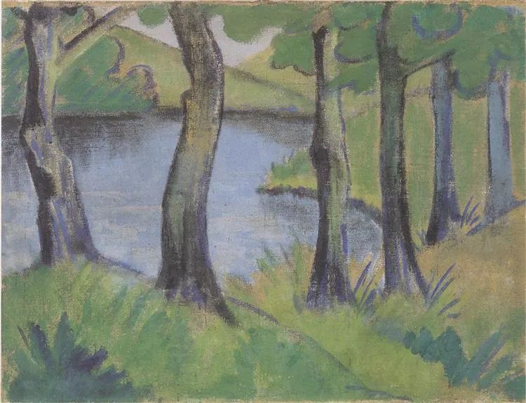
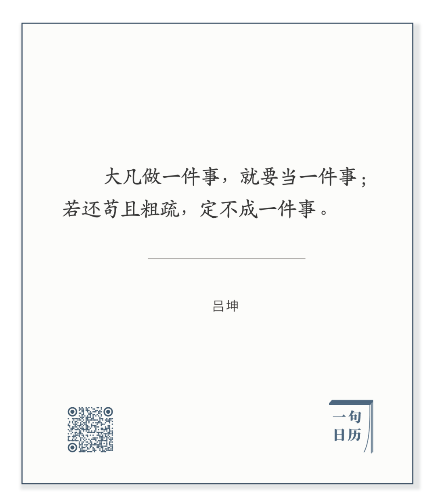

  

  

Otto Mueller，Waldsee

  

孔夫子说，好的艺术（可能也比喻好的人生），其内容，尽善，其形式，尽美。  

  

尽善尽美，只是理想状态，再善再美，未来也有更善更美。“尽”是追求，不停逼近，永不厌倦。  

  

所以，今天推荐下面这句话：

长按二维码可关注  

  

手中的任何一件事，把它当成一件事，尊重它，想办法做得更好，就是“尽”的追求。这是责任，是创新，也是进化。每次多做一点，做好一点，早准备几分钟，再检查一次，并不难，但善与美必在生长。  

  

我尤其尊重与佩服那些能把“所有人都会做的事”做得更好一些的人，那是真功夫。总想着大计划，一举成名，经手之事却苟且粗疏，那只有花架子，不知美，也远离善。  

  

有套书，我放在卫生间，每天随手翻一翻。其内容，早就是中国人的共同文化遗产，不受知识产权的限制，它是《声律启蒙》《千家诗选》《楚辞选》《宋诗选》《山水田园诗选》（前三本还入选了《教育部基础教育课程教材发展中心中小学生阅读指导目录》（2020年版））。

  

这套书的特点，是为这些尽善的内容找到尽美的形式，将文字一一对应吴冠中、齐白石、黄永玉、傅抱石的画作。每看一页的感觉就是，这些字和画，是天生的灵魂伴侣。再分开看字与画，就觉得它们孤单了。

  

只要更努力一点，寻常的事情，突然变得非凡。事情往往就是这样。看的人觉得轻松，做起来才知道“尽”的追求并不容易。

  

所以，什么事都要做，做时想着再进步一点。这就是尽善尽美之路。

  

  

今天是第140期“下周很重要”，以“尽”的心态拟定并完成自己的计划吧，美在其中，善在其中。  

  

推荐：[不停即可](http://mp.weixin.qq.com/s?__biz=MjM5NDU0Mjk2MQ==&mid=2651646940&idx=1&sn=100b2729ca73b7a287736d1fbc3018a2&chksm=bd7e6fc28a09e6d4a9139c37ce2a6d976538b89ed9aacbf81068f7f23a8ebadeea71d6ed0617&scene=21#wechat_redirect)  

上文：[你最爱谁，你就和他吃过最多饭](http://mp.weixin.qq.com/s?__biz=MjM5NDU0Mjk2MQ==&mid=2651647387&idx=1&sn=4fe7165cfae95fcbaad87a2f8617c2b9&chksm=bd7e69858a09e093d19e962081bb45910d49cfc623782d5b1d5143f10547600b58c419618e07&scene=21#wechat_redirect)
