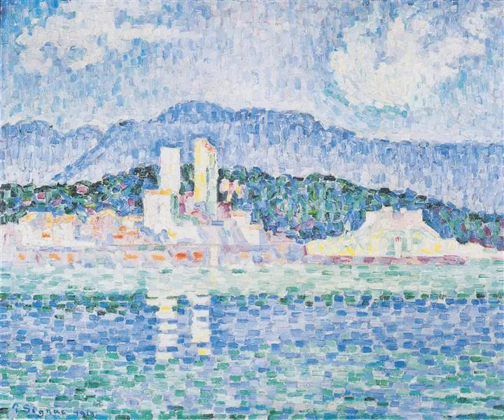

  

Paul Signac，thunderstorms

  

连叔：

  

我老公和我都是你公众号的粉丝，一直想给你写信却不知道从何说起。

  

我跟我老公在一起二十年了，中学一直到现在，期间经历了很多事情，大学，工作，直到后来孩子大病，家人离世，中间种种不足为外人道也，但是从未想过两个人会分开，也算是交过命的夫妻了。

  

今年疫情无聊的时候他联系了一个十几年前的女同学，也算是大学出轨的对象吧，对方之前也是我的朋友，当时跟她分开也是他自己的选择。我在国外，没有干涉他的决定。但是现在这次联系上，在网上聊了两个月在没见面没通过电话的情况下，从简单的聊天变成精神出轨被我发现，事情过了三个月我以为他放下了，结果又被我发现想联系，本来也以为他只是好奇，结果他却按捺不住全盘托出，说觉得一想到不能联系她接受不了，想过要离婚跟她在一起，对她是真爱，对我是亲情之类的话。我已经震惊到无话可说了。说实话，在这之前我从来没有怀疑他对我的爱，虽然嘴上会抱怨他不爱我，但是我知道他哪怕在睡着的时候，只要感觉到是我，也会下意识地紧紧搂住我。

  

在我心里，他是一个道德水准很高的人，工作关系认识很多美女，但是都不会多看一眼，这样一个人，聊天聊了两个月，竟然心甘情愿要去破坏别人家庭和自己家庭当小三，难道真的就是真爱的力量吗？

  

按说这个年纪，可能有人会忍下去吧，但是我实在受不了这种羞辱，还是决定离婚了。只是我想知道，他追求的真的就是真爱吗？

  

如果有机会希望能在公众号登出来，相信他会看到的。

  

檬

  

* * *

  

檬：

  

早上看到你下半夜3点发的邮件，一时无语。我能帮你的，就是和你说几句话。也把你的邮件登出来。

  

我很佩服你快刀斩乱麻的意志力。即使他倒回来求你，我估计，你也不会回头了，因为，经过这事，你已经不再爱他。

  

人是会变的。这是人生有趣的地方，因为你不知道一个人会变得多好，多强大。这也是人生残酷的地方，因为一个人有可能变得很坏，很脆弱。这也是爱情的最大风险，最怕一起走完半生，爱过的人却变坏了。

  

他是不是追求真爱？这已经不重要了。人到中年，力量慢慢消失，有些人就会撩拨别人，以证明自己尚有魅力。可能打着爱的名义，但实际上与爱并无太大关系，是死亡恐惧。所以，人要有点更高的追求，人是智慧动物，知识与作为可以一直增长，感受它们的力量，每天都有意思，犯错误的时间都没有。

  

你当他死了，就好理解。这样，你不会怀疑他曾经爱过你，也能更好地规划未来。

  

他也确实是死了。你不会再爱他，你如此干脆地放弃，或许那个她也觉得他食之无味。无论如何，玩这么一出，他的信用是破产的，没有多少人，会再把他当回事。

  

今天好好补个觉，开始自己的新人生。

  

祝开心。

  

连岳

  

推荐：[假如生活欺骗了你](http://mp.weixin.qq.com/s?__biz=MjM5NDU0Mjk2MQ==&mid=2651639876&idx=2&sn=54974b1eab7825a707b97b493f0dc04a&chksm=bd7e545a8a09dd4cb52aa09e960e12fb90e7f424faa071bef62432fbca444a1161a063dccc25&scene=21#wechat_redirect)  

上文：[能克制，但不要太洁癖](http://mp.weixin.qq.com/s?__biz=MjM5NDU0Mjk2MQ==&mid=2651646640&idx=1&sn=1112c62de98e2b1f5e174014817b1bd0&chksm=bd7e6eae8a09e7b894a6ff71e9d936833b10886a54db0af3fd4f6e542adaa629f1065d855eff&scene=21#wechat_redirect)
