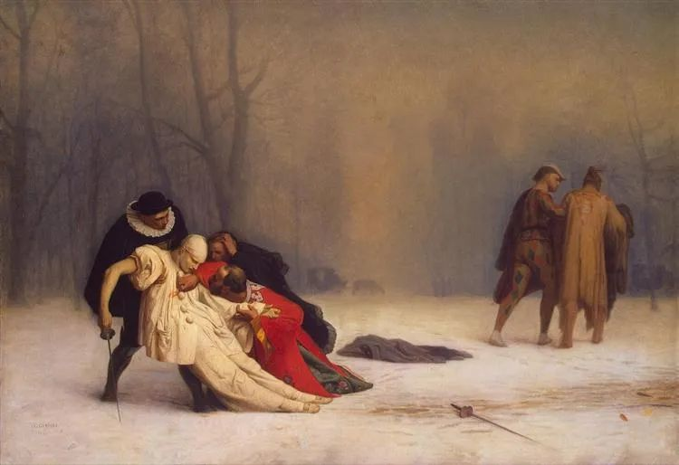
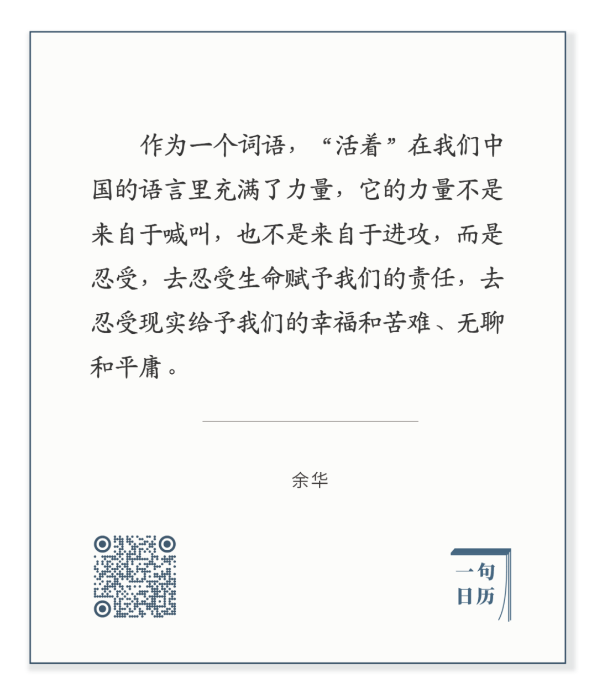

Paul Serusier，Seaweed Gatherer

  

长按二维码可关注

  

活着，是乐观主义，是解决问题的根本办法。

  

心理学家[维克多·弗兰克尔](http://mp.weixin.qq.com/s?__biz=MjM5NDU0Mjk2MQ==&mid=2651642780&idx=2&sn=ea14ca3f8ceeb84add553bbbfa301f4f&chksm=bd7e5f828a09d694ff0864711df23cf5932657d8719badc60acfa179180dd5f2958f8f6db737&scene=21#wechat_redirect)发现，在纳粹集中营里，死亡的主要原因是“不想活下去”，这种绝望情绪将导致囚犯在48小时内死亡。而他在这种绝望之地为每天活着找到理由，我爱一个人，我必须为她在今天活着，明天来临，就为她在明天活着。

  

在日常生活中，我们的挑战并不会如此残酷，但也一样天天有，不是大问题，就是小问题，总会碰到，有些马上有解，有些暂时无解。只看到这点，人难免灰心丧气，甚至悲观绝望，以为人生没什么意思。

  

这时候需要看到另一点，随着你能力的加强，再加上技术的进步，问题都可以解决。你要做的最重要的一件事，就是活着，今天，明天，1万天，3万天，更多天，健康的、热情的、充满求知欲地活着。  

  

[戴维·多伊奇](http://mp.weixin.qq.com/s?__biz=MjM5NDU0Mjk2MQ==&mid=2651645255&idx=1&sn=b174aaad482b07e636ac08e4a7bd00ec&chksm=bd7e61598a09e84ff9e66017e910a0a43364140643de5a5c9407a0467fe97b2d0f076c181e33&scene=21#wechat_redirect)（David Deutsch）说过一个寓言：

  

有个哲学家被暴躁的国王判处死刑。他请求缓刑两年，理由是，在这段时间里，他可以教会国王的爱驹说话。国王很好奇，答应了他的请求。  

  

哲学家的朋友们完全不信他能完成奇迹。  

  

哲学家说，重要的不是这点，而是时间可能解决问题。这两年里，我可能死了，这不用忍受刑罚的痛苦；国王可能死了；国王可能改变主意了；我可能逃脱了；我可能真找到办法让马说话；当然，马也可能神话一般自己说话了。  

  

只要你相信问题能够解决，活着就是大乐趣，大资源，大方法。  

  

今天是第136期“下周很重要”，制订下周计划，解决你现在面临的一个问题。问题让我们寻找方法，它不是烦恼之源，而是能力之源。

  

推荐：[请记住那些对你好的人](http://mp.weixin.qq.com/s?__biz=MjM5NDU0Mjk2MQ==&mid=2651644885&idx=1&sn=c61909d847a433bb0929f36be7caf0df&chksm=bd7e67cb8a09eedd4fc543804dbb901518e5e14b330438f9046fff7556687a4bb364d45c4e9c&scene=21#wechat_redirect)  

上文：[说说李登辉](http://mp.weixin.qq.com/s?__biz=MjM5NDU0Mjk2MQ==&mid=2651645310&idx=1&sn=83358a00aabb1610a9b4e98c51a4f9a6&chksm=bd7e61608a09e87607a0dad7814b5f4d4574b47df95359cac42e9f7cfc26603897a0dae69c3c&scene=21#wechat_redirect)
