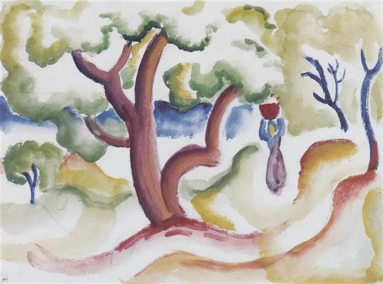
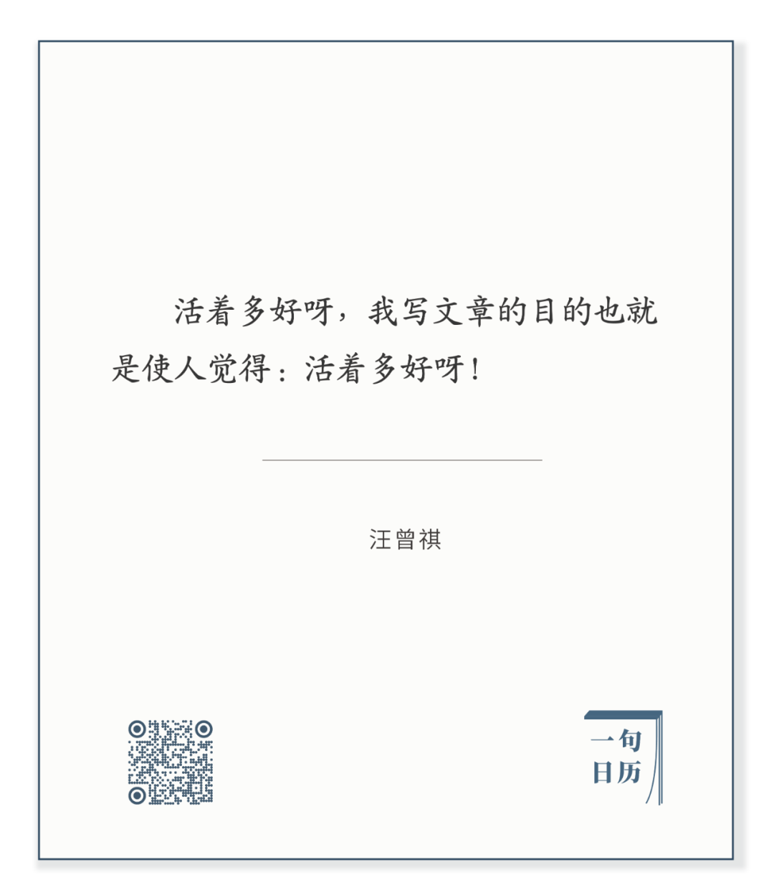

  

August Macke，Woman with pitcher under trees

  

今天推荐汪曾祺先生的这句话：  

长按二维码可关注

  

你可能觉得，这么简单的一句话，好在哪里？

  

好在你活得越久，越觉得它好。好在它是对生活的一种正确信仰。你有这种信仰，你就能活着，你就能活好。你的观念引领你的生活。

  

汪曾祺先生的散文与小说，笔下的人与事，原型都来自他记忆中真实的人物，只不过小说中的人物，可能把多个真人的特征揉合到一个人身上。写些虚幻的东西，写得美好是容易的，但要真实，难度就大很多，又要像，又要美好，你的心眼不好，你看不到这美好，你的文字不好，你写不出这美好。

  

汪曾祺先生两者都好。  

  

你看他的《大淖记事》，故事背景在上个世纪上半叶，里面多少苦人，被欺负，被侮辱，被打被杀，但看完，你看这些苦人多坚韧，春风吹又生，生了就开花结果，用生命力战胜一切苦厄。看完你的生命力也会被点燃。这是多好的文字。

  

这种风格贯穿他所有文字，包括写实的散文。汪曾祺先生一生吃过不少苦头，文字要变得愁眉苦脸，深仇大恨，也没人怪得了他。他就是一个美好而快乐的人，自然而然就发现一切美好而快乐的品质，在自己身上，在他人身上。活着多好呀，世上有好吃的，好玩的，还有好人。

  

一个人未必有汪曾祺先生的文字能力，但对美好生活的信仰，可以像他一样强大。我们必须记住，自己有责任让身边的人，尤其是自己的孩子，当他们接触过我们之后，觉得，活着多好呀。

  

今天是第138期“下周很重要”，请制订你下周的美好计划吧。  

  

推荐：[黄道，白道与黑道，道道相通](http://mp.weixin.qq.com/s?__biz=MjM5NDU0Mjk2MQ==&mid=2651645885&idx=1&sn=e55e770f59503c6d2429e0574b467882&chksm=bd7e63a38a09eab58dcae0e82c9136f04f29c16f84ae50c7d689068297d39ae1f4791bef3037&scene=21#wechat_redirect)

上文：[宁作“社畜”，不作“家畜”，女性不宜中断职业生涯](http://mp.weixin.qq.com/s?__biz=MjM5NDU0Mjk2MQ==&mid=2651646338&idx=1&sn=34919b32abfe4313b2b9a1bafa81c90c&chksm=bd7e6d9c8a09e48a92e63e58d46baccad59ecb3942a4131646141dbafd2028e6d1cd5f1b7898&scene=21#wechat_redirect)
