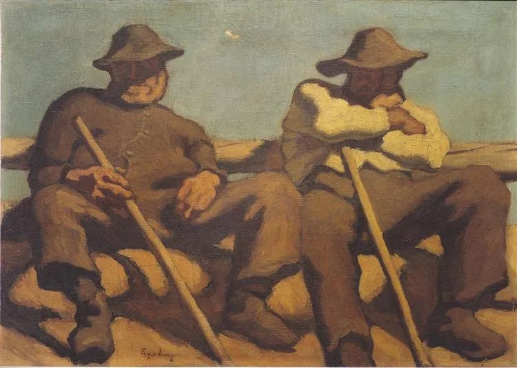

  

Albin Egger-Lienz，Resting Sheopherds

  

工作的重复，很容易让人误解为不好，然后极力逃离，像这样朋友一样：

  

  

他当上了老师，将发现老师也是每天重复，当的时间越长，重复得越厉害，一生只在重复一套教科书。

  

很多人厌烦工作，也主要由于其重复性，显得无聊，总觉得别人的工作可能更有趣，天天花样翻新。有时就生出怀才不遇之感，以为自己是做大事的，随便应付工作，演变成小事不愿做，大事做不了。

  

认识到重复性的重要性，人就不这么想了。

  

你看一棵大树，它的结构和小树一样，叶子，枝桠与树干。只是叶子是小树的万倍多，树干是小树的几十倍粗。小树只要需要站在原地，天天重复，慢慢增长，就会变成大树。

  

农业是人类的伟大发明，人们发现在固定的耕地上，每年只要重复春种、夏耘、秋收、冬藏，就能够养活自己，这工作比起狩猎，无聊得多，但是效率更高。

  

工业社会，人们用机器代替肉体的力量，产品的重复周期短得多，生产线源源不断地吐出产品，工人的工作，更是体现为简单的重复。重复得慢一点的农业，在回忆中变得优美。

  

在现在的信息社会，信息的复制，瞬间可成，重复得更快。更多的工作编码成信息，效率就越高，永无止境。  

  

其实，一个人应该爱重复。你每天重复的事，就是你的竞争力，即使是事务性的工作，想要把它做得更好、更高效、更优美，自己更快乐，其中的创造性也是无穷的。事务性并非没有创造性。  

  

而创造性的工作，没有大量的重复为基础，也无从谈起。我年轻时，若没有听到卡尔维诺的一句教训，走不到今天。他说，如果你只等灵感，就什么也写不出来，写作者要像铁匠木工面包师，每天干活，不停重复，只有忍受这辛苦，灵感才会出现。写作者没什么睡懒觉、喝大酒、游游逛逛的特权，得视自己为苦力，守纪律，流大汗，每天老实做事。  

  

创作者的重复性甚至更强，中国的孩子，在初中都背过孔夫子说的，“学而时习之，不亦说乎？”“温故而知新，可以为师矣。”学习的核心是不停重复，在重复有新体会，新发现。没有重复就没有学习，也没有创作。可惜这两句话的价值，有人一生未必能够理解。

  

你不尊重重复，不爱重复，你就不可能爱任何一个工作，再好的工作，你也不会有作为。  

  

推荐：[为什么富不过三代？](http://mp.weixin.qq.com/s?__biz=MjM5NDU0Mjk2MQ==&mid=2651644604&idx=1&sn=f659528e839367b7f81a68904278cf0d&chksm=bd7e66a28a09efb4d3402d9ed4c598002ad267b9f97d444e420bf1c99659d8d0ba4058084a94&scene=21#wechat_redirect)  

上文：[当他死了](http://mp.weixin.qq.com/s?__biz=MjM5NDU0Mjk2MQ==&mid=2651646701&idx=1&sn=7461263b238589155a8783d4a520880e&chksm=bd7e6ef38a09e7e503d27540e554e65bf1f2aa7bef593b06f8da4e714280f1f1ad7f2141cf32&scene=21#wechat_redirect)
