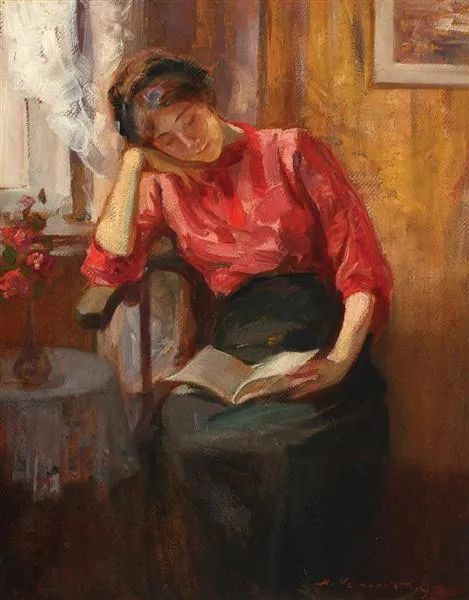

  

Nicolae Vermont，Reading

  

人总是盼望得到爱情的，不然就没有七夕传说。

  

当然，也不是每一个人都能够得到爱，如果爱这么随便，更不会有七夕传说。

  

爱需要一定条件。窈窕淑女，君子好逑。窈是心灵美，窕是身体美。来逑的也是君子，不是小人，小人也馋，但小人没资格爱。古人就知道，爱是好男好女之间的彼此吸引。

  

一个人无能力，不负责，言而无信，邋里邋遢，怎么可能得到爱？但是你有能力，负责任，言出必行，干干净净，也未必一定有爱。

  

爱和其他一切事物一样，是个概率问题，有失败，有失意，大多数人失恋过一次或多次，有人甚至付出婚姻失败的成本，最终才学会爱。伤心、失望、流泪、受伤，这些看起来负面的因素，其实学习爱的代价。你学走路，学功课，学技能，都会经历这些负面，你能接受，哭完继续，因为你知道它是必然的。而一切换到爱情这个主题，为何就忘了？受一点点挫折，甚至根本没有恋爱过，只是看了几条渣男渣女的社会新闻，就吓得浑身发抖，宣称世上没有爱情，成为一个悲观主义者？这本质上是一种撒娇，像小朋友哭着不相信世界，给颗糖就重拾信心。你哭着否定爱情，爱情却不会给你一个佳人，你爱哭多久就哭多久，爱情只给相信它的人。

  

波普尔说过，乐观是人的责任。乐观是人的知识积累足够后的必然。乐观的人才能够去直面与解决问题，他因此增加能力，并获答案的回报。

  

你必须是一个爱情乐观主义者。你要相信爱情，你要相信自己有爱情。这样你得到爱情的概率就更高。你不相信爱情，那就肯定没有爱情，就算走运了，别人主动爱你，你也不会珍惜，觉得那只是虚幻，甚至恶意猜测别人另有所图。没有任何美好的情感能在这种被动的、恶意的环境中存活，不相信爱情的人，最终一定如愿，失去一切爱。

  

请相信爱情，这是得到爱的第一步，没有这一步，就没有爱的无穷步。

  

推荐：[我爱你，但你不许屈就我](http://mp.weixin.qq.com/s?__biz=MjM5NDU0Mjk2MQ==&mid=2651635089&idx=1&sn=4d0e7e3b45b9c3d4da51048d4c1699b7&chksm=bd7e398f8a09b099e816d6ec4476d1bb9ee2dd15555987b676d21e259fefd5d98df220af4be8&scene=21#wechat_redirect)  

上文：[答女儿](http://mp.weixin.qq.com/s?__biz=MjM5NDU0Mjk2MQ==&mid=2651647047&idx=1&sn=5c75a67fbc13ee3e47adb5a3f7462e96&chksm=bd7e68598a09e14ff0e8c43797f6cdd5b3823e0d797248ffd842502a5418ed7c644ceea66e04&scene=21#wechat_redirect)
