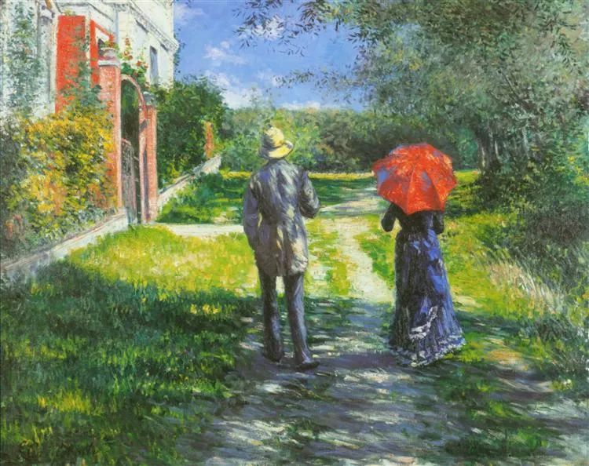

  

Gustave Caillebotte，Rising Road

  

连叔，

  

人为什么要结婚？

  

这是隔壁美女同事问我的问题，这个问题真把我问愣了（我们都刚大学毕业在体制内工作）。

  

老教师说结婚是为了传宗接代，女生结婚是为了完成生育任务以后有人养老。这可说服不了我们。

  

我本来有些回避性依恋，看你的和心理学的一些文章，才刚想要鼓起勇气，趁年轻抓紧时间去爱。

  

可是人为什么要结婚呢？不知道如果是你自己的女儿，你会怎么回答这个问题，你希望婚姻能给她带来什么呢？

  

女儿

  

* * *

  

女儿：

  

女生应该考虑这个问题。这个问题的提出，本身就证明女性地位的提升。

  

女性地位低时，你非结婚不可，无论想不想得通，有没有爱，到了年纪就嫁人，从父母家换到丈夫家，继续干活。不然你就活不下去，你是文盲，又没有工作机会，再多不满也得忍。

  

现在中国女性有了教育权和工作权，有能力的很多。对于她们，歧视女性的观念，除了听起来不痛快以后，实际上已无杀伤力。她们想怎么活，就能怎么活。也因为如此，婚姻的理由不再唯一，它不再是不可挑战的教条，每个人都可以有自己的想法。当女性无法被强迫时，就只能用理性达成婚姻这个契约了。

  

传宗接代，养孩防老。一直是传统的婚姻理由，是主流。现在听起来不那么酷，但也是正当的理由，一个人因此去追求婚姻，无可厚非。我就是喜欢生孩子，为了实现这个目的，我甚至可以忍受一个不那么爱的男人；我努力抚育孩子，希望在我衰老时他给我情感和/或经济上的帮助，有什么不可以？难道不是一个人的自由吗？

  

你认为传宗接代并非必须，对自己的老年生活有信心（甚至无所谓），也是你的自由，也可以，这只是偏好，萝卜青菜，各有所爱。全世界爱萝卜，你独爱青菜，也不是罪。事实是，有些身份也是拒绝婚姻的，比如僧侣。一个人过于痴迷自己的事业，以至于没有时间与兴趣陪伴家人，我认为他也不应该有婚姻。

  

但是人会爱人，这是人最有趣的本能，就像我们爱夏日的清风，爱蓝天的白云，一朵花都能打动你的心，何况是一个美人？

  

你爱上的人，就是美人，你觉得他特别帅，有说不完的话，怎么都腻不够，舍不得睡着。你喜欢他，怜惜他，崇拜他，有时气他厌他，但总是想紧紧地拥抱他。和他在一起，你更美，更坚韧，更快乐，更幸福，更智慧。你们互相依赖，互相成就，像蓝天衬托了白云的白和轻逸，而白云又指示出蓝天的蓝与纯净。此时，你想，我们必须永远在一起，同甘共苦。这就是婚姻最酷的理由。

  

婚姻是爱自然而然的结果，认真去爱，爱能给你最好的答案。

  

祝开心。

  

连岳

  

推荐：[当他死了](http://mp.weixin.qq.com/s?__biz=MjM5NDU0Mjk2MQ==&mid=2651646701&idx=1&sn=7461263b238589155a8783d4a520880e&chksm=bd7e6ef38a09e7e503d27540e554e65bf1f2aa7bef593b06f8da4e714280f1f1ad7f2141cf32&scene=21#wechat_redirect)  

上文：[人为什么活着？](http://mp.weixin.qq.com/s?__biz=MjM5NDU0Mjk2MQ==&mid=2651647000&idx=1&sn=3182990cc7a25a07ab0257bdac36a01d&chksm=bd7e68068a09e1100f97fc68169fd49e29ca11e90e7265b05ee9475f1a620eed7f4aae07b0cb&scene=21#wechat_redirect)
