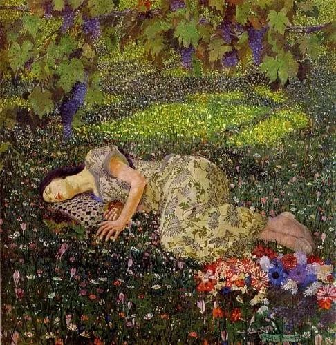

Felice Casorati，Dreaming of Pomegranates

  

连叔：

  

我是一个正在考研的大四学生，也是您的忠实读者，最开始是我男朋友把您的好思想推荐给我，自此几乎您每一篇文章我都有拜读，深深地被您的思想魅力所折服。最近我在考研和生活的路上遇到了一些烦心事，想听听您的意见。

  

我和男朋友都是农村普通家庭考到郑州读书，他去年本科211大学毕业直接参加工作，月薪7000，因为想早些赚钱养家，并尽快在郑州买房娶我。他是一个工作很努力认真的人，也很聪明，朋友很多，也很支持我考研升学历，以后从事教师相关岗位不那么辛苦。还和我是同乡，但就是家境不是很好，长相中等，身高174。

  

再说说我，长相自认为7.5分，身材身高都不错，在有男朋友之前身边从来不乏追求者。但我极少接受别人的爱意和礼物，和男朋友在一起后和他一起认真规划未来，主动拒绝所有异性，我很爱我男朋友，男朋友也是眼里只有我。按理说我们会这么平淡而幸福的走下去，直到我最近遇到了一个我“不太喜欢”的女生A。

  

A颜值身材大概7.5分，比我会打扮。她是那种极度聪明的人（我是这样认为的），在其他城市有一个很爱她的男朋友（也很帅气），在我们考研班也有一个男生一直对她随叫随到，有求必应。平时饭有人买，衣服有人收，水有人打......任何琐碎的事都有这个考研班的男生帮她做，而这个男生也有自己的女朋友，他们也都知道彼此的情况。但在旁人眼里，他们两个就是情侣。

  

平时有想要的名牌鞋子名牌化妆品只要她直接和男朋友说，也能很快拥有。与此同时，她也从不拒绝甚至主动接触其他男生，在我眼里她真是最大化的发挥出自己的性别优势，还有很多很多事例......

  

她的聪明能让她准确的处理好男朋友和其他异性之间的关系，让他们在各自的轨道里运行，且持续对她好，从不同的男生那里获取陪伴、爱、金钱、以及偶尔奢侈的鞋子衣服包包。她的这些行为，在以往我的价值观里是不允许的，但和她接触时间久了心底的阴暗面让我很矛盾痛苦，我接受不了她的价值观，但我不得不承认我有羡慕她的成分。很矛盾是不是这样的女生总是比中规中矩安安分分的女生过的好且得到的更多？我甚至不希望她考的比我好，但又打心底里觉得她这一生会过的比我好很多，至少在世俗的眼光里。

  

连叔，我知道我这样想有不对的地方，我男朋友之前知道我有这样的同学，也一直劝我合理远离。作为您的读者，我实在接受不了自己心底的丑陋一面，可我又总忍不住地去想这些事情，我该怎么办？

  

沉默

  

* * *

  

沉默：

  

你想利用自己的美貌，换取一些好处。这对年轻人来说，确实是个诱惑，得来太容易了，有意地释放一下魅力，给点暗示与希望，就有人献殷勤，给小恩小惠。

  

年轻，收入还低，消费欲望又强，包包衣服之类的，看得很大，其实都是一些小利。你以为靠这些小利可以过好一生，这是误算。人生天天收这些小利，累加起来，也没多少钱；再说了，美貌消失得很快，人不可能一辈子卖弄风骚，年轻姑娘（小伙）不幸染上这个毛病，到了中年以后，只剩卖弄的习惯，再无卖弄的资源，人生反而非常难走了。

  

孔夫子早说了，为政要防止两个错误，一是想走捷径，二是贪小便宜。这是人性的弱点，对聪明貌美之人，这弱点加倍放大。笨人、长相普通，想犯这两个错误，也没什么机会，反而容易踏踏实实长本事。短期看，是前者占便宜，但长期来看，孔夫子指出了后果：欲速则不达；见小利，则大事不成。为政与为人是一样的，这两个错误都不能犯。

  

爱美之心，人皆有之。美人总是会受到更多的关照。与此同时，也有更多的误解和抹黑在等着你。贪小便宜，收了不该收的钱与物，你其他努力很容易被抹杀，人们给你贴上“出卖色相”的标签，你百口莫辩。在世俗的眼光里，你钱多官大，光鲜亮丽，当然高看你一眼，多奉承你几句。你可能还不知道，世俗的眼光，也有残酷的一面，你经不起挑剔，墙倒众人推，一个人落入这种舆论陷阱，太辛苦了。

  

美人能保护自己的美，人美心善，那美是加分项。美人浪费自己的美，靠美贪点小便宜，信用缺失，专业稀松，美反而变成障碍。你还美时，人家小瞧你的美，给个三瓜两枣，你就得陪笑陪玩；你不美时，你努力也来不及了，你努力也没人在乎了。这样的人生，怎么会有意思呢？

  

祝开心。

  

连岳

  

推荐：[有强大，没强求](http://mp.weixin.qq.com/s?__biz=MjM5NDU0Mjk2MQ==&mid=2651633612&idx=1&sn=473ceb7749ecb41051d015eb7cbf52a7&chksm=bd7e33d28a09bac426f30bdd9a143e0e18996058a4dae62b16f45c63fd1b4a272aa03b912636&scene=21#wechat_redirect)

上文：[好好学习，解决问题](http://mp.weixin.qq.com/s?__biz=MjM5NDU0Mjk2MQ==&mid=2651646135&idx=1&sn=9fcdf3c8c55880a9d9d99d027f0150fa&chksm=bd7e6ca98a09e5bff11c43987c8261850e542fca4b7ae89984797e80ff8280efb7b973e73acd&scene=21#wechat_redirect)
