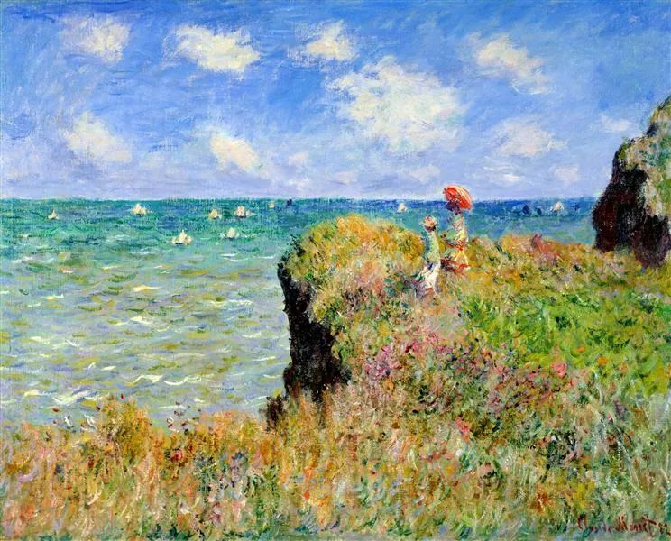

  

Claude Monet，Clifftop Walk at Pourville

  

有人问，老公的爱好就是打牌和打游戏，如何是好？

  

我的答案是，只要尽了工作与家庭上的义务，就没有问题。

  

打牌与打游戏，让人联想到浪费时间，不务正业和赌博，有些当老婆的，总是特别害怕老公沾这些，体现为特别洁癖，碰都不许碰。这引发许多不必要的家庭矛盾。妻子以为老公在堕落，老公很生气，我辛苦了一天，娱乐放松一下的资格都没有？双方立场南辕北辙，不吵都不行。

  

人是需要放松的。放松就是无负担，大脑和身体无压力，必须“浪费”一点时间。我的饮食是隔日断食，一天吃，一天除了喝水，什么也不吃。在吃的这天，我的收尾往往是2两酒，慢慢喝20分钟，什么也不做，什么也不想，享受那种幸福而安宁的状态。

  

在医生看来，任何一滴酒都有害健康。如果不停追求更多的酒精刺激，也会演变成酗酒，最终摧毁一个人的身体和工作能力。但以此为理由剥夺我两天喝一杯酒的放松，我认为那是轻视我的理智与自由。不高兴，不服从，那是肯定的。即使是连太，也没有这个权力。当然，她没有，她总是很开心地替我拿酒。

  

生活不能太洁癖，这是强迫症，要知道，我们需要某些可控的“有害”来获得快乐与满足，它也是奖赏自己的一部分。传统的打牌，新兴的游戏，包括宴饮和娱乐，都可划归为“浪费时间”，或说“不健康”，把它们都剥夺了，人生的每一分钟都斗志昂扬，那是病态，人撑不了多久就会崩溃。

  

从另一个角度看，老婆和家人要放心让自己打牌、游戏和喝酒，也得证明自己是有克制力的人，不像小朋友，无法收手。你确实是工作之余的放松，放松得刚好就停止。一个能理解，一个有克制，家和万事兴。

  

克制力是健康关系的关键。过于洁癖，其实也是一种不克制，是控制欲太强的体现，没有信任他人的能力。这容易杯弓蛇影，自己把自己吓得半死。老公摸一下牌，你就看到赌徒败光家产；他喝一杯酒，你就说他要死于肝癌；他请你吃大餐，你说吃太饱会三高。你好像都有点道理，总是抢到道德高地，但和你呆在一起有什么意思？就是不停地被纠正、被禁止、被怀疑，没人能忍受这点，你会把正常人逼成不正常，然后指着不正常的他说：你看，我担心得没错吧，你就是个不正常的人。这就成了怨偶，两人捆绑在一起，我强求你，你反抗我，不痛不快过一生，大家的人生都浪费了。

  

推荐：[活着多好呀](http://mp.weixin.qq.com/s?__biz=MjM5NDU0Mjk2MQ==&mid=2651646425&idx=1&sn=7b3631cdca24fb51d08884da4ee8ca03&chksm=bd7e6dc78a09e4d16c11941d3c3e2ea8d766320667be8b4fc5cc80a23635b9007a56a09f27e7&scene=21#wechat_redirect)

上文：[10%](http://mp.weixin.qq.com/s?__biz=MjM5NDU0Mjk2MQ==&mid=2651646579&idx=1&sn=3d9ce7268c127cd9ff315a2a68348ba0&chksm=bd7e6e6d8a09e77b212c7f018038bdfa6ae2e16e9857ec50a281d09b61ccb6ef0826610df00d&scene=21#wechat_redirect)
