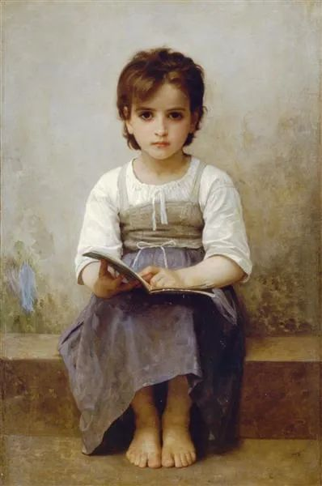

  

William-Adolphe Bouguereau，The hard lesson

  

今年高考，老牌名校南京一中惨败。对比发现，中考入学成绩只有589分的南京二十九中，远不如南京一中的631分，但后者高考高分段人数竟然是南京一中的两倍多。一些愤怒的家长在南京一中大门前举牌抗议。认为一中教学强度不足，过于强调素质教育导致孩子应试能力不足。

  

随后，南京一中宣布改弦易辙，对即将升入高二年级的学生正式开始假期补课。相比之前，这次补课时长有所调整，“学五天、休一天”变为如今的“学六天、休一天”，并增加了晚自习。此后，还有消息称，校方将重点研究培优计划，在保证整体提升的基础上，扩大尖子生数量。

  

这被舆论解读为“素质教育向应该教育低头”。

  

我认为，校方的改变是必要的，反而体现了名校的底子。再不改，高考连败几届，连锁反应就会发生，更难得到优秀生源，想重回“南京老四所”的一流阵营，千难万难。

  

脱离高考谈素质教育都是耍流氓。

  

高考不是完美的选拔制度，但却是目前最好的选拔制度。家境贫寒的优秀孩子，花费不多教育成本，也可通过高考进入名校，未来获得更好机会。

  

高考本身就是对素质的考核，而且是考核硬素质，数理化考得好，不够聪明，不够勤奋，怎么做得到？就是作文偶有误判的语文，考得好的，素质也不可能低。这些孩子进入一流大学，他们毕业后，成才率确实也更高，更容易成为各领域的精英。

  

所谓的应试，就是把一个人最难伪装的素质试出来。它和素质教育不是对立的。

  

一所学校，摸索出一套教育方法，别人学两天，你学一天，别人痛苦，你快乐，别人钻研课本，你琴棋书画，然后高考你还赢别人，那这是牛逼的素质教育，全中国的学校都要向你学习。

  

据我所知，目前没有一所学校实现这幻想。以后也不可能实现，因为它根本就是违反教育规律的。当然，我赞成有些学校继续做梦，表示“我校学生高考不行，素质却很高”，让家长自由选择，谁信这套，谁的孩子让他们教育，孩子从此与好大学无缘，也不要怨天尤人，快乐地接受后果吧。

  

推荐：[幸福而丰富的一生，就是六个字](http://mp.weixin.qq.com/s?__biz=MjM5NDU0Mjk2MQ==&mid=2651645764&idx=1&sn=a0de5f4558466e57d7bec4f5aa75a80b&chksm=bd7e635a8a09ea4c7b5a962ee4140ca0d978202d9276f859cfa5a9dffea8bb792d9f2e128cc3&scene=21#wechat_redirect)  

上文：[黄道，白道与黑道，道道相通](http://mp.weixin.qq.com/s?__biz=MjM5NDU0Mjk2MQ==&mid=2651645885&idx=1&sn=e55e770f59503c6d2429e0574b467882&chksm=bd7e63a38a09eab58dcae0e82c9136f04f29c16f84ae50c7d689068297d39ae1f4791bef3037&scene=21#wechat_redirect)
