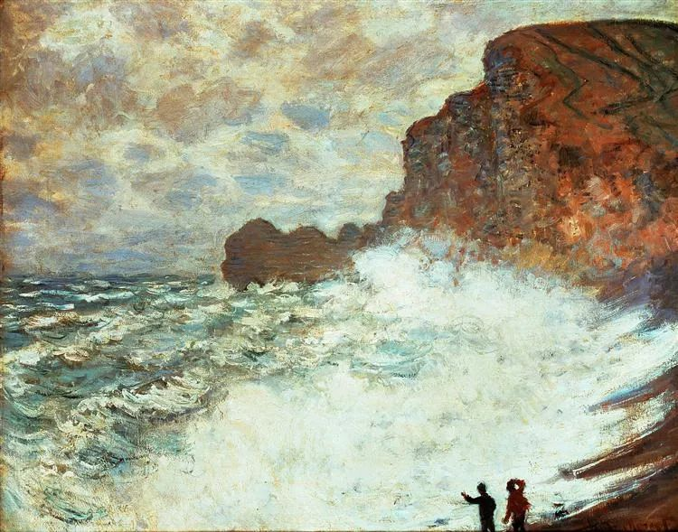

  

Stormy Seascape，Claude Monet

  

7月29日至31日，华为公司创始人、CEO任正非带队访问上海交通大学、复旦大学、东南大学和南京大学。对一些重要问题谈了自己的看法。最近几乎所有重要官方媒体都发布了这条新闻。足见其重要性。

  

任正非淡泊名利，与世无争，但却越来越重要。这地位是通过做实事，打硬仗得到的。这也是最好的企业家之路。想当出色的企业家，多多学习任正非就是了。炫富、刺激公众、炒作丑闻、自我吹嘘，这样的企业家都不难占据关注的焦点，不过，有什么价值吗？只会让人心生厌烦。

  

任正非这次谈到了几个点，都需要意志坚定，目光长远。比如中国的希望在孩子，要搞好教育；大学要为理想和好奇而研究，花几十年时间追赶世界理论中心；中国仍然落后美国，要有耐心在创新上一点点突破；虽然美国一些政客不讲理，搞对立，但要感谢与包容文明的先行者，向一切人学习。

  

毫无疑问，这见识、胸怀与定力，将会被决策者吸纳（否则，就不会有如此高级别的广泛报道），按这条路走，接下来的几十年，中国的机会会更多。其实，这种专业精英与决策者合力的模式，在今年出现过多次。年初突遭疫情袭击时，是钟南山、李兰娟等专家现场调研，为决策者提供意见。不久前，在听取专家意见时，也看到了年轻的城市化专家陆铭教授的身影，在此之前，其实城市化政策已有调整，可能陆铭的意见已被采纳。

  

今年，中国的防疫与经济之所以做得好，我觉得，就是这种“专业精英加决策者合力”的模式在起作用。专业精英对某一问题看得深，看得透，但他们无法调动全国资源。决策者可以调动全国资源，却无法事事精通。他们分开，可能难成大事，尤其是防疫这种事。他们结合得好，再大的危机都能化解，再大的危机都能变成机会。

  

当然，做得再好，也有一部分人是永远唱衰的。到现在，也有人不停地黑华为，更有人认为中国的防疫很糟糕， 经济会崩溃。生于斯，长于斯，发达于斯，享乐于斯，但似乎这个地方不倒霉，就死不瞑目，再多的事实也改变不了他的怨恨。我们在生活中，要有意识地远离这些人，避免自己被毒化，天天惊乍，你觉得明天都过不下去，怎么有可能做几十年的计划？你是这样一个中国崩溃论者，肯定无法踏实做事，连带家人也心浮气躁，无法分享进步。

  

做人应该像任正非这样，实实在在把事情做好，有信任文明与市场的理想主义，也有防备意外与敌意的现实主义。危机发生时，不是逃跑与投降，而是承担时代交给的责任，勇敢地生存、战斗、发展，激励所有人。

  

推荐：[解决投资中国的最本质问题](http://mp.weixin.qq.com/s?__biz=MjM5NDU0Mjk2MQ==&mid=2651643667&idx=1&sn=5f38a255b168c7d0c433f1a52a898a6a&chksm=bd7e5b0d8a09d21ba539ccb7444aaf2b21f6b9745428c12b7920144b7a845e578bfe2d2097ec&scene=21#wechat_redirect)

上文：[家人非我同类，两个相处原则](http://mp.weixin.qq.com/s?__biz=MjM5NDU0Mjk2MQ==&mid=2651647485&idx=1&sn=59db0bdb2f091335d487eab6cf42d857&chksm=bd7e69e38a09e0f55f5c4bdf162b663a2d083a9672dfaab2296d6f4cfe49cbddd8b9db585c24&scene=21#wechat_redirect)
