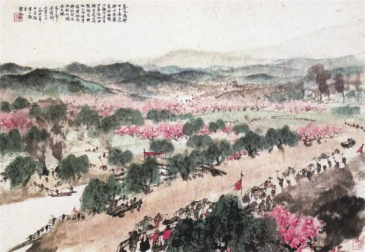

  

傅抱石，送瘟神

  

中国现在很重视“内循环”，也就是国内这个超级大市场。我认为，这是应对可能出现的的最坏情况，即美国成功围堵住中国，只要我们把“内循环”经营好，照样能活，能活好。

  

美国打赢了二战，搞垮了苏联，当了近一个世纪世界霸王，这让很多人有了思维惯性，认定美国做什么都是对的，即使美国做错了，也是对的，所以，美国想搞中国，它就搞得成。经过今年，这种思维惯性应该改一改了。

  

美国至今对防疫毫无办法，因为总有很多人不戴口罩，不愿意居家隔离。有人说，这是美国人对自由价值的捍卫，我有不戴口罩的自由，我有不被隔离的自由。其实，这是对自由的误解。自由是有界限的，美国一位法官说得好，你拳头的活动自由，止于他人的鼻尖。这种自由精神用在防疫上，就是你活动的自由，止于不把病毒送进他人的鼻子。显然，太多美国人并不遵守这原则，在反自由。

  

防疫，其实中国总结出了一套好办法，所以像北京、大连这样出现零星病例，已经可以精准控制，生活与经济很快恢复正常。中国并没有说这些防疫方法是中国的知识产权，不允许美国学吧？美国的防疫专家愿意学，可是美国的总统不愿意学，那么多民众，也不愿意学，这是一个反智的国家。任何一个国家都有反智人群，中国也有，这不奇怪，像美国这样，总统反智，主流反智，就很奇怪了。

  

更致命的，最近在TikTok事件上，可以看到，美国总统干涉市场的权力无比巨大，不受限制。一家在美国市场上自由竞争成长起来的企业，服务美国的消费者，为美国创造价值，只因为其母公司是中国公司，其创办人是中国人，说禁就禁。美国已是一个反市场的国家。

  

一个反市场的、反科学的、反自由的美国，已经是一个变质的美国，它还有道义资源号令天下吗？它号称围堵中国，不如视之为它要闭关锁国，美国家底再厚，也经不起这样折腾。这样的美国，有什么可怕的呢？把自己的事情做好，兵来将挡，水来土掩，发展才是硬道理，即使美国仍有余威，暂时割裂了世界，短期或有压力，但我们站在规律这边，中国怎么堵得住？中国的未来怎么抢得走？

  

推荐：[幸福而丰富的一生，就是六个字](http://mp.weixin.qq.com/s?__biz=MjM5NDU0Mjk2MQ==&mid=2651645764&idx=1&sn=a0de5f4558466e57d7bec4f5aa75a80b&chksm=bd7e635a8a09ea4c7b5a962ee4140ca0d978202d9276f859cfa5a9dffea8bb792d9f2e128cc3&scene=21#wechat_redirect)  

上文：[救救我那色令智昏的女朋友](http://mp.weixin.qq.com/s?__biz=MjM5NDU0Mjk2MQ==&mid=2651646021&idx=1&sn=e1087f76a32ca60ba0e66cd240bd9027&chksm=bd7e6c5b8a09e54dab6d5e89ea1a1df3ccfffa0beefa7f2319c5520e62e0c7272e45d3591ddb&scene=21#wechat_redirect)
