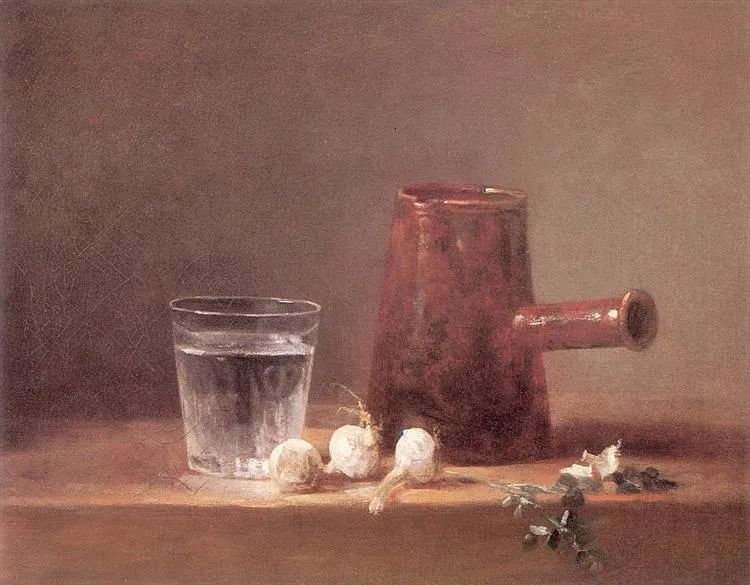

  

Jean-Baptiste-Simeon Chardin，Water Glass

  

这篇作文之所以引起这么大的争议，在于巨大的的反差，大家一看，有些字我不认识，有些人我不知道，有些引言我根本没听说，看得一头雾水，最后它是满分。

  

这方法我在读高中时也用过，用一些生僻字替代常用字，记住一些古怪的人名及引言（有时也自己编造，当时没有网络搜索，老师无法查证），主题合适时就硬套上去，实在不行就绕几个弯子套上去。总而言之，就是要唬住老师，让他以为我很厉害，不得不给我一个高分。我当时书桌上还放几本哲学书，把同学吓得够呛，其实我哪里看得懂。

  

这篇满分作文就是个误判，它不值得那么高的分，了不起给个及格。明年高考的同学，最好不要模仿，有眼光的老师还是多的，卷子撞上那些唬不住的，给你个低低的分数，你死得一点不冤。

  

作文考试，有些基本分不能丢掉。卷面整洁，笔划清晰，标点规划，分段合理，这是基本的技术分，认真就拿得到。

  

切忌刻意唱反调。人类社会一直有其主流价值，我们现在看到孔夫子的“己所不欲，勿施于人”，还是觉得特别好，再过1千年的中国人仍然觉得好，这就是主流价值，天理人情，大原则不会变的。高中生追求深刻，怎么深刻得出来？不过是把青春期的逆反误认为深刻。一个时代，深刻的人就一两个，到处都是深刻的高中生，那才不正常。

  

写文章，主要是为了交流。交流，沟通效率就重要。这也是白话文运动了不起的原因，会说话就会写文章，会说话就看得懂文章，这提升了沟通效率，解放了创造力。一个世纪以后，又认为厉害的是写点文言文，搞几个生僻字，那就太没有见识了，误人误己。

  

文字之美，蕴含在我们日常语言当中，仔细体会，认真提炼，我手写我口，其中的观点与情感，可准确传达给你，就是好文章。去故纸堆翻，在翻译腔里找，有话不好好说，偏要让人猜，这是糟糕的文风。猜完还发现他其实什么也没说，自己都糊里糊涂，更是让人恼火。

  

我们不知道的东西，无法包装成我们知道，如果你想这么做，你就会故意把话说得不清不楚。这骗得了一时，骗不了一世，如此写文章，路越走越窄。一个人尽力清晰、明白地表述，才是正道，这是对读者基本的尊重，尊重他们的时间，尊重他们的智力。

  

先真诚，再准确，最后才是文采，按这个顺序，文章总会越写越好。 

  

推荐：[储蓄永远是富人思维](http://mp.weixin.qq.com/s?__biz=MjM5NDU0Mjk2MQ==&mid=2651635450&idx=1&sn=b7204aeb7e2353ec557a2163c6c96423&chksm=bd7e3ae48a09b3f22dd4bdd263161cf0683cc45cb03fc8f92c8cb4b9742b7e5f423591d9d7f8&scene=21#wechat_redirect)  

上文：[45岁之前，接受你的不舒服](http://mp.weixin.qq.com/s?__biz=MjM5NDU0Mjk2MQ==&mid=2651645656&idx=1&sn=b091002199318ee70019c5f9ca4b3091&chksm=bd7e62c68a09ebd0b4db42e463c6966278499e1413c46d9ad2e7c4900e463b78bf2a70432618&scene=21#wechat_redirect)
