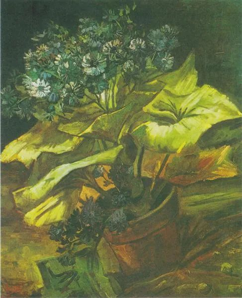
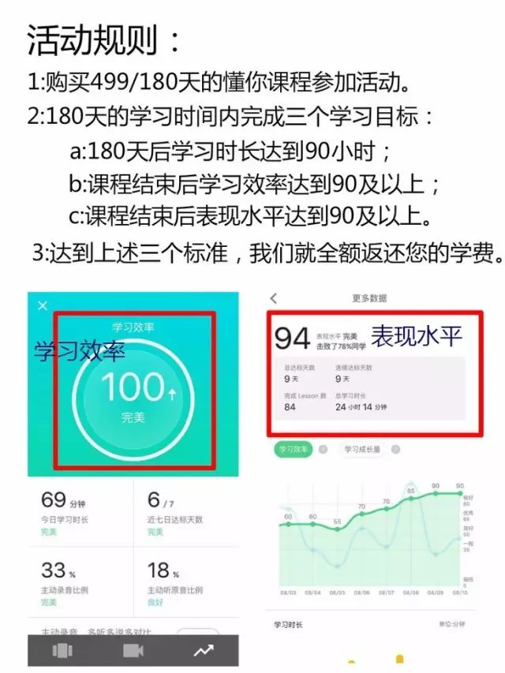

  

Vincent van Gogh，Flower pot with Asters

  

人要有责任感。这是人类文明演化至今得出的公理。因为人类是通过分工合作胜过所有动物。没有责任感，无人愿意与你合作，孤家寡人，人很难过。  

  

责任感，简单点说，就是让信任自己的人活得更好一些。他们活得更好，自己就活得更好。通过这种间接手段获得自己利益，就是人特有的智慧，其他动物做不到。  

  

中华文明早熟，体现在2500年前左右，孔子就知道这点，所谓的“己所不欲，勿施于人”，自己都讨厌的事，你给别人，就是让他活得更差。再进一步，就是“己欲立而立人，己欲达而达人”，成就他人就是成就自己。  

  

但这些原则，泛泛而谈，很多人不知如何落实，导致背诵的是一套圣人之言，行事却是一塌糊涂，既浪费了先贤的积累，又导致自己人格分裂，很可惜。  

  

把原则落实，就是量化的过程。  

  

这点，其实我们的祖先也在尝试，一个有抱负、有能力的人，要以天下苍生为己任，要先从小目标开始：照顾好自己的家庭。  

  

你的孩子是生而爱你的人，你的配偶是知而爱你的人，他们是天下最信任你的人。如果你不爱他们，损害他们的利益，你怎么可能惠及众生？  

  

借助现代科学标准，量化可以做得更好。  

  

先把事情简单化，这是牛顿与爱因斯坦的方法论。爱因斯坦说过：尽量把事情简单化，但不要过于简单。比如圆周率简化成3.14，有利于我们运算，误差在可接受范围；但简化成3，就变质了，胡来。  

  

把家庭责任感简化，是以下两要素：

  

一是健康。体脂率，BMI，现在可以精确测算，你随时可知道它们是否健康。一个人明知自己不健康，比如太胖，太依赖酒精，却仍然不克制，听之任之，无视家人日夜担心，那么，他表现得再忧国忧民，真诚度也存疑。这也是我喜欢隔日断食法的原因，每两天有一天只喝水，让饥饿陪伴自己一天，考验自己的意志力，责任即负重，没有意志力，挑不动。  

  

二是陪伴。陪伴的时间多长？你知道配偶今天的忧乐，你知道孩子功课今天的难易。我有个舅舅，由于当时成长环境所限，文化程度不高，脾气也暴躁，但儿女都成器，达到了他们资质的上限。我舅舅的诀窍就是笨办法，从小学开始，天天到学校门口询问老师孩子当天的学业及表现，然后按老师的指点监督孩子的学习，瞪大双眼，硬坐在旁边。

  

现在的父母，不缺知识，很多缺的就是自律，总喜欢一劳永逸，不爱每天必然出现的压力。其实，每天都需要的自律，才是王道，自律是责任感的养料。在一个知识型的社会，在百岁人生，我们退休后都可以再活祖先们的一辈子，每天学习，应该是终生习惯。在学习中，和孩子的学习同步，在学习的难关中和他们一起琢磨耐心与意志，这就是最好陪伴。很多人说，学第二语言难，中国人学英文难，所以不学。此言差矣，难正是它的价值，没有难就没有自律，用你的学习，用你学步般的第二语言，陪伴孩子，陪伴家人，实践自己的责任感。

  

如果你担心自己有时松懈，需要一些他律，那么，懂你英语就是好选择，天天打卡，比学赶帮超，用他律启动你自律，化苦为乐，如此美事，等什么呢？从今天开始。

  

  

 ****▼**** 点 **阅读原文**, 用学英文量化责任感。
