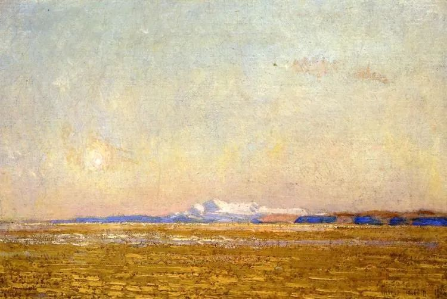
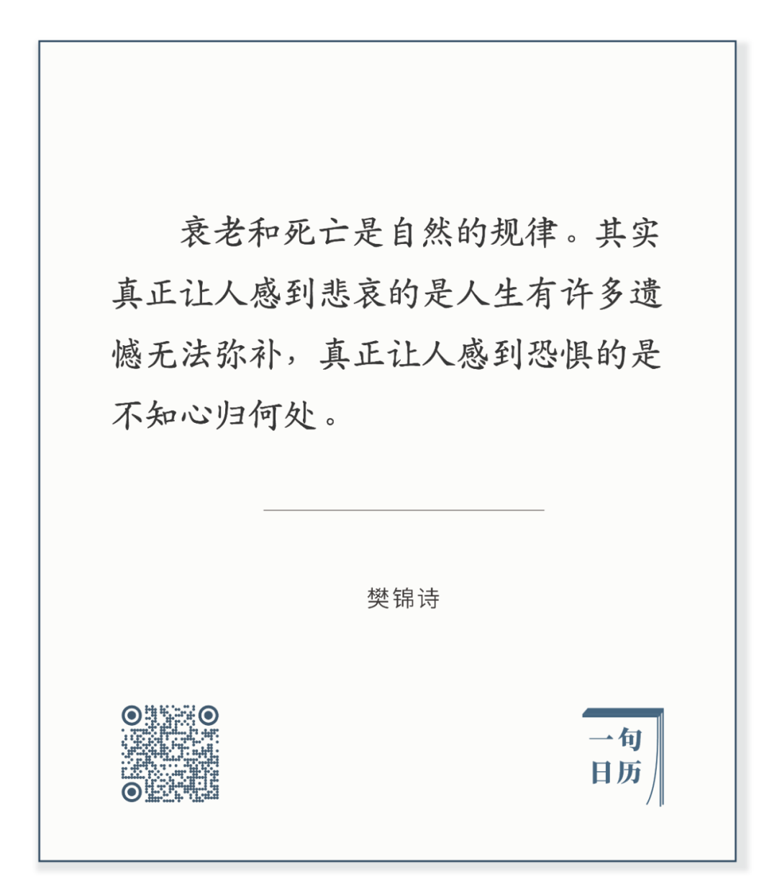

  

Childe Hassam，Desert

  

长按二维码可关注

  

敦煌是很好的旅游点，但在大漠里长住，没多少人能够做到。沙漠能把人的孤独放大，无边无际的空寂凝成巨掌，好像武林高手向你出招，你没有内力抵抗，心里就会受伤。

  

其实人都是孤独的，只不过，繁华与人群能够掩饰孤独，麻醉一个人，骗他可以逃避孤独。在做自己应该做的事情之时，你听到的只有自我对话，仿佛身处大漠，只是这孤独你不觉得苦，因为你知道自己心归何处，有强大的内力。

  

樊锦诗曾坦言数次想离开敦煌，最后明白敦煌就是自己的“命”，心有归处。

  

这个心路历程，每个人都会经历，都会经历犹豫，怀疑，摇摆，再到坚定，知天命，也知自己的“命”——我必须挑起身上的责任。正如樊锦诗喜欢对刚到敦煌的年轻人说的：年轻人有三条道路可走，黄道，白道和黑道。黄道是做官，白道是发财，黑道就是做学问，在黑暗中摸索前进。到了敦煌你就只能走黑道了，没有那两条道路可走。

  

做官与发财，这两条路，如果心不定，也做不好。走仕途的，觉得自己做了不少事，却提不到提升重用，心生抱怨，或者总想着搞点贪污贿赂，觉得自己钱不能少，那官也做不舒服。搞商业的，不是花心思打磨产品与服务，总是想着歪门邪道来快钱，骗人都没有心理压力，就是暂时能来钱，最后也得破产。

  

无论选择什么人生道路，内心没有创造价值的定力，那就是沙漠中的流沙，随风飘移，一生惶恐，不知所终。我们不为他人创造价值，不为社会创造价值，我们就不会有价值。

  

今天是第137期“下周很重要”，你下周份的计划就是你下周份的定力。无论定力汇集，就是你心归处。

  

  

推荐：[锦诗人生](http://mp.weixin.qq.com/s?__biz=MjM5NDU0Mjk2MQ==&mid=2651645656&idx=2&sn=88d4cacecae0d583039c9d42ba0514a3&chksm=bd7e62c68a09ebd03b3d274c874da0c572a2634d037e90b903a033af4708bc68f3cabe87280b&scene=21#wechat_redirect)  

上文：[幸福而丰富的一生，就是六个字](http://mp.weixin.qq.com/s?__biz=MjM5NDU0Mjk2MQ==&mid=2651645764&idx=1&sn=a0de5f4558466e57d7bec4f5aa75a80b&chksm=bd7e635a8a09ea4c7b5a962ee4140ca0d978202d9276f859cfa5a9dffea8bb792d9f2e128cc3&scene=21#wechat_redirect)
