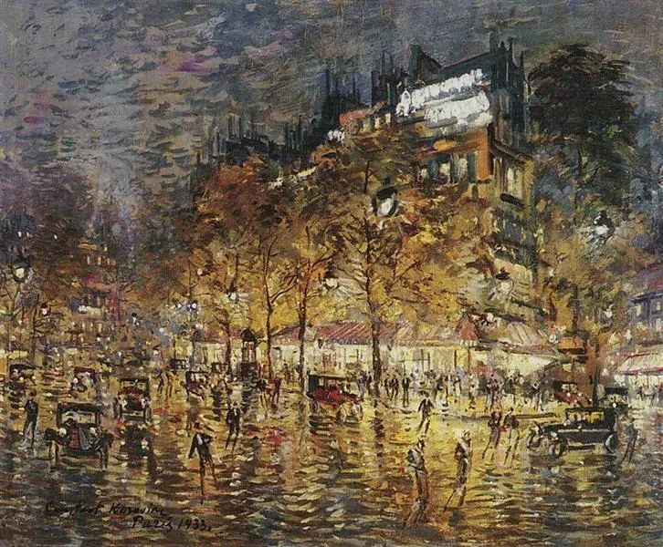

  

Konstantin Korovin，Paris

  

连岳：

  

求助，我们开门见山。

  

我家基本情况：我和我老婆都是二婚，各有一个孩子，她女儿跟我们住，10岁，婚后我们生了一个儿子。

  

从小孩出生到现在一岁半，我们一直请保姆和丈母娘一起带，丈母娘身体不好，有慢性病，家又在外地，所以基本上是一个月丈母娘带三个星期，坐车回老家休息一个星期，我就叫我妈来帮忙。

  

矛盾是这样产生的：在我妈来我家期间，有天下班回家，姐姐说弟弟碰到头，哭了很久，我老婆问了下保姆，确认没事后，一家人就开始吃饭，在饭桌上，我妈突然就爆发了，声泪俱下的哭诉说她这么辛苦，姐姐还要告她的黑状，怪她没带好弟弟，挑拨我老婆和她吵架……又说她对我老婆的女儿掏心掏肺的好，结果还要被报复。

  

当时我心情很复杂，一方面，我妈70岁了，确实辛苦，另一方面，的确又有点小题大作。不过，还好我老婆一直克制，好言相劝叫我妈不要多心。

  

事后，我老婆说她觉得我妈心理有问题，但是她不会计较，希望不要再发生第二次。

  

可是，第二次很快又发生了。

  

这次我妈来的第二天，要求我们把新请的保姆换掉，我老婆不同意，我夹在中间为难，说话就冲了，结果一下就把我妈点爆了，她劈头盖脸暴跳如雷的骂了我们好一顿，然后就走掉了，我老婆只好给单位请假在家带小孩，又把丈母娘从老家叫回来。

  

说实话，我也觉得我妈不对，凭心而论，我老婆不错，对我妈一直很尊重，在家给她倒茶水削水果，逢年过节，包括三八节母亲节，都买礼物送红包，我妈在医院做理疗，她下班了就去探望，周末送饭，算是很懂事了。

  

所以我妈控诉她为了我们累死累活的辛苦，得不到回报，说我们靠不住，从没管过她……不是事实，我也觉得我老婆委屈，但她毕竟是我妈，我能怎么办！

  

我父亲去世得早，我妈带大我和弟弟不容易，她再婚后，和继父关系也不好，她确实受过很多苦。

  

现在的问题是，我老婆把我妈的微信删了，她明确表示以后和我妈保持距离，不愿意再过多交往。我要求她加回我妈的微信，她拒绝，这让我很恼火。

  

为什么她就不能为了我再包容一次呢？回到以前那种和谐亲密的状态。

  

一个左右为难的男人

  

* * *

  

一个左右为难的男人：

  

恭喜你娶到一个好老婆，从你的描述来看，她有礼有节，先礼后兵，不是不懂事的人，也不是怕事的人，有智慧，有勇气。这样的女人要珍惜，你没那么好的运气，在第三次婚姻中仍然能遇上这样的女人。你一直触碰她的原则和底线，她可能并不会害怕放弃你。

  

她再“包容”你妈妈一次，你妈妈就从此变好，我想，别说是聪明的她，换成任何一个人，都会“包容”。你也知道，再“包容”一次，就是永远忍受下去。而你妈妈是不会改的，她将一再寻衅滋事，无理由爆炸，让你老婆受委屈。

  

你妈妈一生受过很多苦，作为儿子，你同情她，没有抛弃她，你也是好样的。就是全天下都嫌弃她，你也有继续包容她的责任与义务。可以想见，你老婆与你妈妈保持距离之后，你妈妈将更加狂暴，这怒火只能发泄给你，这让你烦躁、害怕、痛苦，难以忍受，于是你希望老婆继续忍让（即“回到以前那种和谐亲密的状态”）。其实，这只是让你老婆忍受烦躁、害怕与痛苦，换取你的轻松。爱一个人，心疼她，将尽量让她避免这种状态，她想继续“包容”，你都得制止。

  

很多家庭，都有一个黑洞型人物，或心理变态，或愚蠢偏执，或投机无度，这些无底的大黑暗，有本事吸走其他人的快乐、幸福与财富，是标准的和谐杀手。若处理不好与其的关系，整个家庭，甚至整个家族的沦陷，都是必然，可能会毁掉几代人。你妈妈就是黑洞型人物，有一点心理变态，再加上很多愚蠢偏执。你老婆坚定的物理隔绝法，是唯一正确的应对方法。

  

你定期去看看妈妈，照顾她的生活，承受她的抱怨与怒火，你就是她与你的小家庭之间的边界，你受多少委屈，小家庭就得到多少和谐和未来。你做这件事，完成双重责任，既是对你妈妈负责，也是对你老婆负责。别逃避，别转嫁，承担起来，这才是一个男人该有样子，这样的男人才值得爱。

  

祝开心。

  

连岳

  

推荐：[相信爱情](http://mp.weixin.qq.com/s?__biz=MjM5NDU0Mjk2MQ==&mid=2651647115&idx=1&sn=ab9e2d8b27dc4976ff15f76dbd30ddcd&chksm=bd7e68958a09e18348c6aae89055110a71bbedd3e6bebe91b90822f2382aaa94b75f49704278&scene=21#wechat_redirect)  

上文：[活得简单一点，那种沉思后的简单](http://mp.weixin.qq.com/s?__biz=MjM5NDU0Mjk2MQ==&mid=2651648440&idx=1&sn=2c05202f63c46d6da688b77e2b12ff0a&chksm=bd7e75a68a09fcb0248b4426b520c233ff9950ed24cfee10a57ffbf1d5895d4808bc29a57ca7&scene=21#wechat_redirect)
