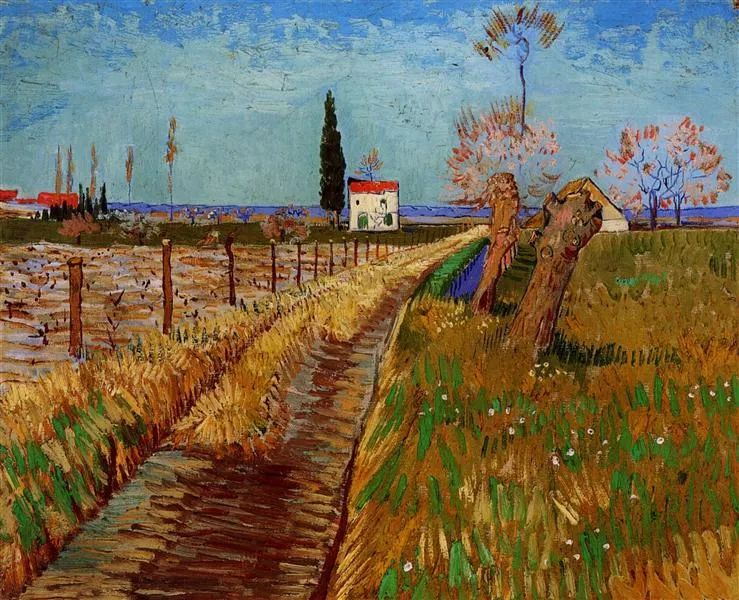

  

Vincent van Gogh，Path

  

几个月前，江苏有对年轻夫妻（男28岁，女26岁），携两个幼儿自尽。警方几天前通报了基本情况，这对夫妻经济收入较低，仍向他人借款、银行贷款购买轿车，大额购买体彩、福彩。

  

超出自己承受能力的债务摧毁了这个家庭。这对夫妻行事极端，但是他们面临的风险，却有普通性。金融业高度发达的当下，在信用破产之前，借钱很容易，鼓励、诱惑一个人超前消费的广告也比比皆是。借到钱马上可以获得满足，拥有奢侈品、汽车，产生阶层上升的幻觉。或者投入到“迅速致富”的行当中，比如放高利贷、大额购买彩票、传销、加盟各种高回报的神奇项目——这些缺乏风险意识与概率常识的冒险，几乎必然失败。借的钱败掉容易，还钱却很艰难，只要债务超出偿还能力，利滚利的债务就会迅速收紧绞索。

  

对有些年轻人，或低收入者，几万块债务就足以让他绝望。一个人要健康成长，慢慢致富，那么，绝不借超出自己能力的钱，就是一条不能破的底线。这是最重要的财务常识，也是最重要的成长常识和幸福常识。不坚守这点，有些成功人士，风云人物，也会摔倒。只不过是年轻人借几万十几万，他们借几亿几千亿，一旦还不了债，亿万身家蒸发，庞大企业垮台，结局倒是同样的一无所有。只不过年轻人还有机会，自己愿意改，长辈帮一把，那些债务不算大事，摔倒了可以爬起来。年纪大了，搞一个大的债务，那就再无机会，摔倒等于摔死。

  

倒不是说人不能有债务。比如不向银行借钱，绝大多数人一辈子也买不起房子。房贷几十万几百万，看起来很可怕。可是借给你的银行不害怕，他评估过你的信用与能力，知道你还得起，万一你信用破产，房子还在。向银行借钱的你也不害怕，你知道随着自己的能力提升，收入增长，再加上货币的长期贬值，还钱越来越轻松，万一有意外，房子卖掉，就能还债。这种借贷双方都得益，都不害怕的债务，就是良性债务。人倒是要有勇气去承担良性债务。否则，人就会犯吝啬的毛病。孔夫子说了，如果人吝啬，才华再美也没用。而最大的吝啬就是苛待家人，让他们不能安居。

  

不良债务，要有一分不借的定力。良性债务，要有一定敢借的责任。这种分辨力很重要，但并不难。那些认真工作攒信用的人，不炫耀，不虚荣，却供着房子，都有这个能力，他们的一生注定是富裕的、幸福的。

  

推荐：[不谈财务自由，才是多数人该有的财务常识](http://mp.weixin.qq.com/s?__biz=MjM5NDU0Mjk2MQ==&mid=2651630968&idx=1&sn=8c2731da58dba8e9e81e7e6f97f991c2&chksm=bd7e29668a09a070e49376b7d170306fd6589c6d12f8c09b40b9483aec900f48f8eec59fcd66&scene=21#wechat_redirect)  

上文：[坏的一定会慢慢过去](http://mp.weixin.qq.com/s?__biz=MjM5NDU0Mjk2MQ==&mid=2651649335&idx=1&sn=4bf1ba89aad874aa603bdfc374582aae&chksm=bd7e71298a09f83ff896329fa32618a5ab441a3a3792e0085eb911b9607a5886091e42479bfb&scene=21#wechat_redirect)
