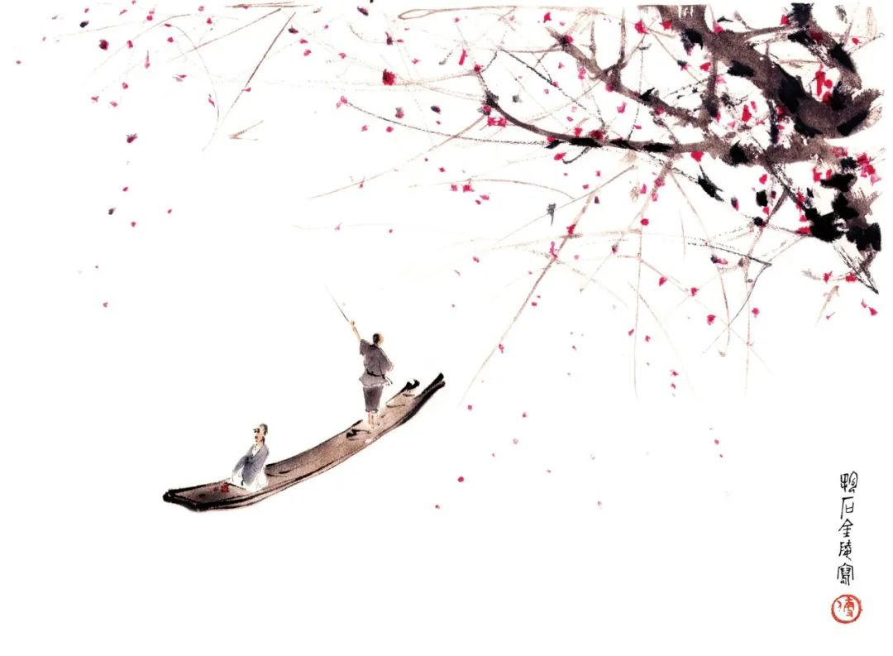

  

傅抱石图  

  

接下来的十来年里，甚至是几十年里，会非常有趣。美国的围堵与中国的突围，将是世界的一条主线。结局可以先剧透一下，中国的突围一定成功，从此再无人可以围堵。这是中国文明基因决定的。  

  

现在的大事，放到历史长河中，都是小事。人要读读历史，尤其是中国人，我们有这么长的历史，当下的挑战，可能在历史上已经做过一次题目。仅仅89年前，1931年，中国文明迎来最大危机，日本侵略者发动“九·一八”事变，东北迅速沦陷。你把现在中国的样子告诉当时的中国人，他们怎么敢相信呢？

  

89年很短，1931年，袁隆平先生已经1岁。著名学者许倬云先生也已经1岁。对一个半世纪来的中国，他的评价是：“在西潮冲击下蹒跚颠簸，中国人也因之对于自己的文化传承，由怀疑而至扬弃。中国文化几乎有可能在地球上消失。”而这个中国，在公元1500年前，还处于绝对的领先，直至哥伦布开启的大航海时代来临，才逐渐落后，最后甚至有文明灭亡危机——如果我们现在说的是日文，那中国文明就亡了。现在也有一些中国人认为美国一定会赢，美国宣布任何一项对中国的“制裁”，他们就同时宣布中国要完蛋了，这就是积贫积弱时代的最后回音。  

  

文明的进步，必然遇到冲突与危机。越是伟大的文明，经历的冲突与危机越多。中国文明的发展史，就是一连串的冲突史、危机史。当下来一次冲突与危机，并不算意外，也不必害怕，更不能投降，应视之为中国文明发展的机遇。

  

中国，是一个地理概念，更是一个文明概念。  

  

中国文明早慧。竞争一开始，其内核就是文明竞争。从商开始，它的胜出，就是凭借掌握了当时唯一成熟的文字系统——这套文字不停演化，我们现在还在用，以后将一直用。到了周，已经提出“天命”观念，摆脱了宗神与族神的限制，也超越了统治者的局限性，具有普世价值。其设定的游戏规则是：如果治国者不合天命，有违道德，天命就会寻找更有道德的人。

  

天命观经由孔子，发展为成熟的儒家学说，从修身到治国，为中国人提供了一套原则。季羡林先生（1931年时20岁）曾说，原以为“半部《论语》治天下”是吹牛，后来发现是大实话，甚至不需要半部，一句“己所不欲，勿施于人”就够了。

  

如何选择人才？商鞅在秦国的变法，找到了打破血统与阶层的方法，选贤与能。弱小的秦国凭此蓄力，最终一统江山。商鞅的方法，演变为科举制度，为人才提供突破阶层的进阶之路。现在的高考，内容与科举完全不同，但选拔贤能的功能是一样的。  

  

儒家讲进取，人要当真君子，大丈夫，以天下为己任。这有点累，没关系，中国文明的另一重要组成部分是老子庄子的道家，无为而治，顺应自然。进则儒，退则道，儒七分，道三分，儒显道隐。责任落在我肩上，用儒家承担，不逃避。抱负实现不了，用道家看淡，不抱怨。中国文明的基因就这么形成了，万古江河，世代更迭，其中的文明基因不变。现在“为人民服务”的宗旨很好，而人民是什么？不就是周人认为的“天命”吗？

  

[理查德·道金斯认为](http://mp.weixin.qq.com/s?__biz=MjM5NDU0Mjk2MQ==&mid=2651644652&idx=2&sn=625545857e7d597391fef1c52c363ff1&chksm=bd7e66f28a09efe47f62601d9079d213e1eb5db3dd5700f809e9dcf229d7974d6a57ac3e7ad4&scene=21#wechat_redirect)，基因有生物学的DNA，也有文明基因meme（觅母）。史上帝国不少，凭武力也一时无敌，但文明基因弱，或被打断，终于烟消云散。中国文明基因形成后，第一次大冲击来自佛教的传入，但极为平和地化解了，经过一千年，佛教完全融入中国文明，成为儒道的补充。

  

近一个半世纪以来，以日本为代表的侵略是中国文明的最大危机，中国文明再次展现它的韧性，不仅顽强地生存下来，现在还将科学技术市场开放等因素融入中国文明。在这个历史纵深中看，当下面临美国的围堵，算得了什么呢？不仅不该灰心丧气，还该庆幸大时代终将到来。
