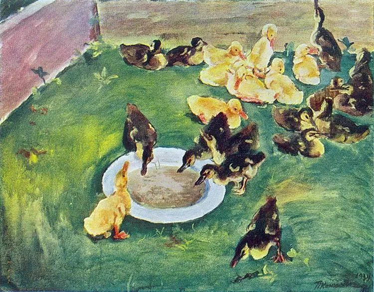

Pyotr Konchalovsky，Ducklings

  

连岳， 你好！

  

从高中起开始关注你在《上海一周》的专栏。那时觉得大人的世界太复杂，我未来不会如此。哪想到如今也不能免俗。 

  

给你写信是想问问，老公的富婆红颜知己怎么处理？老公有个红颜知己（女方已婚有娃），是同事。女方很有钱，目前借给我们200w，其父曾是我省正厅领导（后被双规），但仍有人脉。我老公和她来往频繁。当然女方是我老公喜欢的类型，她也喜欢我老公。我老公和她很投缘，两人经常花很多时间微信，有时候喊一起吃饭（好几个人），以前还接送她上下班（两人应该暂时还无性关系）。

  

我也发过脾气，但是没效果。他总解释“为了供着财神”。我一直逃避考虑红颜的问题，忙着自己的生活。但最近发生了两件事，让我不痛快。一是，前几天她想蹭我老公车去饭店参加单位聚餐，我老公看我不想见她，要自己搭地铁回去，就拒绝了她。后来我送他到饭店门口，红颜电话我老公，汽车蓝牙免提开着，她可能也知道我在，又是撒娇又是发脾气。我老公尴尬应对，我没说话。二是，这两天我们计划购房，我老公很认可她的建议（她的建议对），但我之前也曾提了同样的观点，未受认可。 

  

我和我老公肯定有感情，但本身性格不是太合适，又夹一个红颜，有时候我也想分开，但娃才3岁。怕社会歧视，对我也对娃。盼你回音！ 

  

一个没想过会给你写信的读者

  

* * *

  

一个还是给我写了信的读者：

  

你老公的问题，并不是婚外情、红颜知己问题，而是他的兼职问题。

  

他是兼职卖淫而已，直面这点，问题就好解决了。

  

他唯一的女主顾，有钱，有势，有智商，处于绝对的统治地位。事情也证明，她不在乎你这个妻子怎么想。或者说，你们的想法与反应完全在她的预料之中，她也知道，你们对她的“钱与关系”有渴望，只要控制着你们这个贪念，她就控制着你们的一切。你生生气，吃点醋，对她来说，反而是另类的情调。

  

和其他蒙在鼓里的人不同，你了解事件的进程，“借”到200万，你也知情。可以看出，这200万对你们来说，不是小钱，再加上你们又计划买房子，需要用钱。你并不反对这个交易，否则这钱就“借”不成。你丈夫凭你的这个反应，认定你批准了这件不道德的交易。接下来，他取悦这位女主顾，包括和她发生性关系，不过就是在履行合同。你生气或提离婚，他反而可能认为是不遵守默契。

  

当然，从你的叙述来看，你不会离婚，你将消化这件事，反正两人“性格不合”，感情也没多深，他卖一卖，赚些钱，也不错。婚姻变成这样，很遗憾，不过你们自己愿意接受与承受，也不关别人什么事。人，尤其是年轻人，若少自尊，没耐心，贪图他人富贵，确实容易出卖一切，将自己的人生猥琐化。

  

我能帮你们的，就是给点风险提示。这位“红颜知己”的能力与智力，远在你们之上，当她玩腻你老公时，那200万还是得还的。在这件不道德的交易中，她是予取予求的女王，给的一切都能取回，你们出售了爱情与婚姻，最后却可能一无所获。

  

祝开心。

  

连岳

  

推荐：[穷查理，富人生](http://mp.weixin.qq.com/s?__biz=MjM5NDU0Mjk2MQ==&mid=2651643298&idx=2&sn=21cb1652a6999d789f0a8ee63ea2a0c3&chksm=bd7e59bc8a09d0aa91d168a813d0fb5701f65340732f00a9d89df9bce724100ee44af2c6ff1a&scene=21#wechat_redirect)  

上文：[欺负老师的人应该马上受到惩罚](http://mp.weixin.qq.com/s?__biz=MjM5NDU0Mjk2MQ==&mid=2651648067&idx=1&sn=ad6029d6c7bcb4c641d243228967e1c3&chksm=bd7e745d8a09fd4b0ec996c631b79fff8881b508fa7c7cd589064c83b6d48492452f58feff54&scene=21#wechat_redirect)
