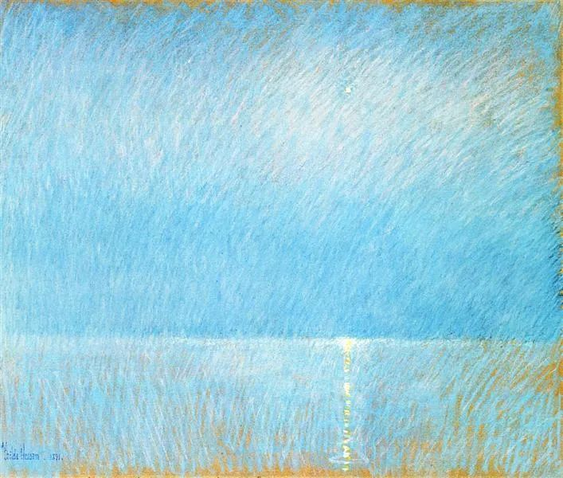

  

Childe Hassam，The Evening Star

  

卡尔·萨根去世以后还在深刻地影响世界。中国人科学素养的提升，某种程度还要感谢他。

  

2001年，卡尔·萨根去世5周年。北京电视台邀请了他的儿子及一些相关科学人士，做了一个节目，讨论卡尔·萨根生前的最后一本书《魔鬼出没的世界》，介绍了萨根的科学思想及主要贡献。节目有一位观众是时任副总理李岚清，想必他深受打动，马上打电话调了节目光盘，要了一本《魔鬼出没的世界》。很快召开了规格很高的“国务院科普工作座谈会”，制定方案，决定免税，以推动中国的科普活动。

  

决策层对科学思维普及的渴望可见一斑。更早之前，早在上个世纪70年代，邓小平就开始形成“科学技术是第一生产力”的思想。决策者对国家的发展走向，民众的思潮，有着关键的引领作用。80年代，邓小平在一次讲话中说，我很高兴，现在连山沟里的农民都知道科学技术是生产力。

  

在特殊的今年，中国民众那么容易接受科学家的建议，隔离，戴口罩，与长期来普及科学思维有关。当然，科学家说的不一定对，科学思维最重要的一环是“权威不一定对”。中国当时的防疫方法也受一定的质疑与批评，但事实证明是对的。最早控制了疫情，最早恢复了正常生活与经济活动——这当然是巨大的生产力。

  

与此相对应的，是科技一直处于领先的美国，从总统到民众，反感防疫专家的科学建议，以至于无法收拾。这个情况，卡尔·萨根也有所预计。他对美国社会的反智反科学忧心忡忡，连被美国人神化的里根总统，他做决定，竟然是听占卜师的！所以，现在疯疯癫癫，毫无常识的特朗普，也不算另类。卡尔·萨根痛批美国的基础教育落后的趋势，孩子的数理化水平低于同水平的国家，反智的传媒业又不停迎合并喂养反科学伪科学的内容，导致美国人越来越愚蠢，“这种无知和权力混合制成的易燃品早晚有一天会在我们面前燃成熊熊大火。”果然如此。

  

当然，中国民众普遍的科学素养，未必高过美国人。我们身边充满着各种怪力乱神。这次防疫成功，主要是决策者听科学家的，再借由高效的管理将科学方法输送到社会的每一根毛细血管。

  

科学思维的得到，是个缓慢的过程。某种程度上，人类得到科学，并非必然。卡尔·萨根引用物理学教授阿兰·克鲁默的话说“面对科学的诸多显而易见的成就和益处，我们仍然敌视它……仅此即可证明它是处于人类发展的主流之外的一个事物，也许只是一个意外和侥幸。”

  

怀疑的、提问式的、采用实验方法的科学，它的出现，主要来自古希腊，诸种条件具备：理性辩论的风气；开放的海洋经济；供学者云游的广阔的希腊语世界；充满想象力的文学作品；独立的商人阶层，他们赞助文化，聘请私人教师；僧侣无法垄断知识；最重要的有利因素是，这些因素持续了1000年。

  

科学，就是随时准备被人否定和自我否定。这是反人性的，不通过学习与训练无法得到。卡尔·萨根说，科学家与大多数人不同的地方在于，在强有力的证据面前，他们会改变自己的想法，甚至会放弃自己珍视的信念。改变并不可怕，可怕的是不改变。

  

科学家的人性并没有不同，很多人被否定，也是不开心的。只不过，并没有办法，他就是生活在一个必须接受质疑与挑战，用证据说话的体系里。 

  

你拿到《魔鬼出没的世界》后，可以先看第十二章《鉴别谎言的技术》，里面列举了人类有史以来（仍将继续很长时间）的几类谎言，以及科学思维的几种工具。人必须掌握这些工具，它们不是科学家独有的，而是新的底层思维，将人生建立在它之上，将美妙幸福得多。正如卡尔·萨根认为他的父母虽然俱为普通人，却是他一生遇见的最好的老师（胜过诺奖得主），引他走上科学之路，他们不过只是从小鼓励孩子跟随好奇心，保持怀疑，用证据说话。只要掌握科学思维，什么事都做得更好。科学思维在人类史上，由意外变成必然。这是最伟大的趋势，从个人到国家，再到人类，我们必须活在这个大势里。
