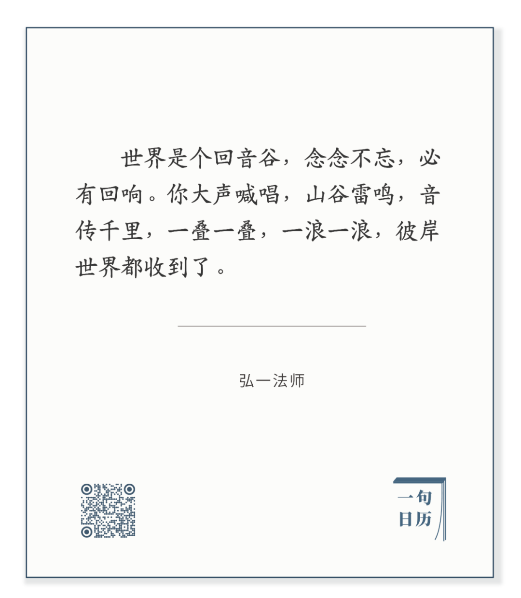

Koloman Moser，Mountain ranges

  

长按二维码可关注

  

愿望的力量，愿力。念念不忘，必有回响。听起来很玄，玄得如同彼岸世界。  

  

玄而又玄，众妙之门。

  

这就是卡尔·波普尔所说的猜想。人类之所以厉害，在于他有大脑，可产生无穷尽的猜想。无中生有，一生二，二生三，三生万物。猜想是零本万利的生意。

  

愿力，是你最想去验证的猜想。用观察，用逻辑，用实验，看看猜想对不对：我爱的姑娘到底爱不爱我？我的解题方法酷不酷？我的产品有没用？我的思想能否更好地解释世界？  

  

答案为否，一念即可忘。

  

答案为是，一浪变成一巨浪，一念生出一叠念，念念不忘，必有回响。你和世界，今天和明天，此世和后世，都发生了变化，你想要的变化。

  

去想，去发愿，将力量从脑袋传递到手脚，让世界感受到，它将回应你。  

  

今天是第141期“下周很重要”，写下你的愿望，聆听那一小声回响。你不知道自己将来声音有多大，回响有多亮，但这一小声，已经很美。每一天，都从想到响，此岸已经足够好。

  

推荐：[尽](http://mp.weixin.qq.com/s?__biz=MjM5NDU0Mjk2MQ==&mid=2651647437&idx=1&sn=853cd1788a0b7dd48c09a4d6646dc3d4&chksm=bd7e69d38a09e0c5dc3181bf7d349e237ddeffc19a486962fad2cd28f9eaafa97f2f20a5b2e3&scene=21#wechat_redirect)  

上文：[预见了2020的人](http://mp.weixin.qq.com/s?__biz=MjM5NDU0Mjk2MQ==&mid=2651647889&idx=1&sn=a4dd15274c912c10f502675322dadc71&chksm=bd7e6b8f8a09e299c8d6323904216511ffa010ea1a0662d4c51d3c6b530f72d836329c49c1a8&scene=21#wechat_redirect)
