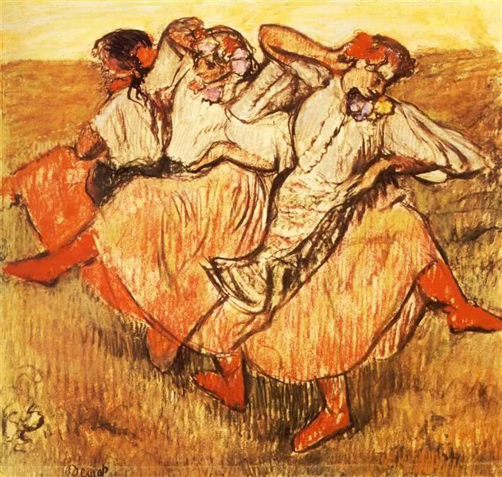

  

Edgar Degas，Dancers

  

连叔，

  

看了您的很多文章，感觉您的视角非常独特也很有想法。我开学高三，最近比较迷茫，想请教连叔的看法。我在魔都，目前成绩肯定能上985，但是我想法特别多，导致最近注意力无法集中学习。

  

我最近一直思考人生的意义，不知道是按照世俗的标准来伪装自己，还是遵循自己的内心，卸下伪装。我也不知道在这个利益为上的社会里面该如何生存，如果只是为了利益，那人活着不就像一台机器吗？我总是想要提前懂得很多道理来提前规避未来的风险，但是我也知道人生是体验一个过程，该经历的还是要经历。

  

我挺矛盾的，不知道我是不是应该少想一些，多去学习？但是我想不明白又学不进去，所以只好来找连叔。因为这些问题没被解决，我很长一段时间心情不好，心理咨询师建议不要把情绪压抑，但是释放情绪又影响学习效率。希望能够获得连叔的建议。

  

从心开始

  

* * *

  

从心开始：

  

特意等到开学，展开讨论你的问题。

  

人生的意义是个大问题，谢谢你信任我，把它交给我。为了讨论这个问题，我也准备了几十年。

  

世俗的标准，追求利益，卸下伪装真实做自己，它们之间可能像你说的一样尖锐对立，似乎非得选边站。但在我看来，它们存在统一起来的可能性。我的人生经验证明，这种统一性广泛存在，追求意义的人生并不必要活在对抗当中。当然，我年轻时并不知道这点，与世界有不少对抗，这或许是一个必经的过程，孔夫子那么聪明好学的人，到了60岁，才能耳顺，不被迷惑、误解与对立扰乱立场与心性。

  

比如我们这次交流，我们都真实，你好学，我解惑，符合世俗里的好师生标准，也不追求利益。一切元素都顺畅地结合在一起，并没有什么冲突。不追求利益，不就饿死了吗？仔细分析，发现也不会，利益能通过“不追求利益”的方式产生，这才是最稳固的利益。我以写作为生，不能为读者创造利益，就没有我的利益。同样，我知道这点也花了很长时间，如上面所说，我为这篇文章准备了几十年。有技术上的准备，永不终止的阅读储备，写作训练，还要作息规律，身体健康。更重要的是观念上的进化，少年时写作，着眼点都在自己，为展示自己的聪明、不俗气、与众不同，当然，只停留在这个阶段也可以，照样可以写出好文章，但那样就没什么意思了。眼界渐宽，阅历渐长，自己的一点小聪明小才气，算什么呢？一粒尘埃而已。把写作的着眼点放在他人，为他人解决一点小麻烦，都有莫大的快乐与价值，你看，古圣先贤，其他聪明人，并没有亲自来解决这个小麻烦，只有我解决了。

  

完成眼前的任务，技能与观念提升，再完成大一点的任务，意义也会由小到大，不停呈现。它不是一个成文的标准答案，它是一个过程，由一系列任务组成。对你来说，今年的意义就是考上985，985也分上中下，你要尽量往上。考上好大学，需要你最真实的努力，它符合你的利益，家长老师都开心，世俗的标准也会恭喜你。一件事，从个人到他人，从利益到价值，如此圆融，如此统一，怎么能不尽心尽力？

  

犹太教法典中，有一种对伊甸园的描述不太为人所知：上帝告诉亚当与夏娃，他故意不把创世完成，因为“完成创世”是人类的责任。我认为这种描述接近世界的本质。人的一生，就是完成的过程，一直到死为止。你永远都得尽力，完成的任务不知什么时候就会出现。任正非年纪那么大，突然就要完成中国科技企业不被打垮的艰巨任务。钟南山年纪也那么大，今年还要再战新冠疫情。大丈夫应如是。

  

你猜不出你以后的人生将有什么伟大的挑战，不停完成，你很可能是下一个任正非和钟南山，这是何等壮丽的人生。不过，你先得把高三完成好。

  

祝开心。

  

连岳

  

推荐：[幸福而丰富的一生，就是六个字](http://mp.weixin.qq.com/s?__biz=MjM5NDU0Mjk2MQ==&mid=2651645764&idx=1&sn=a0de5f4558466e57d7bec4f5aa75a80b&chksm=bd7e635a8a09ea4c7b5a962ee4140ca0d978202d9276f859cfa5a9dffea8bb792d9f2e128cc3&scene=21#wechat_redirect)  

上文：[妒火中烧](http://mp.weixin.qq.com/s?__biz=MjM5NDU0Mjk2MQ==&mid=2651647606&idx=1&sn=ea9904b00d4e73df17bff4318b31750a&chksm=bd7e6a688a09e37e4c901ff2f6df201f714933726a2a0285dd0f74e40a655727d05f09ff4f85&scene=21#wechat_redirect)
