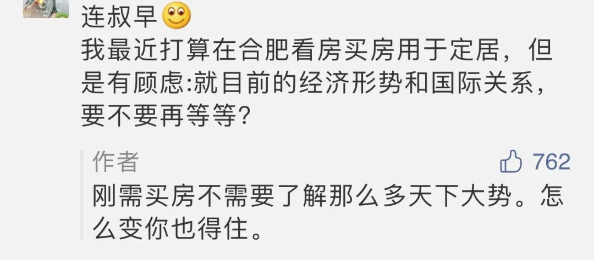

  

Samuel Mutzner，Corn Field

  

下面这位朋友的犹豫不决，是许多刚需买房时的常态：

  

  

这心态可以理解。刚需买房，基本是人生的第一次买房，在最没经验时支出最大一笔开支，这导致对价格波动承受力极弱。

  

市场一定有起伏，即使长期上涨的市场，也是在曲折中前进。房子的价值大，正常起伏几个百分点，就是几万、十几万、几十万。你买入后，心情若随波动起舞，一下涨好多钱，高兴得睡不着，一下跌好多钱，害怕得做恶梦，甚至别人房子涨得比你快，你都急得抓狂，这就把好事变成了坏事。房子没给你带来安宁与幸福，只有无穷算计后的苦恼。

  

买房记住几点简单的判断就行：

  

一、人天生需要房子的庇护，尤其是成家的人。满足这种安全的心理需求的责任感，是初心，高于投资。就像把你和家人扔到孤岛上，你也会搭间小木棚，或找个小山洞布置得舒服一些。这里没有市场，小木棚小山洞都赚不了钱，你心甘情愿做，就是因为必须保护家人。在市场里，也不要忘了这个初心。家人在哪里长住，总是需要房子的。

  

二、现在的市场对刚需最友好，不可能更友好了。政府除了让刚需买房，禁止其他投资者进入市场，那些有钱的、有经验的、承受力强的，都不再是你很难赢的竞争对手。

  

三、在经济发达的中心城市（标准粗暴一点，比如说省会或同等级别的城市）买的房子，保值是一定的。升值多少，那看运气。

  

买了房子，有了人生根据地，好好享受，好好工作，让自己和家人的生活上一个层次。其他的事，尤其是天下大事，不要想太多。

  

天下大事往往不按牌理出牌，一般预想不到。今年谁能想到有全球新冠疫情？

  

大事出现后，它的评价与结果，也可能出人意料。比如疫情之初，多少人（包括不少中国人）等着盼着中国完蛋？可中国做得越来越好。在这种好结果面前，有些人却不会改变想法，还在等着盼着中国完蛋。也就是说，如果你自己没有主见，等着大事给你一个标准答案，那是没有的。尤其是在信息社会，你总能看见相反的意见，你不坚定，你就无法做任何决定，最后死于信息泛滥。

  

别想太多，对的事情，做就是了。买房子庇护家人，永远是对的，在中国这个和平繁荣的上升之路，尤其对，那就赶快去做。

  

推荐：[自由是权利，自由更是财富](http://mp.weixin.qq.com/s?__biz=MjM5NDU0Mjk2MQ==&mid=2651645501&idx=2&sn=2bf693b7e4d5d7f4e0c9606e3d46736e&chksm=bd7e62238a09eb35081f423f05f946d9a0d0e0dd5e47df8acb1351b07d35acbc61a91ace4cfc&scene=21#wechat_redirect)  

上文：[一个男人该有的样子，一个被爱的人该有的样子](http://mp.weixin.qq.com/s?__biz=MjM5NDU0Mjk2MQ==&mid=2651648476&idx=1&sn=c7b74808e3b39b278b4300b846fb4189&chksm=bd7e75c28a09fcd447552606dbd6120ef46f51a4d97446f9d60a0e11e387462965d551b909fc&scene=21#wechat_redirect)
