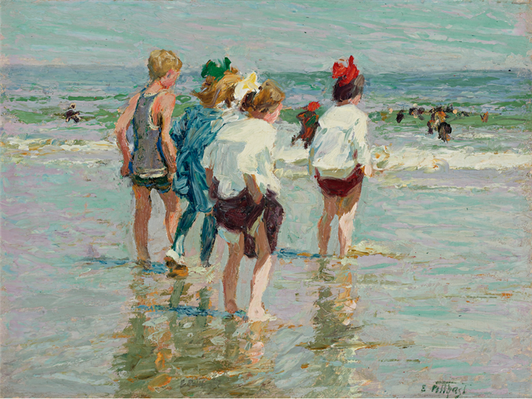
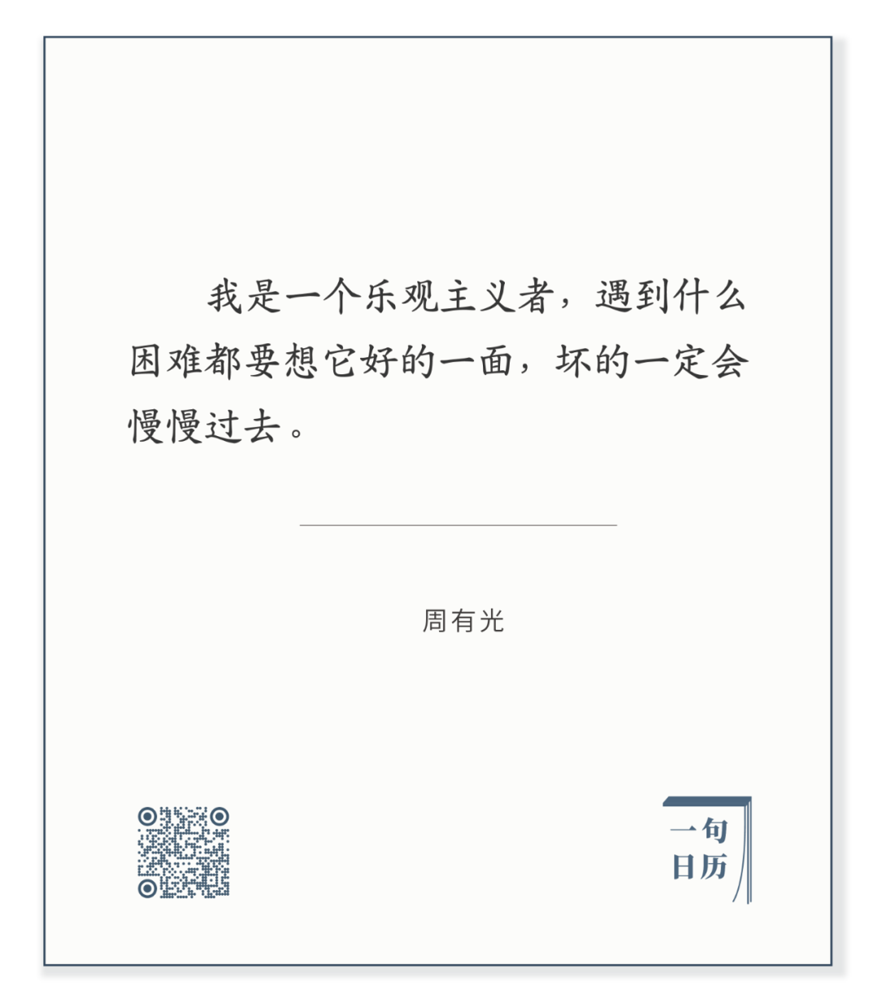

Edward Henry Potthast，Brighton Beach

  

长按二维码可关注

  

人天生的气质，有的乐观，有的悲观。  

  

但我们最终都要成一个乐观主义者。乐观是一种思维方式，可以后天习得。

  

恐惧、焦虑、急功近利，甚至不负责任，都与悲观联系紧密。反正明天必然洪水滔天，今天就由着性子乱来吧。今天乱，明天多半更糟，就这么自我验证了。

  

人生不止今天明天两天。你我有三万多天。

  

重要一点的事情，都是长期的，不花几百几千天，做不成。在这么长的时间里，会有困难，很多困难，想得到与想不到的。一遇到困难，就悲观绝望，走不完这条长路。

  

这不是说天生悲观的人一定输。悲观者一眼可以看到不利，只是他无限放大这不利。保留看到不利的天赋，克制放大的冲动，可以规避许多风险，把事情做得更好。做成的事累积起来，你自然就乐观了。  

  

而天生乐观的人，不要浪费这个天赋。如果以为做做白日梦即可，没有任何风险评估，甚至故意无视风险。狠狠地输几次，人生再无机会，悲惨的结局只会给你悲观。  

  

天生不同，却殊途同归，我们都得成为一个乐观主义者，坏的都会过去。天天有坏，但天天的好都多一点，就行了。  

  

今天是第144期“下周很重要”，制订计划，某种程度上，就是坚信能战胜阻拦自己的困难，无论是自己心性带来的困难，还是环境产生的困难。  

  

推荐：[子绝四，大人生](http://mp.weixin.qq.com/s?__biz=MjM5NDU0Mjk2MQ==&mid=2651648808&idx=1&sn=56e68ed83a9e47d9d251034130fc809d&chksm=bd7e77368a09fe20ffa00a86d6f742660fa7afc3cc2d70f84b7a867b7ae56688a78753f4e829&scene=21#wechat_redirect)

上文：[说说上海抢人，这才是自信](http://mp.weixin.qq.com/s?__biz=MjM5NDU0Mjk2MQ==&mid=2651649276&idx=1&sn=18bd98e97fdce0d0976e163398cf3769&chksm=bd7e70e28a09f9f4ae3add309e08f4d032b090e5cb38c99f760507e4327c8fca2b408f16f3c2&scene=21#wechat_redirect)
