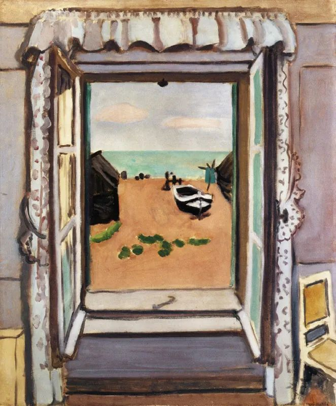

  

Henri Matisse，Open Window

  

连叔您好:

  

感谢您能在百忙之中打开了我的邮件，如果有幸被您阅读，能否请您指点一下迷津。

  

先说说我的背景故事吧。我是幼女，最受宠，自小就很刻苦，成绩稳居年段前十，是长辈们口中的“尖子生”。然而我并不快乐，看重成绩的家族，让我的世界逐渐进入一种很抑郁的状态。父母常年外出工作，在我的青春期里几乎没有什么沟通和陪伴，寄养在外婆家。从小学四年级一直到高一，我妈才回家，打算当全职妈妈照顾我，可是我和她已经很陌生了，相隔5年没见，我全当没有了妈妈，她的出现我只有愤怒。我开始不念书，好几次故意考了年段倒数，可他们就只知道骂，从来不会过问我的感受，每天家里都是骂，摔的声音，骂我是废物。每晚含泪而睡，咬咬牙捱过了3年，考上了本一，就读英语翻译专业。就这，办了好几桌酒席。可是我极度厌恶父母利用我在家族面前炫耀，他们没有看见我的痛苦却要邀功我努力来的结果。气得我只想离开。

  

所以我解放了自己的天性。在大学里，我的性情一发不可收拾，我甚至借网贷，自己创业，谈恋爱，挂科，在外面租房子，欠了一屁股债，后来也都是父母出面还的。我彻底成了家族人眼中的败类，名声很不好听，但是我知道我不差，我没做过伤天害理的事，唯一做不好的就是没有继续当个乖孩子。可我真的不愿意了。我开始和他们唱反调。谈的男朋友是初中学历，被我妈知道后，全家反对，我爸妈把我软禁在家里一个月，控制我，辱骂我，连窗户都不能开。在某一天我出逃了。他们还说要报警抓我。

  

现在是离家出走的第六个月，正好是大学毕业第三个月，我正在自己创业中，能赚点但不稳定，每个月给父母打钱，虽然他们也都会接受，但还是在电话里骂了我好几个月，说我会后悔，他们希望我在老家当一名老师，嫁给他们给我物色的有高学历的相亲对象。

  

我辜负了他们的期望(却达到了我的预期效果）可是我也没有觉得很轻松，反而更累，这十几年过的也折腾。我是不是也许就该要活着父母喜欢的那样呢？当个老师？或者上班族？稳定铁饭碗？高学历对象？迷茫的我看过很多很多很多心理的书，看完豁然开朗，过后照样焦虑，无意义感越来越重，那么我人生的意义到底何在？我怎么把握自己的人生呢！我的月亮真的不存在吗？寻找六便士是不是真的才符合社会常态呢？

  

小毛

  

* * *

  

小毛：

  

你还生活在对父母的强烈仇恨之中。

  

先把这恨解决了，才能谈人生的其他问题。

  

恨会让一个人简陋，你生活在机械的否定当中：我恨之人希望我做的事，我偏不做，他们不希望我做之事，我偏去做。这里面只有激情，没有理智。但你又将之理解成他们是六便士，而你是月亮，美化这种恨，那可能一生都难以走出。

  

他们可能是六便士，选择未必对，未必美，这不能证明你是月亮，你或许只是五便士，更差一点，更丑一点。

  

走不出恨的人，人生没有希望，没有意义。你的能量都用在抱怨、诅咒、破坏、毁灭，你不可爱，你也不会爱人。我很同情你的男朋友，他被你利用了，你看中的就是他的初中学历，你知道这点可以激怒父母，让他们做出过分的举动。你其实很聪明，他们的反应都在你预料之中，可是惩罚他们之后，你并不快乐，是时候走出恨了。

  

孩子在成长过程中，都有恨父母的时间，有的短，有的长。你属于长的。

  

这个恨的产生，有几种原因：

  

一是父母确实不称职，遗弃或虐待孩子。  

  

二是有失误，在教育的过程中犯一些错误。人不是神，总会犯错误。任何父母，或见识有限，或能力不足，或局限于当时的环境，在抚育孩子的过程中，一定出现过不少错误。  

  

三是教育必然有的严厉时刻。

  

二与三这种现象，几乎出现在所有父母的教育当中。也就是说，孩子都有恨父母的念头产生，并不是只有你受过这苦，这是成长的烦恼与成本。只是很多孩子，睡一觉起来，恨就消失了。再记仇的孩子，成长之后，生出同理心，知道人之不易，恨也不会长存。

  

你父母把你寄养在外婆家五年，你恨这点。那或许是他们的失误，或许是他们不得已。在心理医生看来，这可能对你的心灵造成一些创伤。可是，正常的心理医生都会说，这伤是小伤，可以愈合，不该不停地回忆、反刍、强化。就算他们有错，也受到了相应的惩罚，为你还债，忍受你的各种逆反，早就两清了。

  

从你妈妈的角度来看，她可能为生活所迫，不得不离开孩子几年，之后当全职照顾你，为你一直痛苦到现在，无法可想，她的人生，哪里有一丝月光？为那分离的五年没有得到宠爱，你报复到了这种程度，已经过度了。

  

你已大学毕业，也开始创业。把事业经营好，心情平静，和父母好好沟通，像正常人那样，像有爱的家庭那样，父母说得对的地方，就听。不对的地方，你就用事实证明你的想法对。爱也不是事事顺从，没有主见，爱是大家都可以追求自己的月亮，而只盯着自己的不开心，那不仅自己看不到月亮，也让别人没有月亮。

  

从今天开始，不要恨他们了。不恨，才有爱与意义生成的空间。

  

祝开心。

  

连岳

  

推荐：[道理虽好，孩子必须过他们的一生](http://mp.weixin.qq.com/s?__biz=MjM5NDU0Mjk2MQ==&mid=2651637134&idx=1&sn=cd4edab7c20a41963fb5c0b826f163df&chksm=bd7e41908a09c8865a83a211307257674c70a7d8f36974bafc7bb076582ce1821e64395fedcb&scene=21#wechat_redirect)  

上文：[不道德的交易](http://mp.weixin.qq.com/s?__biz=MjM5NDU0Mjk2MQ==&mid=2651648123&idx=1&sn=8ad5ffdf9e4d1ea92f08214e72e962c9&chksm=bd7e74658a09fd73f6bcb1ec378c111d2fc0a7d40cfe0221f057d03b5412effbd23131759849&scene=21#wechat_redirect)
