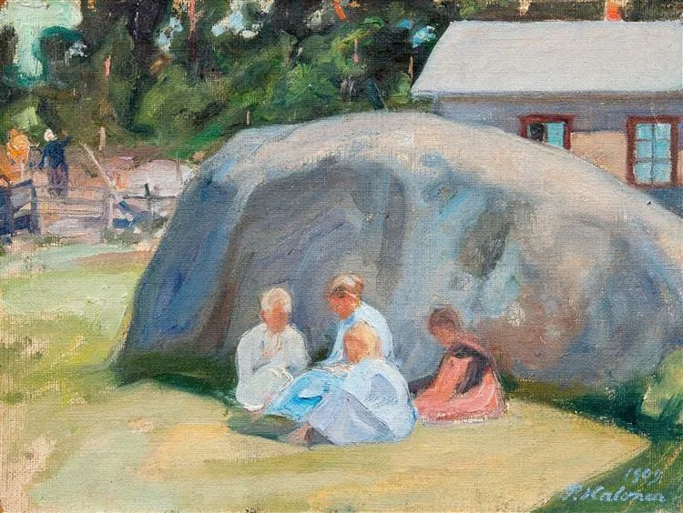
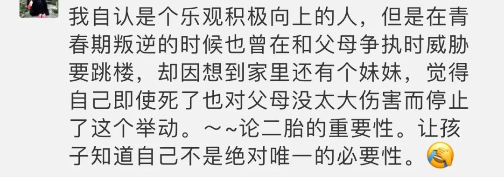

Pekka Halonen，Children Playing in the Yard

  

这几年最好的一个政策改变，就是全面放开二孩。虽然离彻底的生育自由还有一步之遥，但是考虑到多数人最多也就生两个孩子，这自由已经够用。当然，彻底自由最好，我相信很快也会到来。

  

生育最基本的选择，有生与不生之分。有些人选择不生，生育政策的变化，对他们影响不大。除了出台必须生育的强制政策。我觉得也不太可能到这地步。这两类人中的好斗者，经常互相攻击，极力证明对方的选择是错的，会后悔。我觉得大可以不必，任何选择都有收益，有风险，各自承担就是了。

  

选择生，生两个比只生一个更有益。你想生，那最主要的原因肯定是传承基因，这点没什么不好意思承认，正大光明的事。只有一个孩子，传承基因的风险就会加大，不自觉就会对孩子过度保护，他的人生目标也变得比较单一，主要任务就是再生一个孩子，将基因多传一代。可以想见，一孩政策若没有改变，几代之后，整个民族的精神都会变得胆小怯懦，像是人人手上捧着一个蛋，要将它传给后代。

  

人必须在群体里生存。很多社交技能是从小与兄弟姐妹的互动中习得的。如何良性竞争；如何克制妒嫉；如何分工合作；如何反控制，维护自己边界；如何站在对方的立场考虑问题；如何争吵；必要时如何打一架；争吵打架后如何和好；如何认识自己的地位；如何原谅；如何爱；如何深情相拥；如何不离不弃。有一（几）个相爱相杀的兄弟姐妹，天天练习，自然而然就学会了。

  

只有一个孩子，家里又全是宠溺他的人，他很难学会这些技能。进入社会，到了需要用这些技能时，无所适从，动辄心碎，逃回宠溺他的安乐窝。这种孩子，从小学会了一个独有的本事，他知道父母难以承受失去自己，他将有意无意地将自己当成人质，绑架父母，予取予求。这就形成了一孩悖论：一个孩子，受到更多保护，他的风险却更大。

  

昨天有位读者朋友说到自己独特的经历：

  

  

这种心理反应，有其普遍性。两个孩子，就是这样增加了其自身与全家的安全性。孩子成长，难免有风险，应对这种风险，除了爱、温暖与耐心，最好的办法就是多生一（几）个孩子。  

  

推荐：[万科会死吗？](http://mp.weixin.qq.com/s?__biz=MjM5NDU0Mjk2MQ==&mid=2651630789&idx=1&sn=7b15973a0c47a18f7b22d4760a28cae0&chksm=bd7e28db8a09a1cde7f20a3b6596c5f20c1cdb23e425f398cd7ec9c3582f64c43f2baf054931&scene=21#wechat_redirect)  

上文：[说说14岁少年被母亲打耳光后跳楼身亡事件](http://mp.weixin.qq.com/s?__biz=MjM5NDU0Mjk2MQ==&mid=2651648991&idx=1&sn=b17b40c65a1edf1af5ff5dcd8ad37278&chksm=bd7e77c18a09fed7d5ea28dfc4f168534261e7172aecbf8ff5527531b9e8fa32f840aacafc04&scene=21#wechat_redirect)
