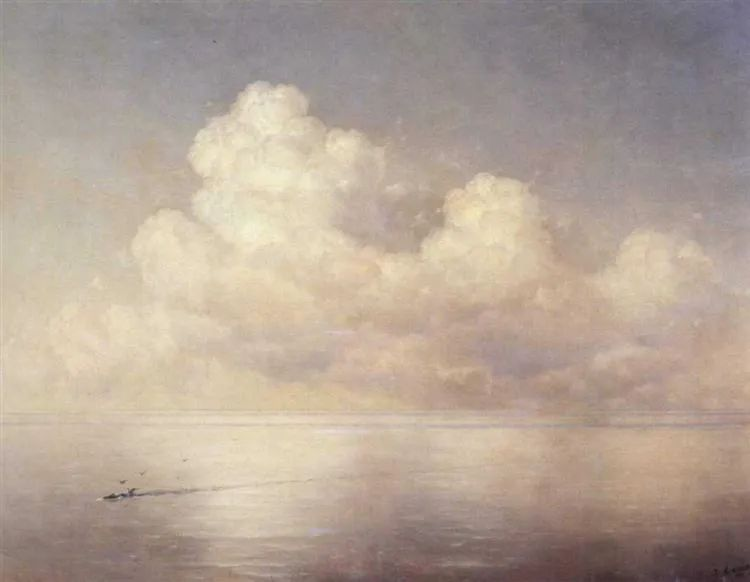
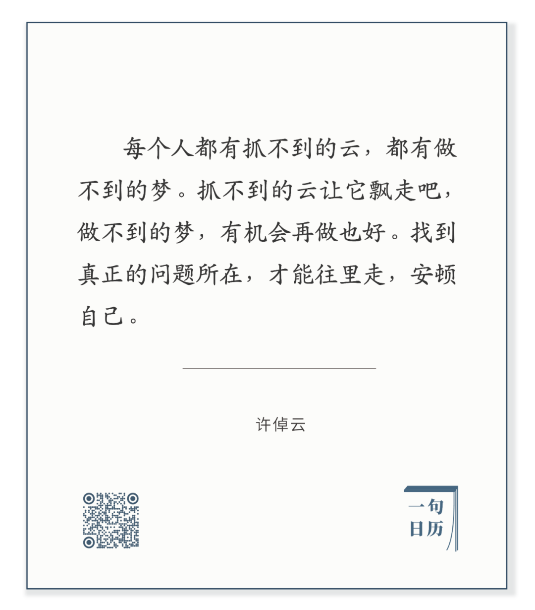

Ivan Aivazovsky，Clouds above a sea calm  

  

长按二维码可关注

  

云和梦，都美。美在变幻无穷。当然可以欣赏，但不能安顿。只是看云做梦，人生就是一场虚无。

  

在思维方式与行事方法上，人也容易陷入虚无飘渺的误区，以为只要想得像云一样美，人生就美。想得美，只是计划，还要做得美才行。  

  

子绝四：毋意，毋必，毋固，毋我。  

  

什么意思呢？

  

毋就是无。孔夫子没有4种心态：

  

一是老是预想某事发生，即想得美；

  

二是不期待某事必然实现，这样自然没有失望与抱怨；

  

前两点做得到，就能产生第三种不固执的心态。人生很多事不能固执，不能固执于错误，不能固执于索取，不能固执于一定有回报，不能固执于一点亏不能吃。

  

第四的无我，当然不是没有一点我，言语观念行动互动，都由我出发，没有我就没有后续的一切。无我是不要只关注自己，把自己看得很大。大千世界，我是小我。心心念念只有我，就活得小，什么毛病都容易产生，妄想，贪婪，固执。

  

人要活得大一点，读读历史，看看云彩，仰观宇宙之大，俯察品类之盛。时空观大了，人才会大。

  

人大了，失望，失意，失利，都会变得小且无害，甚至像云彩一样为你助兴，你知道它们终究只是大人生、大格局的过程与组成部分。失望，失意，失利，不过是提出问题的方式，毋意，毋必，毋固，毋我，一步步解决问题就是了。

  

今天是第143期“下周很重要”，以“绝四”心态制订并完成计划吧。

  

  

推荐：[活得简单一点，那种沉思后的简单](http://mp.weixin.qq.com/s?__biz=MjM5NDU0Mjk2MQ==&mid=2651648440&idx=1&sn=2c05202f63c46d6da688b77e2b12ff0a&chksm=bd7e75a68a09fcb0248b4426b520c233ff9950ed24cfee10a57ffbf1d5895d4808bc29a57ca7&scene=21#wechat_redirect)  

上文：[万古江河，给你信心](http://mp.weixin.qq.com/s?__biz=MjM5NDU0Mjk2MQ==&mid=2651648768&idx=1&sn=56ee1486cb6fd9299f03cb8c0404e852&chksm=bd7e771e8a09fe0877a0774b3b379a75133eb9ca8988d437076b2d95786763b718ccf4c25855&scene=21#wechat_redirect)
