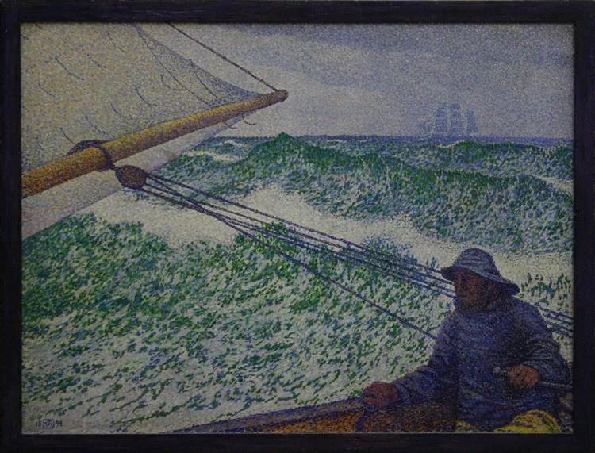

Theo van Rysselberghe，The Man at the Tiller

  

连叔：

  

连叔，我今年虚岁二十一了。今年才高中毕业，读了一遍又一遍一年又一年。今年等待着我的，依然是专科学校。身边的朋友同学无不在向前迈进，好似只有我停滞不前，偶有倒退，我迷茫不堪。在一番折腾下，我即将去专科了，我觉得这样的路对于我说才是最真实的。只是可怜了父母钱财，枉费了父母的期望，但是却证明了自己的“努力”。

  

最近家里经济压力很大，年迈的父母顽强的守护着自己的公司，却频频被官司缠身，让人好心疼。

  

我有好多好多的心声想要吐露，我却一句也写不出来，但是我知道自己，有许多许多心声需要吐露。我自己也不懂自己。

  

连叔，我该何去何从呢？我本以为今年能顺利进入本科，刚开始还自信满满，好大一个意外。一个受尊敬的老师在高考前将您的公众号推给我，我也是很尊敬您的。如今学历的重要性不容小觑。我想考研，身边人大多都不赞成，觉得我不是读书的料。我研究过武汉本科自助班、成人自考本科、专升本。各有各的优缺点，时间花的少的含金量低，本就优柔寡断的人该怎么去选择呀。时间不等人，我实在是没有坚定的选择。请您指导性的骂我一通吧！我想清醒过来。

  

小心台阶

  

* * *

  

小心台阶：

  

你并不是一个优柔寡断的人。多数人觉得你不是读书的料，你还是坚持想考研，这就是证据，证明你很能执着自己的追求。

  

学历的重要性不容小觑，这是真理。有些孩子，天赋不错，就是因为不知道这条真理，以为书是替父母老师读的，能偷懒就偷懒，荒废学业，学历不高，多年后迎来后悔。你不像他们，你很努力。这是好素质。以后交给你的事，你会尽力而为，凭这点，自食其力，获得尊重，就不难了。绝大多数人的工作，不过是些小事，有明确的标准，你不惜力，打磨成精品，世界淘汰不了你。别说你有专科文凭，就是你只有高中文凭，甚至没有文凭，把事做好，别人都会喜欢你。学历不耀眼，天并没有塌下来。

  

这世上很多东西的重要性不容小觑。

  

身高的重要性不容小觑，但矮个子成年后就不梦想自己能变高了。

  

美貌的重要性不容小觑，相貌平平的人照样得活好。

  

暴富的重要性不容小觑，可工薪阶层量入为出，也能逐渐富足。

  

出生的重要性不容小觑，我们也不会嫌弃普通的父母。

  

这个表可以一直列下去，轻易写满200条。结论只有一个，有些不容小觑的重要东西，我们恰恰没有，那就只能接受这个现实，在这个遗憾的基础上努力。人生就是遗憾的艺术。无人没遗憾。你看，生命的重要性不容小觑，人却总有一死。

  

你可能认为学历并不一样，只要死磕，总能搞到一张研究生文凭。好大学的、硬碰硬的没有，我拿一张水一点的，甚至多花点钱“买”一张，总是大有希望的。如果认为文凭的重要性是通过盖有学校印章的一张纸体现，这种想法没错，你毕竟拥有这张纸。但它的重要性是表示一个人智商高，有学术研究能力。你这两方面应该都很普通。现在企业的HR都学聪明了，研究生文凭，洋文凭满天飞，鱼龙混杂，咸鱼多，蛟龙少，我索性只看你本科读什么学校。本科是好大学，那你文凭的重要性不容小觑，否则，小觑你没商量，你拼死拼活搞来的研究生文凭，像废纸。

  

高智商的重要性不容小觑，没有就切忌装聪明。中人之资是绝大多数，我们的路径不同，没有那张高智商证明书，在生活工作中慢慢积累，只要负责、好学，在一件件小事中精进，也有美好的一生。你父母年迈，生意又多有难处，你读完专科就可以帮助他们走出危机，把这张生活的试卷答好，功力相当于研究生。

  

学习是一辈子的事，不是一张纸的事。要有这样的信心：学历的重要性不容小觑，那又怎样？我学历不出色，你也得承认我的重要性。

  

祝开心。  

  

连岳

  

推荐：[一个人可以被毁灭，却不能被打败](http://mp.weixin.qq.com/s?__biz=MjM5NDU0Mjk2MQ==&mid=2651643360&idx=2&sn=d28e8e4dfc8448e8d27127f17289525d&chksm=bd7e59fe8a09d0e88ed7dad83790aa328cb1ac89c7caa33f161692bd29f6e91b71b04e0db31f&scene=21#wechat_redirect)  

上文：[当一个幸福的普通人](http://mp.weixin.qq.com/s?__biz=MjM5NDU0Mjk2MQ==&mid=2651648244&idx=1&sn=a96385c96d9f9c18891b5ef186bd237d&chksm=bd7e74ea8a09fdfcf9465a22000ab310f3c89c532fad59f76805fde30a50cf47b5bba6e1bc79&scene=21#wechat_redirect)
